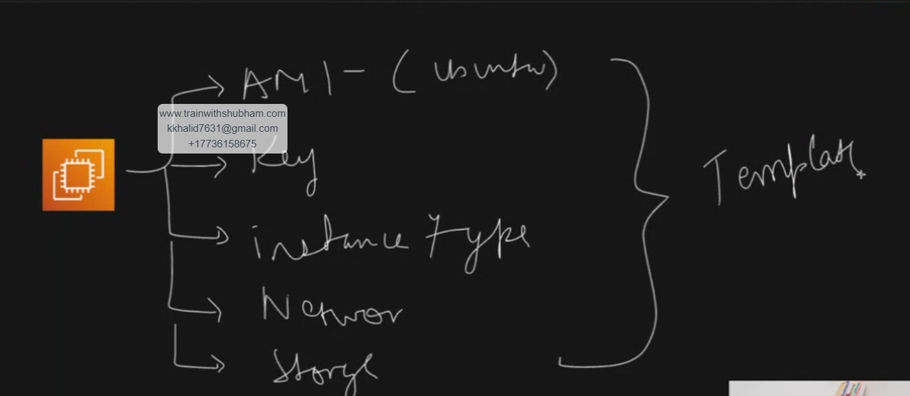

# EC2 Launch Template Study Notes

https://youtu.be/EivKXHx-GB0



<video src="videos/ec2-template-creation.mp4" controls width="700"></video>


## Topic

How to create an EC2 instance, create a launch template from that instance, launch EC2 from the template, create new template versions, and troubleshoot the common errors we faced.

---

## 1. What is EC2?

**EC2** stands for **Elastic Compute Cloud**.

It is a virtual server in AWS. We use EC2 to run Linux/Windows servers, websites, applications, scripts, and DevOps tools.

Example:

```text
Ubuntu EC2 + Nginx = Simple Web Server
```

---

## 2. What is a Launch Template?

A **Launch Template** is like a saved configuration for launching EC2 instances.

It can store:

| Setting | Example |
|---|---|
| AMI | Ubuntu 26.04 |
| Instance type | t3.micro |
| Key pair | devops.pem |
| Security group | launch-wizard |
| Storage | 8 GiB gp3 |
| User data | Nginx installation script |
| Tags | Name = my-server |

Instead of selecting all options again and again, we create a template and launch EC2 from it.

---

## 3. Why Use Launch Templates?

Launch templates are useful because:

- We can launch the same type of EC2 again and again.
- We can create versions like **v1**, **v2**, **v3**.
- We can test changes safely.
- We can use launch templates with Auto Scaling Groups.
- We can keep EC2 configuration consistent.

---

# Part 1: Create EC2 Manually

## Step 1: Go to EC2

AWS Console:

```text
AWS Console → EC2 → Instances → Launch instances
```

---

## Step 2: Choose Name

Example:

```text
Name: my-server
```

---

## Step 3: Choose AMI

Example:

```text
Ubuntu Server 26.04 LTS
```

---

## Step 4: Choose Instance Type

Example:

```text
t3.micro
```

This is commonly used for practice labs.

---

## Step 5: Choose Key Pair

Example:

```text
devops.pem
```

This key is used to SSH into the EC2 instance.

SSH command example:

```bash
ssh -i "devops.pem" ubuntu@PUBLIC-DNS
```

Example:

```bash
ssh -i "devops.pem" ubuntu@ec2-34-208-165-21.us-west-2.compute.amazonaws.com
```

When connecting the first time, SSH may ask:

```text
Are you sure you want to continue connecting (yes/no/[fingerprint])?
```

Type:

```text
yes
```

---

## Step 6: Configure Security Group

For SSH:

| Type | Port | Source |
|---|---:|---|
| SSH | 22 | My IP |

For website access:

| Type | Port | Source |
|---|---:|---|
| HTTP | 80 | 0.0.0.0/0 |

> For practice, HTTP from `0.0.0.0/0` is okay. For production, security should be more strict.

---

## Step 7: Configure Storage

Example:

| Option | Value |
|---|---|
| Size | 8 GiB |
| Volume type | gp3 |
| IOPS | 3000 |
| Throughput | 125 |
| Delete on termination | Yes |
| Encryption | Not encrypted |

---

## Step 8: Launch Instance

Click:

```text
Launch instance
```

Wait until:

```text
Instance state: Running
Status checks: 2/2 checks passed
```

---

# Part 2: Connect to EC2

## SSH from PowerShell

Go to the folder where your `.pem` file exists.

Example:

```powershell
cd C:\Users\krmar\Downloads
```

Connect:

```powershell
ssh -i "devops.pem" ubuntu@PUBLIC-DNS
```

Example:

```powershell
ssh -i "devops.pem" ubuntu@ec2-34-208-165-21.us-west-2.compute.amazonaws.com
```

---

# Part 3: Create Launch Template from Instance

## Step 1: Select Existing EC2

Go to:

```text
EC2 → Instances
```

Select your running EC2 instance.

---

## Step 2: Create Template from Instance

Click:

```text
Actions → Image and templates → Create template from instance
```

This copies many settings from your EC2 into a launch template.

---

## Step 3: Add Template Name

Example:

```text
my-ec2-template
```

Optional description:

```text
Ubuntu EC2 launch template for practice
```

---

## Step 4: Check Template Settings

Review:

| Section | Check |
|---|---|
| AMI | Ubuntu |
| Instance type | t3.micro |
| Key pair | devops.pem |
| Security group | HTTP and SSH rules |
| Storage | 8 GiB gp3 |
| User data | Optional script |
| Tags | Name tag |

---

# Part 4: User Data Script

## What is User Data?

**User data** is a script that runs automatically when EC2 launches for the first time.

We used it to install Nginx and create a simple web page.

---

## Basic Nginx User Data

Use this script:

```bash
#!/bin/bash
apt-get update -y
apt-get install nginx -y
echo "Assalam o alaikum, This server IP is $(hostname -i)" > /var/www/html/index.html
systemctl enable nginx
systemctl restart nginx
```

---

## Important User Data Rules

### 1. Always Start with Shebang

Correct:

```bash
#!/bin/bash
```

This tells EC2 to run the script using Bash.

---

### 2. Correct Command Substitution

Wrong:

```bash
${hostname -i}
```

Correct:

```bash
$(hostname -i)
```

---

### 3. Use `tee` if Permission Issue Happens

Sometimes this may fail because redirection does not use sudo:

```bash
sudo echo "text" > /var/www/html/index.html
```

Better:

```bash
echo "text" | sudo tee /var/www/html/index.html
```

---

# Part 5: Create Launch Template Versions

## What are Template Versions?

Launch templates support versions.

Example:

| Version | Purpose |
|---|---|
| v1 | First template |
| v2 | Fixed EC2 launch issue |
| v3 | Added Nginx user data |

Each version stores a different configuration.

---

## Why Create Versions?

Because we do not want to destroy the old template.

Instead, we create a new version and test it.

Example:

```text
v1 = original
v2 = storage error fixed
v3 = Nginx added
```

---

## How to Create a New Version

Go to:

```text
EC2 → Launch Templates
```

Select template.

Click:

```text
Actions → Modify template / Create new version
```

Make changes.

Click:

```text
Create template version
```

---

## Set Default Version

After creating a new version, set it as default:

```text
EC2 → Launch Templates → Select template → Actions → Set default version
```

Choose the new version, for example:

```text
v3
```

Then launch the instance from the template.

---

# Part 6: Launch EC2 from Template

Go to:

```text
EC2 → Launch Templates
```

Select your template.

Click:

```text
Actions → Launch instance from template
```

Check:

| Option | Example |
|---|---|
| Template version | v3 |
| Number of instances | 1 |
| Instance type | t3.micro |
| Security group | Has SSH and HTTP |
| Storage | 8 GiB gp3 |

Click:

```text
Launch instance
```

---

# Part 7: Test Nginx

## Check Nginx Status

SSH into EC2, then run:

```bash
systemctl status nginx
```

Good output:

```text
Active: active (running)
Loaded: loaded
```

---

## Test Locally on EC2

Run:

```bash
curl localhost
```

or:

```bash
curl PRIVATE-IP
```

Example:

```bash
curl 172.31.34.124
```

Expected output:

```text
Assalam o alaikum, This server IP is 172.31.34.124
```

---

## Test from Browser

Open:

```text
http://PUBLIC-IP
```

Example:

```text
http://34.208.165.21
```

If it opens, then:

- Nginx is running
- User data worked
- Security group allows HTTP
- EC2 is reachable from the internet

---

# Part 8: Errors We Faced and Solutions

## Error 1: EBS Card Index Is Not Supported

### Error Message

```text
EBS card index is not supported for this instance type.
Root volume can only be set to index 0.
```

### Cause

The launch template had:

```text
EBS card index: 0
```

But the selected instance type was:

```text
t3.micro
```

`t3.micro` does not support this EBS card index setting.

---

### Solution

When modifying the template version, go to:

```text
Storage (volumes) → Volume 1 → EBS card index
```

Set it to:

```text
Don't include in launch template
```

Then create a new launch template version.

---

### Important

Do not only change it during EC2 launch.

Fix it inside the **launch template version** itself.

Correct flow:

```text
Modify template → Create new version → Remove EBS card index → Create template version → Set default version → Launch instance
```

---

## Error 2: EBS Card Index Option Not Visible

### Problem

While modifying the template, the EBS card index option was not visible.

### Cause

The volume details were collapsed.

### Solution

Click the small arrow beside:

```text
Volume 1 (Template and AMI Root)
```

After expanding, the full storage options appear.

Then change:

```text
EBS card index
```

to:

```text
Don't include in launch template
```

---

## Error 3: Region Confusion

### Problem

One screen was in Ohio and another was in Oregon.

Example:

```text
Ohio = us-east-2
Oregon = us-west-2
```

### Cause

Launch templates and EC2 instances are region-specific.

A template in one region will not behave like a template in another region.

### Solution

Always check the top-right AWS region before creating or launching EC2.

Keep everything in the same region.

Example:

```text
If template is in Oregon, launch EC2 in Oregon.
If template is in Ohio, launch EC2 in Ohio.
```

---

## Error 4: User Data Public IP Was Blank

### Problem

The page showed:

```text
Assalam o alaikum, This server Public IP is
```

The public IP value was empty.

### Cause

This command did not return anything:

```bash
curl -s http://169.254.169.254/latest/meta-data/public-ipv4
```

Reason: EC2 metadata was likely using **IMDSv2 required**.

IMDSv2 needs a token before accessing metadata.

---

### Solution Using IMDSv2

Use this:

```bash
TOKEN=$(curl -X PUT "http://169.254.169.254/latest/api/token" \
  -H "X-aws-ec2-metadata-token-ttl-seconds: 21600" -s)

PUBLIC_IP=$(curl -H "X-aws-ec2-metadata-token: $TOKEN" \
  http://169.254.169.254/latest/meta-data/public-ipv4 -s)

echo "Assalam o alaikum, This server Public IP is $PUBLIC_IP" | sudo tee /var/www/html/index.html
```

---

## Full User Data for Public IP with IMDSv2

```bash
#!/bin/bash
apt-get update -y
apt-get install nginx -y

TOKEN=$(curl -X PUT "http://169.254.169.254/latest/api/token" \
  -H "X-aws-ec2-metadata-token-ttl-seconds: 21600" -s)

PUBLIC_IP=$(curl -H "X-aws-ec2-metadata-token: $TOKEN" \
  http://169.254.169.254/latest/meta-data/public-ipv4 -s)

echo "Assalam o alaikum, This server Public IP is $PUBLIC_IP" > /var/www/html/index.html

systemctl enable nginx
systemctl restart nginx
```

---

## Error 5: Browser Does Not Open Website

### Possible Cause

Nginx is running, but HTTP port 80 is blocked in the security group.

### Check on EC2

```bash
curl localhost
```

If this works but browser does not open, then issue is most likely the security group.

### Solution

Add inbound rule:

| Type | Protocol | Port | Source |
|---|---|---:|---|
| HTTP | TCP | 80 | 0.0.0.0/0 |

---

## Error 6: Nginx Not Installed

### Check

```bash
systemctl status nginx
```

If output says service not found or inactive, then Nginx was not installed or started.

### Solution

Install manually:

```bash
sudo apt-get update -y
sudo apt-get install nginx -y
sudo systemctl enable nginx
sudo systemctl restart nginx
```

Then test:

```bash
curl localhost
```

---

# Part 9: Useful Commands

## SSH

```bash
ssh -i "devops.pem" ubuntu@PUBLIC-DNS
```

---

## Check Nginx

```bash
systemctl status nginx
```

---

## Restart Nginx

```bash
sudo systemctl restart nginx
```

---

## Enable Nginx on Boot

```bash
sudo systemctl enable nginx
```

---

## Test Website Locally

```bash
curl localhost
```

---

## Test Private IP

```bash
curl PRIVATE-IP
```

---

## Check Private IP

```bash
hostname -i
```

---

## Check Public IP from Browser

```text
http://PUBLIC-IP
```

---

## Update Nginx Home Page

```bash
echo "Hello from EC2" | sudo tee /var/www/html/index.html
```

---

# Part 10: Final Version Summary

## v1

First launch template created from EC2 instance.

Possible issue:

```text
EBS card index was included
```

---

## v2

Fixed launch template issue.

Main fix:

```text
EBS card index = Don't include in launch template
```

EC2 launched successfully from template.

---

## v3

Added Nginx user data.

Nginx installed automatically.

Browser showed:

```text
Assalam o alaikum, This server IP is 172.31.34.124
```

This confirmed:

- EC2 launched from template
- User data ran successfully
- Nginx installed
- HTTP port 80 worked
- Browser access worked

---

# Part 11: Best Practice Flow

Use this flow for future practice:

```text
1. Create EC2 manually
2. Test SSH
3. Create launch template from EC2
4. Launch EC2 from template
5. If error happens, modify template and create new version
6. Set latest good version as default
7. Add user data in new version
8. Launch new EC2 from latest version
9. Test with SSH, curl, and browser
10. Document errors and fixes
```

---

# Quick Checklist

Before launching from template, check:

| Check | Status |
|---|---|
| Correct region selected | ✅ |
| Correct launch template version selected | ✅ |
| EBS card index removed | ✅ |
| Security group allows SSH 22 | ✅ |
| Security group allows HTTP 80 | ✅ |
| User data starts with `#!/bin/bash` | ✅ |
| Nginx install command is correct | ✅ |
| Default version updated | ✅ |
| EC2 status checks passed | ✅ |

---

# Final Notes

Launch templates are very important in AWS because they help us create repeatable EC2 deployments.

The biggest lesson from this lab:

```text
Do not fix only the launch screen.
Fix the launch template version itself.
```

Another important lesson:

```text
Every change should be saved as a new version.
Then set the correct version as default.
```

This is how we safely improve infrastructure step by step.
