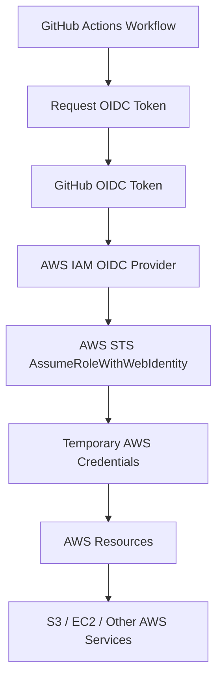
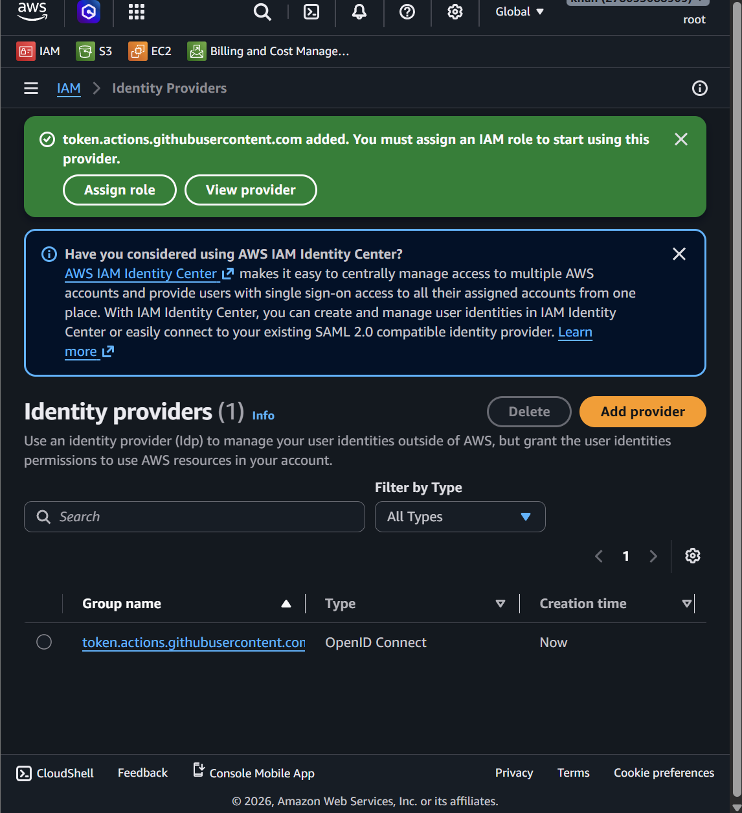
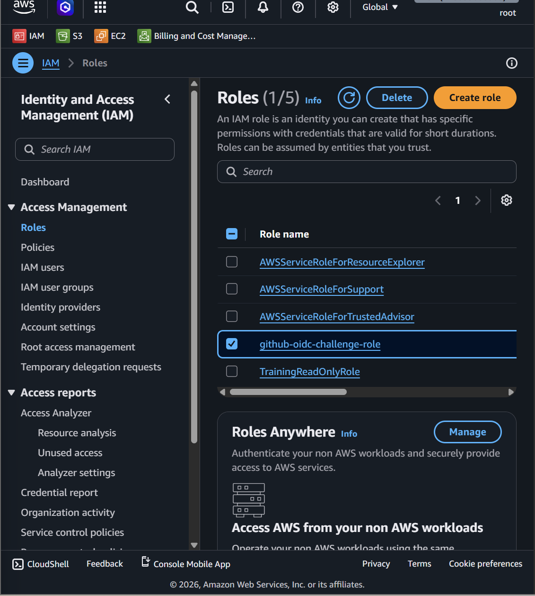
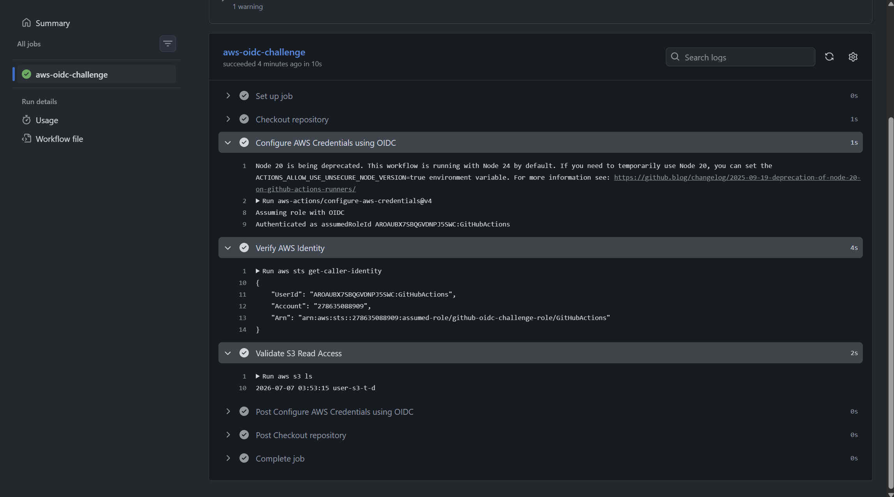

# Optional Advanced Challenge – GitHub OIDC with AWS

### **OIDC** token means:
```text
OpenID Connect Token
```
### Simple meaning

#### An **OIDC** token is a short-lived identity token that proves:

```text
Who is requesting access?
Where is the request coming from?
Is it trusted?
```

### In GitHub Actions + AWS
```text
GitHub Actions
   ↓
Requests OIDC token
   ↓
GitHub gives temporary identity token
   ↓
AWS checks the token
   ↓
AWS STS gives temporary AWS credentials
```

### One-line memory
```text
OIDC token proves the identity of GitHub Actions to AWS.
```
So in this lab:
```text
GitHub Actions does not use AWS access keys.
GitHub Actions uses an OIDC token to prove itself to AWS.
AWS STS then gives temporary credentials.
```

## Goal

Configure secure GitHub Actions access to AWS **without storing long-lived AWS access keys** in GitHub Secrets.

This challenge helps understand how GitHub Actions can authenticate to AWS using:

```text
OIDC
IAM
AWS STS
Temporary credentials
```


---

# Main Concept

Old method:

```text
GitHub Secrets
   ↓
AWS_ACCESS_KEY_ID
AWS_SECRET_ACCESS_KEY
   ↓
AWS Account
```

Better and more secure method:

```text
GitHub Actions
   ↓
OIDC Token
   ↓
AWS IAM OIDC Provider
   ↓
AWS STS
   ↓
Temporary Credentials
   ↓
AWS Resources
```

The main idea is:

```text
Do not store long-lived AWS access keys in GitHub.
Use temporary credentials through OIDC and STS.
```

---

# Architecture

```text
GitHub Actions
      │
      │ OIDC Token
      ▼
AWS IAM OIDC Provider
      │
      ▼
AWS STS AssumeRoleWithWebIdentity
      │
Temporary Credentials
      ▼
AWS Resources such as S3 or EC2
```

---

# Mermaid Architecture Diagram



---

# Why This Challenge Is Important

This is a real DevOps and cloud security practice.

It helps avoid storing permanent AWS keys in GitHub Secrets.

Benefits:

```text
No long-lived AWS access keys in GitHub
Temporary credentials only
Better security
Better audit trail
Least privilege access
Recommended CI/CD authentication method
```

---

# Key Services

| Service | Purpose |
|---|---|
| GitHub Actions | Runs the workflow |
| OIDC | Provides identity token from GitHub |
| IAM OIDC Provider | Allows AWS to trust GitHub OIDC tokens |
| IAM Role | Defines what GitHub Actions can access |
| AWS STS | Issues temporary credentials |
| S3 / EC2 | AWS resources accessed by workflow |

---

# Important Terms

## OIDC

OIDC stands for:

```text
OpenID Connect
```

In this challenge, GitHub uses OIDC to prove to AWS that the workflow is coming from a trusted GitHub repository.

## STS

STS stands for:

```text
Security Token Service
```

AWS STS provides temporary security credentials.

In this challenge, STS allows GitHub Actions to assume an IAM role using:

```text
AssumeRoleWithWebIdentity
```

## Temporary Credentials

Temporary credentials are short-lived AWS credentials.

They are safer than long-term access keys because they expire automatically.

---

# Step 1 – Create GitHub OIDC Provider in AWS

https://youtube.com/shorts/WBKyZzqLVWA 


<video src="videos/Create-GitHub-OIDC-Provider-in-AWS.mp4" controls width="700"></video>


Open:

```text
AWS Console → IAM → Identity Providers → Add Provider
```

Provider type:

```text
OpenID Connect
```

Provider URL:

```text
https://token.actions.githubusercontent.com
```

Audience:

```text
sts.amazonaws.com
```

Click:

```text
Add Provider
```

---

## Screenshot Deliverable 1

 

```text
token.actions.githubusercontent.com
```

---

# Step 2 – Create IAM Role for GitHub Actions

https://youtu.be/wCrNEalX-NY

<video src="videos/step-2-Create-IAM-Role-for-GitHub-Actions.mp4" controls width="700"></video>


Go to:

```text
AWS Console → IAM → Roles → Create Role
```

Select trusted entity:

```text
Web Identity
```

Identity Provider:

```text
token.actions.githubusercontent.com
```

Audience:

```text
sts.amazonaws.com
```

Use your GitHub details:

```text
GitHub organization or username: <YOUR_GITHUB_ORG_OR_USERNAME>
GitHub repository: <YOUR_REPOSITORY_NAME>
```

Example:

```text
GitHub organization or username: krmaryum
GitHub repository: test-github-actions
```

Role name:

```text
<YOUR_OIDC_ROLE_NAME>
```

Example:

```text
github-oidc-challenge-role
```

Attach a safe challenge permission:

```text
AmazonS3ReadOnlyAccess
```

Then create the role.

---

## Screenshot Deliverable 2



```text
IAM Role created
Role name: github-oidc-challenge-role
Policy attached: AmazonS3ReadOnlyAccess
```

---

# Step 3 – Update the Trust Policy

Open the role:

```text
IAM → Roles → github-oidc-challenge-role → Trust relationships
```

Edit the trust policy.

Replace the placeholders:

```text
<YOUR_AWS_ACCOUNT_ID> = your AWS account ID
<YOUR_GITHUB_ORG_OR_USERNAME> = your GitHub username 
<YOUR_REPOSITORY_NAME> = your repository name
```

---

# Trust Policy

```json
{
  "Version": "2012-10-17",
  "Statement": [
    {
      "Effect": "Allow",
      "Principal": {
        "Federated": "arn:aws:iam::<YOUR_AWS_ACCOUNT_ID>:oidc-provider/token.actions.githubusercontent.com"
      },
      "Action": "sts:AssumeRoleWithWebIdentity",
      "Condition": {
        "StringEquals": {
          "token.actions.githubusercontent.com:aud": "sts.amazonaws.com"
        },
        "StringLike": {
          "token.actions.githubusercontent.com:sub": "repo:<YOUR_GITHUB_ORG_OR_USERNAME>/<YOUR_REPOSITORY_NAME>:*"
        }
      }
    }
  ]
}
```

---

# Trust Policy Explanation

## Principal

```json
"Federated": "arn:aws:iam::<YOUR_AWS_ACCOUNT_ID>:oidc-provider/token.actions.githubusercontent.com"
```

Meaning:

```text
AWS trusts the GitHub OIDC provider.
```

## Action

```json
"Action": "sts:AssumeRoleWithWebIdentity"
```

Meaning:

```text
GitHub Actions can assume this role using an OIDC web identity token.
```

## Audience Condition

```json
"token.actions.githubusercontent.com:aud": "sts.amazonaws.com"
```

Meaning:

```text
The token must be intended for AWS STS.
```

## Repository Condition

```json
"token.actions.githubusercontent.com:sub": "repo:<YOUR_GITHUB_ORG_OR_USERNAME>/<YOUR_REPOSITORY_NAME>:*"
```

Meaning:

```text
Only workflows from this GitHub repository can assume the role.
```

---

# Stricter Branch Restriction

For better security, restrict the trust policy to only the `main` branch.

Use:

```text
repo:<YOUR_GITHUB_ORG_OR_USERNAME>/<YOUR_REPOSITORY_NAME>:ref:refs/heads/main
```

Example:

```text
repo:krmaryum/aws-week-1-challenge:ref:refs/heads/main
```

This means only workflows running from the `main` branch can assume the role.

---

# Step 4 – Add GitHub Actions Workflow

Create this file in your repository:

```text
.github/workflows/aws-oidc-challenge.yml
```

Replace:

```text
<YOUR_AWS_ACCOUNT_ID>
<YOUR_OIDC_ROLE_NAME>
```

with your own values.

```yaml
name: AWS OIDC Challenge

on:
  workflow_dispatch:

permissions:
  id-token: write
  contents: read

jobs:
  aws-oidc-challenge:
    runs-on: ubuntu-latest

    steps:
      - name: Checkout repository
        uses: actions/checkout@v4

      - name: Configure AWS Credentials using OIDC
        uses: aws-actions/configure-aws-credentials@v4
        with:
          role-to-assume: arn:aws:iam::<YOUR_AWS_ACCOUNT_ID>:role/<YOUR_OIDC_ROLE_NAME>
          aws-region: ap-south-1

      - name: Verify AWS Identity
        run: aws sts get-caller-identity

      - name: Validate S3 Read Access
        run: aws s3 ls
```

---

# Important Workflow Permission

This part is required:

```yaml
permissions:
  id-token: write
  contents: read
```

Meaning:

```text
id-token: write allows GitHub Actions to request an OIDC token.
contents: read allows the workflow to checkout/read repository content.
```

Without this, OIDC authentication may fail.

---

# Step 5 – Run the Challenge

https://youtu.be/aJbSyv8akw4

<video src="videos/Step-5–Run-the-Challenge-github-workflow.mp4" controls width="700"></video>


1. Push the workflow to GitHub.
2. Open the repository in GitHub.
3. Go to:

```text
Actions
```

4. Select:

```text
AWS OIDC Challenge
```

5. Click:

```text
Run workflow
```

6. Open the workflow logs.
7. Check the output of:

```bash
aws sts get-caller-identity
```

---

# Expected Success Output




Expected output should show an assumed-role ARN similar to:

```text
arn:aws:sts::<YOUR_AWS_ACCOUNT_ID>:assumed-role/<YOUR_OIDC_ROLE_NAME>/...
```

Example:

```text
arn:aws:sts::123456789012:assumed-role/github-oidc-challenge-role/GitHubActions
```

If you see an assumed-role ARN, the GitHub OIDC challenge is completed successfully.

---

# Allowed Action Test

This command should work if the role has `AmazonS3ReadOnlyAccess`:

```bash
aws s3 ls
```

Expected result:

```text
S3 bucket list appears
```

or if no buckets exist:

```text
No output, but no AccessDenied error
```

---

# Denied Action Test

Because the role only has S3 read-only permission, write actions should be denied.

Example denied command:

```bash
aws s3 mb s3://my-oidc-denied-test-bucket
```

Expected result:

```text
AccessDenied
```

This proves least privilege is working.

---

# Testing Table

| Test | Expected Result | Reason |
|---|---|---|
| Workflow starts manually | Allowed | `workflow_dispatch` is configured |
| GitHub requests OIDC token | Allowed | `id-token: write` permission exists |
| AWS role assumption | Allowed | Trust policy allows repository |
| `aws sts get-caller-identity` | Shows assumed-role ARN | STS issued temporary credentials |
| `aws s3 ls` | Allowed | Role has `AmazonS3ReadOnlyAccess` |
| Create S3 bucket | Denied | Role does not allow S3 write actions |

---

# Common Errors and Fixes

| Error | Possible Cause | Fix |
|---|---|---|
| Not authorized to perform `sts:AssumeRoleWithWebIdentity` | Trust policy mismatch | Check repo name, account ID, OIDC provider ARN |
| Could not load credentials | Missing `id-token: write` | Add OIDC permissions in workflow |
| AccessDenied on `aws s3 ls` | Role lacks S3 permissions | Attach `AmazonS3ReadOnlyAccess` |
| Role ARN not found | Wrong account ID or role name | Check role ARN carefully |
| Workflow cannot trigger | Missing `workflow_dispatch` | Add `workflow_dispatch` under `on` |
| Trust policy works for all branches | Broad `repo:*` condition | Restrict to `ref:refs/heads/main` for better security |

---

# Security Best Practices

```text
Do not store AWS access keys in GitHub Secrets if OIDC can be used.
Use temporary credentials.
Use least privilege permissions.
Restrict trust policy to one repository.
Restrict trust policy to main branch when possible.
Attach only required AWS permissions.
Review GitHub Actions logs carefully.
Do not expose AWS account ID in public screenshots.
```

---

# Deliverables Checklist

| Deliverable | Status |
|---|---|
| Screenshot of GitHub OIDC provider created | Required |
| Screenshot of IAM role created | Required |
| Screenshot of trust policy updated | Required |
| Workflow file added to repo | Required |
| Screenshot of successful GitHub Actions run | Required |
| Screenshot/log of `aws sts get-caller-identity` | Required |
| Screenshot/log of `aws s3 ls` | Required |
| Screenshot/log or note for denied write action | Recommended |

---

# Short Note for Deliverable

```text
In this optional advanced challenge, I configured GitHub Actions to access AWS using OIDC instead of long-lived AWS access keys. I created a GitHub OIDC provider in IAM, created an IAM role for GitHub Actions, configured a trust policy using sts:AssumeRoleWithWebIdentity, and added a GitHub Actions workflow to assume the role. The workflow successfully used temporary AWS credentials and verified access with aws sts get-caller-identity and aws s3 ls.
```

---

# Final Summary

```text
GitHub OIDC with AWS allows GitHub Actions to securely access AWS without storing permanent access keys. GitHub sends an OIDC token to AWS, AWS STS verifies it, and then AWS provides temporary credentials for the IAM role.
```

One-line memory:

```text
GitHub OIDC + AWS STS = secure temporary AWS access for GitHub Actions.
```

Alhamdulillah, this challenge helps build real-world DevOps security skills.
