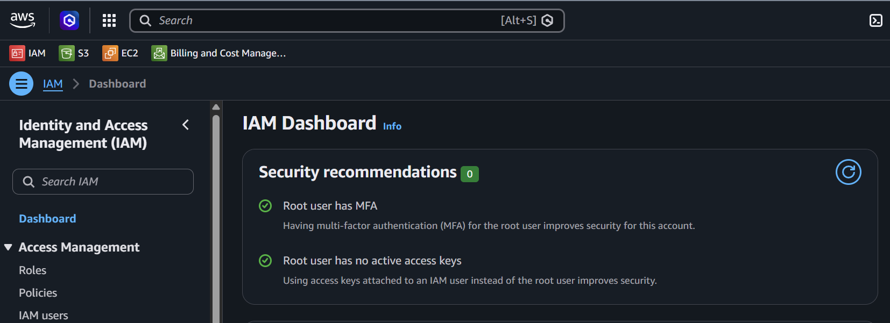
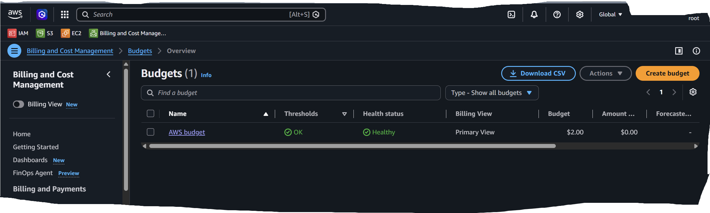

# README – Lab 1: Secure Your AWS Account

## Overview

This lab is part of the AWS learning journey and focuses on creating a safe AWS account foundation before starting hands-on cloud practice.

The main goal is to secure the AWS account by enabling root MFA, creating billing alerts, and avoiding daily use of the root user.

---

## Lab Goal

```text
Create a safe AWS account foundation for the next 10 weeks.
```

---

## What You Will Learn

In this lab, you will learn:

- Why AWS account security is important
- Why root user should be protected
- How MFA improves login security
- How to open the Billing Dashboard
- How to create a budget or billing alert
- Why root user should not be used for daily AWS practice
- What information must not be shared in screenshots

---

## Main Security Focus

```text
Protect root user
Enable MFA
Monitor billing
Create budget alerts
Use IAM users/roles for daily work
Do not expose sensitive account details
```

---

## Lab Steps

### Step 1 – Log in to AWS Account

Create or log in to your AWS account.

Use a strong password and keep root credentials private.

---

### Step 2 – Enable MFA on Root User

MFA stands for:

```text
Multi-Factor Authentication
```

It adds an extra verification step after the password.

Simple idea:

```text
Password + MFA code = safer login
```

---

### Step 3 – Open Billing Dashboard

Go to:

```text
AWS Console → Billing and Cost Management
```

Check current charges, Free Tier usage, and cost summary.

---

### Step 4 – Create Budget Alert

Create a budget alert to monitor AWS charges.

Example beginner budget:

```text
Budget amount: $2 or $5
Alert threshold: 80% or 100%
Notification: Email
```

---

### Step 5 – Stop Using Root User Daily

The root user has full access to the entire AWS account.

For daily AWS practice, use:

```text
IAM user
IAM role
IAM Identity Center user
```

---

## Deliverables

Add screenshots for:

| Deliverable | Description |
|---|---|
| Root MFA enabled | Screenshot showing root user has MFA enabled |
| Billing/Budget alert created | Screenshot showing budget alert created |
| Short note | Explanation of why root user should not be used daily |

---

## Suggested Folder Structure

```text
lab-1-secure-your-aws-account/
├── README.md
├── lab-1-secure-your-aws-account-study-notes.md
└── images/
    ├── account-MFA.png
    └── budget.png
```

---

## Screenshot Examples in Markdown

```html

```

```html

```

---

## Short Note for Submission

```text
The root user should not be used for daily activities because it has full access to the AWS account. If root credentials are exposed, the entire account can be compromised. For daily work, it is safer to use IAM users or roles with only the permissions required for the task.
```

---

## Screenshot Security Rules

Before sharing screenshots, crop or blur sensitive information.

Do not share:

```text
Root email
AWS account ID
Access keys
Secret access keys
MFA QR code
Payment details
Credit card information
Billing address
Detailed billing information
Personal phone number
```

---

## Common Mistakes

| Mistake | Better Practice |
|---|---|
| Not enabling MFA | Enable MFA immediately |
| Using root user daily | Use IAM user or role |
| Not creating budget alert | Create a small budget alert |
| Sharing account ID or email | Crop or blur screenshots |
| Sharing access keys | Never share keys |
| Thinking Free Tier means everything is free | Always check billing dashboard |

---

## Best Practices

```text
Enable root MFA
Create budget alerts
Check Billing Dashboard regularly
Do not use root user daily
Use IAM user/role for practice
Follow least privilege
Delete unused resources after labs
Protect screenshots before sharing
```

---

## Lab Completion Summary

```text
In Lab 1, I secured my AWS account by enabling MFA on the root user, checking the Billing Dashboard, creating a budget alert, and understanding why the root user should not be used for daily AWS activities.
```

---

## Final One-Line Summary

```text
Secure the AWS account first: enable root MFA, create billing alerts, and use IAM users or roles for daily work.
```

Alhamdulillah, Lab 1 is completed.
