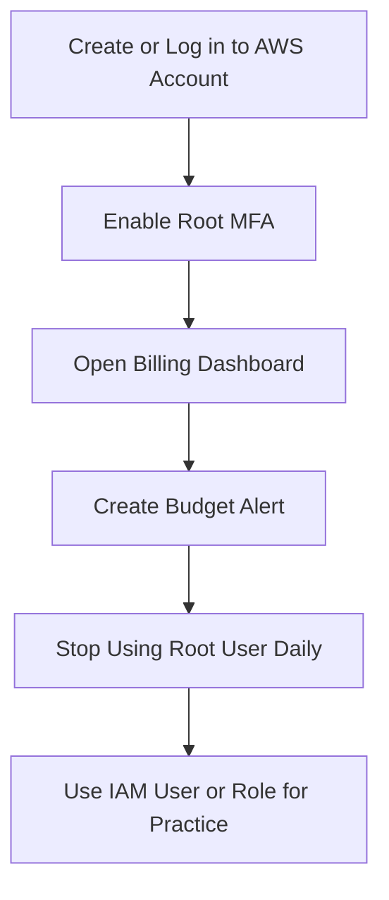

# Lab 1 – Secure Your AWS Account

## Goal

Create a safe AWS account foundation for the next 10 weeks of AWS practice.

The main purpose of this lab is to secure the AWS account before doing more hands-on work.

Main security focus:

```text
Protect root user
Enable MFA
Check billing dashboard
Create budget alerts
Stop using root user for daily work
Do not expose sensitive account details
```

---

# Why This Lab Is Important

AWS accounts can create real cloud resources, and some resources may create charges.

If the account is not secured properly, there can be security and billing risks.

This lab helps prevent:

```text
Unauthorized account access
Accidental billing surprises
Root user misuse
Sensitive information exposure
Uncontrolled AWS resource usage
```

---

# Key Concepts

| Term | Meaning |
|---|---|
| Root User | The main AWS account user with full access |
| MFA | Multi-Factor Authentication, an extra login protection step |
| Billing Dashboard | AWS page to check current charges and usage |
| Budget Alert | Notification when estimated cost reaches a limit |
| IAM User/Role | Safer identity for daily AWS activities |
| Free Tier | Limited free AWS usage, not all services are free |

---

# Lab Scenario

```text
Use your own AWS account.
Use the Free Tier carefully.
Do not share sensitive account details in screenshots.
```

The goal is to create a safe AWS account foundation before continuing AWS labs.

---

# Step 1 – Create or Log in to AWS Account

Open the AWS Console and sign in.

```text
AWS Management Console
```

Use a strong password for the root account.

Do not share the root login information with anyone.

---

# Step 2 – Enable MFA on Root User

MFA stands for:

```text
Multi-Factor Authentication
```

MFA adds an extra verification step during login.

Simple meaning:

```text
Password + MFA code = safer login
```

## Why MFA Is Important

If someone knows the password, they still cannot log in without the MFA code.

For the root user, MFA is very important because root has full access to the AWS account.

---

## Steps to Enable Root MFA

1. Sign in as the root user.
2. Go to account/security settings.
3. Choose MFA.
4. Add an authenticator app or security key.
5. Scan the QR code using an authenticator app.
6. Enter the MFA codes.
7. Confirm MFA is enabled.

Common authenticator apps:

```text
Google Authenticator
Microsoft Authenticator
Authy
Duo Mobile
```

---

# Step 3 – Open Billing Dashboard

Go to:

```text
AWS Console → Billing and Cost Management
```

Check:

```text
Current charges
Free Tier usage
Cost summary
Billing preferences
Payment method
Budget section
```

---

# Step 4 – Create Billing Alert / Budget Alert

A budget alert helps notify you before AWS charges become high.

Recommended beginner budget:

```text
Budget amount: $5
Alert threshold: 80% or 100%
Notification: Email
```

Example:

```text
If estimated AWS charges reach $4 or $5, send an email alert.
```

---

## Steps to Create a Budget

1. Open AWS Billing and Cost Management.
2. Go to Budgets.
3. Click Create budget.
4. Choose Cost budget.
5. Set budget amount, for example `$5`.
6. Add email notification.
7. Create the budget.

---

# Step 5 – Stop Using Root User for Daily Activities

The root user should only be used for important account-level tasks.

Do not use root user for daily AWS practice.

For daily work, use:

```text
IAM user
IAM role
IAM Identity Center user
```

---

# Why Root User Should Not Be Used Daily

The root user has complete access to the entire AWS account.

If root credentials are exposed, the whole account can be compromised.

Root user can access:

```text
All AWS services
Billing information
Account settings
Security settings
Payment settings
IAM settings
```

For daily practice, it is safer to use an IAM user or IAM role with limited permissions.

---

# Short Note for Deliverable

```text
The root user should not be used for daily activities because it has full access to the AWS account. If root credentials are exposed, the entire account can be compromised. For daily work, it is safer to use IAM users or roles with only the permissions required for the task.
```

---

# Deliverables


> Root MFA has been enabled successfully. The IAM dashboard shows that the root user has MFA and no active access keys, which improves account security.


> I created an AWS budget alert to monitor estimated charges. This helps prevent unexpected billing by notifying me when usage reaches the selected budget threshold.


---

# Screenshot Security Note

Before sharing screenshots, hide or crop sensitive information.

Do not share:

```text
Root email
AWS account ID
Access keys
Secret access keys
MFA QR code
Payment details
Credit card information
Detailed billing information
Personal address
Phone number
Security credentials
```

---

# Safe Screenshot Checklist

| Item | Safe to Share? | Note |
|---|---|---|
| MFA enabled status | Yes | Hide root email/account ID |
| Budget created status | Yes | Hide personal billing details |
| Root email | No | Crop or blur |
| Account ID | No | Crop or blur |
| Access key | No | Never share |
| Secret access key | No | Never share |
| MFA QR code | No | Never share |
| Payment details | No | Crop or blur |

---

# Common Mistakes

| Mistake | Why It Is a Problem | Better Practice |
|---|---|---|
| Not enabling MFA | Account is less secure | Enable MFA immediately |
| Using root user daily | Too much access | Use IAM user/role |
| Not creating budget alert | Cost surprise | Create $5 budget alert |
| Sharing screenshots with account ID | Security risk | Blur/crop sensitive details |
| Sharing access keys | Very dangerous | Delete/rotate exposed keys |
| Thinking Free Tier means everything is free | Can cause charges | Check billing dashboard |

---

# Best Practices

```text
Enable MFA on root user
Use a strong root password
Do not use root for daily work
Create billing budget alerts
Check Billing Dashboard regularly
Use IAM users or roles for practice
Follow least privilege
Do not share sensitive screenshots
Delete unused resources after labs
```

---

# Simple Flow



---

# Lab Completion Summary

```text
In this lab, I secured my AWS account by enabling MFA on the root user, opening the Billing Dashboard, creating a budget alert, and understanding why root user should not be used for daily AWS activities.
```

---

# Final One-Line Summary

```text
Secure the AWS account first: enable root MFA, create billing alerts, and use IAM users or roles for daily work.
```

Alhamdulillah, Lab 1 is completed.
