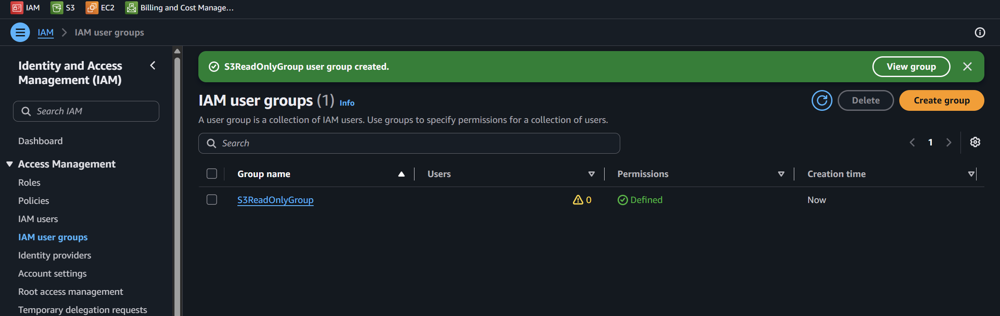
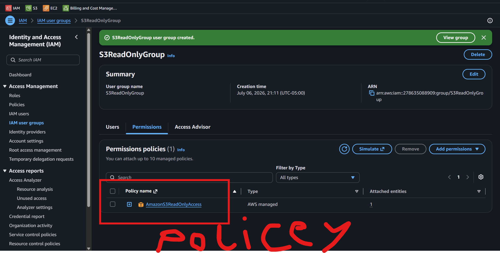
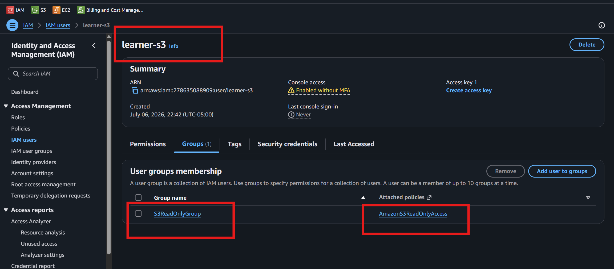
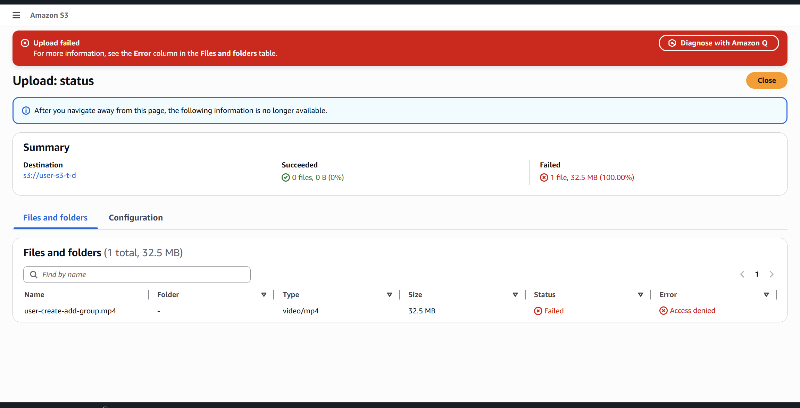
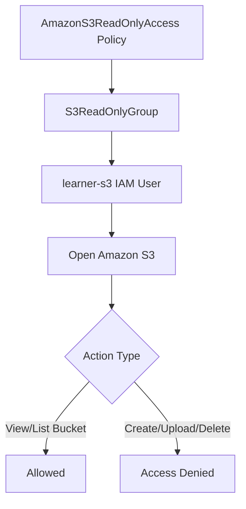

# Lab 2 – S3 Read-Only IAM Group and User

## Goal

Understand IAM group-based access in AWS.

In this lab, I will create an IAM group, attach an S3 read-only policy to the group, create an IAM user, add the user to the group, and test what the user can and cannot do in Amazon S3(Authorization).

---

# Main Concept

Instead of attaching permissions directly to each user, it is better to attach permissions to a group and then add users to that group.

Simple flow:

```text
Policy → Group → User
```

For this lab:

```text
AmazonS3ReadOnlyAccess policy
        ↓
S3ReadOnlyGroup
        ↓
learner-s3 user
        ↓
User can view/list S3
User cannot create, upload, delete, or modify S3 resources
```

---

# Why This Lab Is Important

This lab teaches two important AWS IAM concepts:

```text
Group-based access
Least privilege
```

## Group-Based Access

IAM groups help manage permissions for multiple users.

If many users need the same permission, attach the policy to the group and add users to the group.

## Least Privilege

Least privilege means giving only the permissions required for the task.

In this lab, the user only needs to view/list S3 buckets, so the user receives read-only S3 access.

---

# Lab Requirements

## Create Group

| Setting | Value |
|---|---|
| Group name | S3ReadOnlyGroup |
| Policy | AmazonS3ReadOnlyAccess |

## Create User

| Setting | Value |
|---|---|
| User name | learner-s3 |
| Add user to group | S3ReadOnlyGroup |

---

# Step 1 – Create IAM Group

Go to:

```text
AWS Console → IAM → User groups → Create group
```

Create a group with this name:

https://youtu.be/XdU8YmgvQ4M

<video src="videos/group-create.mp4" controls width="700"></video>


```text
S3ReadOnlyGroup
```

Attach this AWS managed policy:

```text
AmazonS3ReadOnlyAccess
```

This policy allows read-only access to Amazon S3.

---

## Screenshot Deliverable 1




Do not show sensitive account details.

---

# Step 2 – Confirm Policy Attached to Group

Open:

```text
IAM → User groups → S3ReadOnlyGroup → Permissions
```

Confirm this policy is attached:

```text
AmazonS3ReadOnlyAccess
```

---

## Screenshot Deliverable 2



```text
S3ReadOnlyGroup
AmazonS3ReadOnlyAccess policy attached
```

This proves the group has S3 read-only permission.

---

# Step 3 – Create IAM User

https://youtu.be/YFsNhmYQ9vc


<video src="videos/user-create-add-group.mp4" controls width="700"></video>


Go to:

```text
IAM → Users → Create user
```

Create a user with this name:

```text
learner-s3
```

If you need to test from the AWS Console, enable console access for the user.

Add the user to this group:

```text
S3ReadOnlyGroup
```

---

## Screenshot Deliverable 3


```text
IAM → Users → learner-s3 → Groups
```




---

# Step 4 – Test Login as learner-s3

https://youtu.be/XL8ybDt3WS4

<video src="videos/user-s3-edit-denied.mp4" controls width="700"></video>


Log in as the IAM user:

```text
learner-s3
```

Open:

```text
AWS Console → S3
```

The user should be able to:

```text
Open S3 console
View/list S3 buckets
View bucket details allowed by read-only permission
```

---

## Configure Multiple Users on CLI

[Configure Multiple Users on CLI](md/configure-different-aws-users-cli-profiles-study-notes.md)


---

## Screenshot Deliverable 4




```text
Amazon S3 → Buckets
```

This proves the read-only action is allowed.

---

# Step 5 – Test Denied Action

Now try an action that requires write or admin permission.

Examples:

```text
Create bucket
Upload file
Delete object
Delete bucket
Change bucket permissions
Change bucket policy
```

Because the user only has read-only access, the action should fail.

Expected result:

```text
Access Denied
You don't have permissions
```

---

## Screenshot Deliverable 5

Take screenshot of the denied action.

Screenshot should show:

```text
Access Denied
```

or:

```text
You don't have permissions
```

This proves that least privilege is working.

---

# Testing Table

| Test | Expected Result | Reason |
|---|---|---|
| Open S3 console | Allowed | User has S3 read-only access |
| List buckets | Allowed | AmazonS3ReadOnlyAccess allows viewing/listing |
| Create bucket | Denied | Read-only policy does not allow create actions |
| Upload object | Denied | Read-only policy does not allow write actions |
| Delete object | Denied | Read-only policy does not allow delete actions |

---

# IAM Permission Flow Diagram



---

# Allowed vs Denied Actions

## Allowed Actions

The user should be able to perform read-only actions such as:

```text
View S3 dashboard
List buckets
View bucket names
View object list if allowed
View basic bucket details
```

## Denied Actions

The user should not be able to perform write or delete actions such as:

```text
Create bucket
Upload object
Delete object
Delete bucket
Modify bucket policy
Modify bucket permissions
```

---

# Why Access Denied Is Good Here

In this lab, **Access Denied is expected**.

It means the user does not have permission for actions outside the assigned policy.

This proves:

```text
The policy is working
The group permission is working
Least privilege is working
The user does not have extra access
```

---

# Short Note for Deliverable

```text
In this lab, I created an IAM group named S3ReadOnlyGroup and attached the AmazonS3ReadOnlyAccess policy to it. Then I created an IAM user named learner-s3 and added the user to the group. After logging in as learner-s3, I confirmed that the user could view/list S3 buckets but could not perform write actions such as creating, uploading, or deleting resources. This lab helped me understand IAM group-based access and least privilege.
```

---

# Deliverables Checklist

| Deliverable | Status |
|---|---|
| Screenshot of group created | Required |
| Screenshot of user added to group | Required |
| Screenshot of policy attached | Required |
| Screenshot of allowed S3 view/list action | Required |
| Screenshot of denied action | Required |

---

# Screenshot Security Note

Before sharing screenshots, hide or crop sensitive information.

Do not share:

```text
AWS account ID
Root email
IAM sign-in URL if sensitive
Temporary password
Access keys
Secret access keys
MFA QR code
Payment details
Personal billing information
Personal email if visible
```

---

# Common Mistakes

| Mistake | Problem | Fix |
|---|---|---|
| Attaching policy directly to user | Harder to manage users at scale | Attach policy to group |
| Forgetting to add user to group | User will not receive group permissions | Add learner-s3 to S3ReadOnlyGroup |
| Using AdministratorAccess | Too much permission | Use AmazonS3ReadOnlyAccess |
| Expecting upload to work | User is read-only | Upload should be denied |
| Sharing sensitive screenshots | Security risk | Crop or blur private details |
| Testing as root user | Wrong test | Log in as learner-s3 |

---

# Best Practices Learned

```text
Use IAM groups to manage common permissions
Use AWS managed policies for beginner labs
Use least privilege
Avoid AdministratorAccess for learners
Test both allowed and denied actions
Use IAM users/roles instead of root user
Protect credentials and screenshots
```

---

# Final Summary

```text
Lab 2 teaches IAM group-based access by attaching AmazonS3ReadOnlyAccess to S3ReadOnlyGroup and adding learner-s3 to that group. The user can view/list S3 resources but cannot create, upload, delete, or modify S3 resources.
```

Alhamdulillah, Lab 2 helped me understand how IAM group permissions and least privilege work in AWS.
