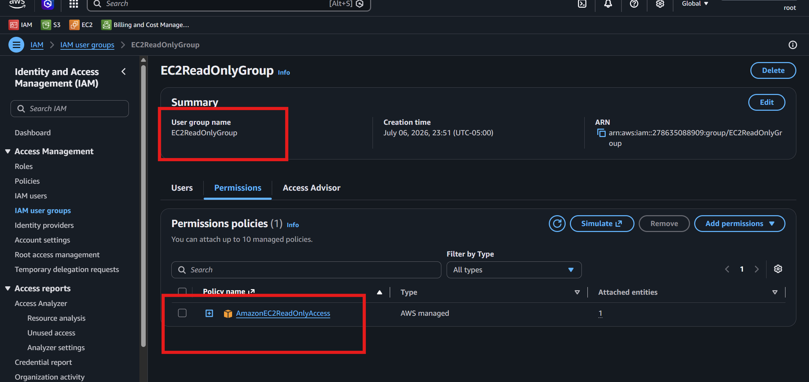
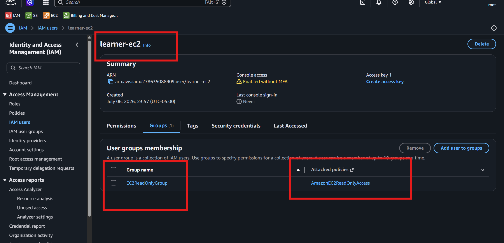
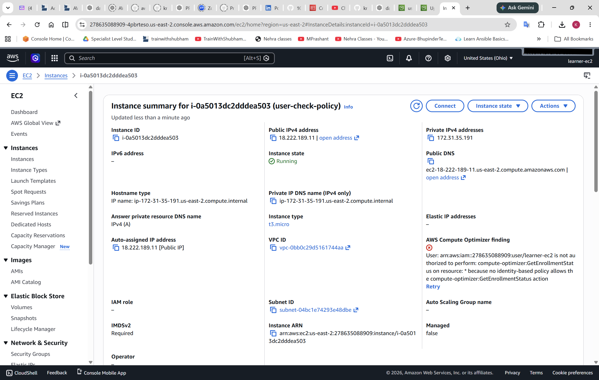
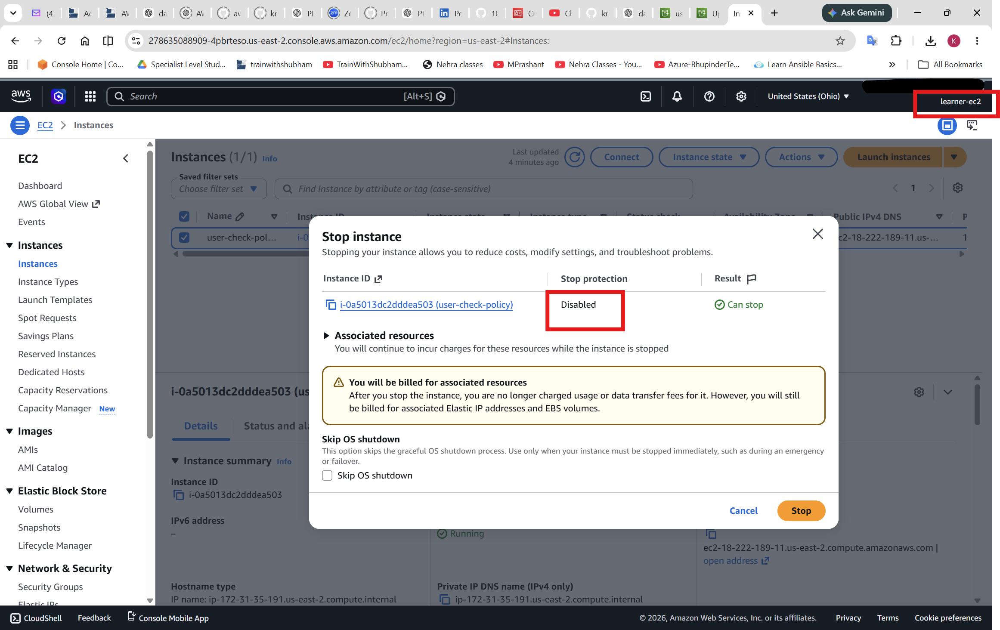
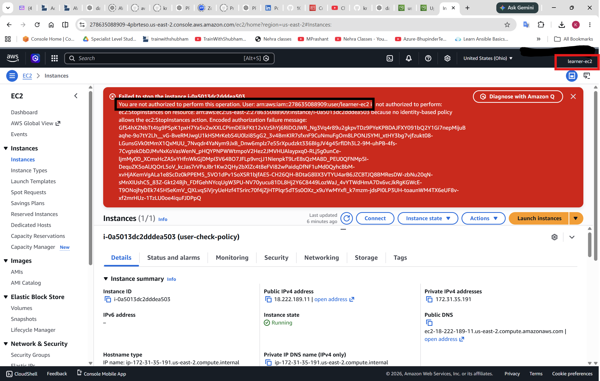
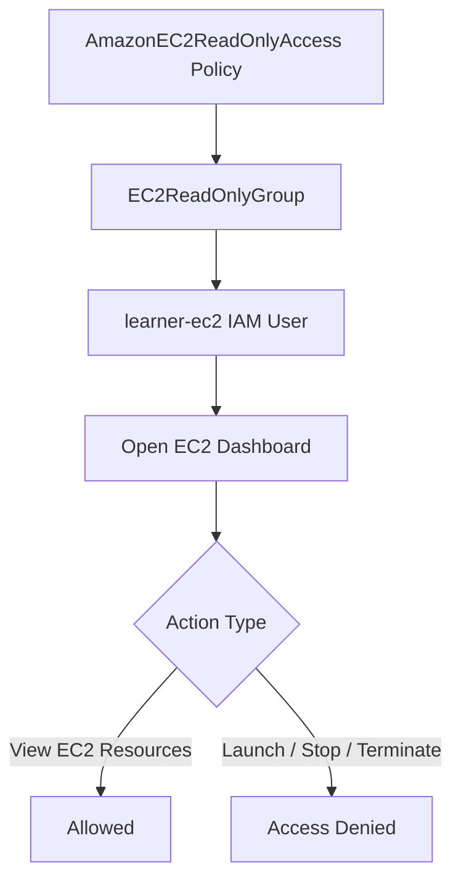

# Lab 3 – EC2 Read-Only Access

## Goal

Apply **least privilege** to Amazon EC2.

In this lab, I will create an IAM group with EC2 read-only permissions, create an IAM user, add the user to the group, and test that the user can view EC2 resources but cannot create or terminate instances.

---

# Main Concept

The main IAM permission flow is:

```text
Policy → Group → User
```

For this lab:

```text
AmazonEC2ReadOnlyAccess
        ↓
EC2ReadOnlyGroup
        ↓
learner-ec2
        ↓
Can view EC2 resources
Cannot create, stop, start, or terminate EC2 instances
```

---

# Why This Lab Is Important

This lab helps understand:

```text
IAM groups
IAM users
AWS managed policies
EC2 read-only access
Least privilege
Allowed vs denied actions
```

The most important security idea is:

```text
Give only the permissions required for the task.
```

If a user only needs to view EC2 resources, then the user should not receive permission to launch or terminate EC2 instances.

---

# Lab Requirements

## Create Group

| Setting | Value |
|---|---|
| Group name | EC2ReadOnlyGroup |
| Policy | AmazonEC2ReadOnlyAccess |

## Create User

| Setting | Value |
|---|---|
| User name | learner-ec2 |
| Add user to group | EC2ReadOnlyGroup |

---

# Step 1 – Create IAM Group

Go to:

```text
AWS Console → IAM → User groups → Create group
```

Create a group with this name:

```text
EC2ReadOnlyGroup
```

Attach this AWS managed policy:

```text
AmazonEC2ReadOnlyAccess
```

This policy allows the user to view EC2 resources but not modify them.

---

## Screenshot Deliverable 1

Take screenshot of:

```text
IAM → User groups → EC2ReadOnlyGroup
```




```text
Group name: EC2ReadOnlyGroup
```

---

# Step 2 – Confirm Policy Attached

Open:

```text
IAM → User groups → EC2ReadOnlyGroup → Permissions
```

Confirm this policy is attached:

```text
AmazonEC2ReadOnlyAccess
```

---

## Screenshot Deliverable 2


```text
EC2ReadOnlyGroup
AmazonEC2ReadOnlyAccess policy attached
```

This proves the group has EC2 read-only permission.

---

# Step 3 – Create IAM User

Go to:

```text
IAM → Users → Create user
```

Create a user with this name:

```text
learner-ec2
```

If testing through the AWS Console, enable console access for this user.

Add the user to this group:

```text
EC2ReadOnlyGroup
```

---

## Optional Screenshot

Take screenshot of:

```text
IAM → Users → learner-ec2 → Groups
```




```text
learner-ec2 is a member of EC2ReadOnlyGroup
```

---

# Step 4 – Log in as learner-ec2

Log out from the current AWS user or open another browser/incognito window.

Log in as:

```text
learner-ec2
```

Then open:

```text
AWS Console → EC2
```

---

# Step 5 – Test Allowed EC2 Dashboard Access

The user should be able to view EC2 resources.

Allowed view actions may include:

```text
View EC2 Dashboard
View Instances
View Security Groups
View Key Pairs
View AMIs
View Volumes
View Elastic IPs
View Load Balancers
```

---

## Screenshot Deliverable 3

Take screenshot of:

```text
AWS Console → EC2 Dashboard
```

Screenshot should show that `learner-ec2` can view EC2 resources.

This proves EC2 read-only access is working.

---

# Step 6 – Test Denied Create or Terminate Action

Try an action that requires write/admin permission.

Examples:

```text
Launch instance
Terminate instance
Stop instance
Start instance
Create security group
Delete security group
Create key pair
Delete key pair
Modify instance settings
```

Expected result:

```text
Access Denied
You are not authorized
```

This is correct because `learner-ec2` only has read-only access.

---

## Screenshot Deliverable 4








Example note:

```text
When logged in as learner-ec2, I tried to launch or terminate an EC2 instance, but the action was denied because the user only has AmazonEC2ReadOnlyAccess.
```

---

# Testing Table

| Test | Expected Result | Reason |
|---|---|---|
| Open EC2 Dashboard | Allowed | User has EC2 read-only access |
| View instances | Allowed | Read-only policy allows viewing EC2 resources |
| View security groups | Allowed | Describe/view actions are allowed |
| Launch instance | Denied | Read-only policy does not allow create actions |
| Terminate instance | Denied | Read-only policy does not allow delete/terminate actions |
| Start/stop instance | Denied | These are modification actions |

---

# IAM Permission Flow Diagram



---

# Allowed vs Denied Actions

## Allowed Actions

The user should be able to view EC2 information such as:

```text
Instances
AMIs
Volumes
Snapshots
Security groups
Key pairs
Elastic IPs
Regions
Availability Zones
Load balancers
```

## Denied Actions

The user should not be able to make changes such as:

```text
Launch instance
Terminate instance
Start instance
Stop instance
Reboot instance
Create security group
Delete security group
Create key pair
Modify instance settings
```

---

# Why Access Denied Is Good Here

In this lab, **Access Denied is expected** for create, modify, or terminate actions.

It proves:

```text
Least privilege is working
The user only has read-only access
The policy is correctly attached to the group
The user is receiving permissions from the group
The user does not have extra permissions
```

---

# Short Note for Deliverable

```text
In this lab, I created an IAM group named EC2ReadOnlyGroup and attached the AmazonEC2ReadOnlyAccess policy to it. Then I created an IAM user named learner-ec2 and added the user to the group. After logging in as learner-ec2, I confirmed that the user could view EC2 resources but could not create, start, stop, or terminate EC2 instances. This lab helped me understand least privilege for EC2 access.
```

---

# Deliverables Checklist

| Deliverable | Status |
|---|---|
| Screenshot of EC2ReadOnlyGroup | Required |
| Screenshot of AmazonEC2ReadOnlyAccess policy attached | Required |
| Screenshot of EC2 dashboard access | Required |
| Screenshot or note for denied create/terminate action | Required |

---

# Screenshot Security Note

Before sharing screenshots, hide or crop sensitive information.

Do not share:

```text
AWS account ID
Root email
IAM sign-in URL if sensitive
Temporary password
Access keys
Secret access keys
MFA QR code
Payment details
Personal billing information
Instance public IP if not needed
Private keys or key pair content
```

---

# Common Mistakes

| Mistake | Problem | Fix |
|---|---|---|
| Attaching policy directly to user | Harder to manage at scale | Attach policy to group |
| Forgetting to add user to group | User will not receive permissions | Add learner-ec2 to EC2ReadOnlyGroup |
| Using AdministratorAccess | Too much permission | Use AmazonEC2ReadOnlyAccess |
| Testing as root user | Wrong test | Log in as learner-ec2 |
| Expecting launch instance to work | User is read-only | Launch should be denied |
| Sharing sensitive screenshots | Security risk | Crop or blur sensitive details |

---

# Best Practices Learned

```text
Use IAM groups for common permissions
Use read-only policies for learner users
Apply least privilege
Avoid AdministratorAccess for practice users
Test both allowed and denied actions
Do not use root user for daily work
Protect screenshots and credentials
```

---

# Final Summary

```text
Lab 3 teaches least privilege for EC2 by attaching AmazonEC2ReadOnlyAccess to EC2ReadOnlyGroup and adding learner-ec2 to that group. The user can view EC2 resources but cannot create, stop, start, or terminate EC2 instances.
```

Alhamdulillah, Lab 3 helped me understand how to safely provide EC2 read-only access using IAM groups.
