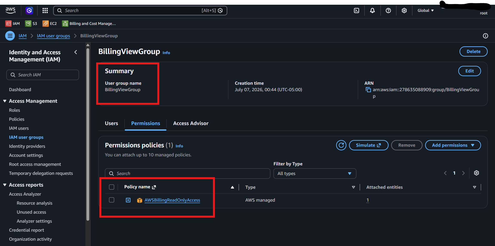
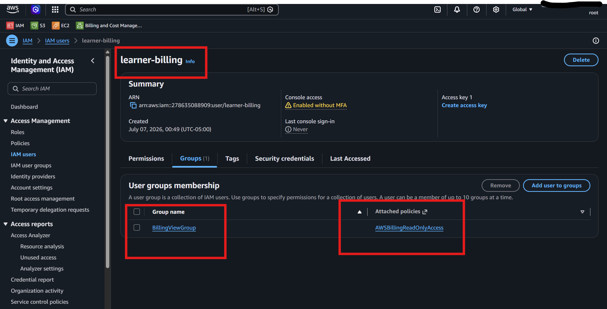
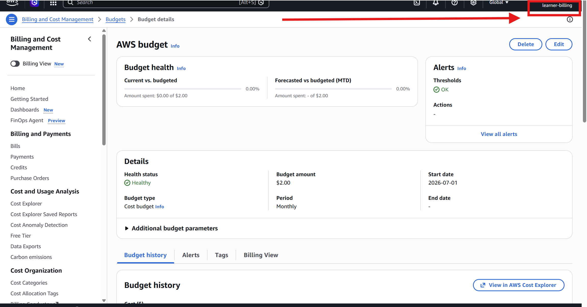
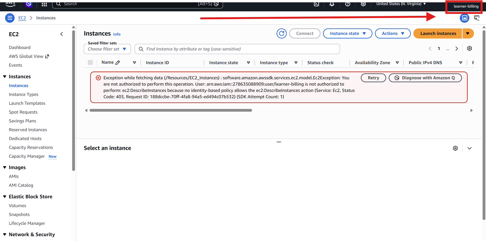
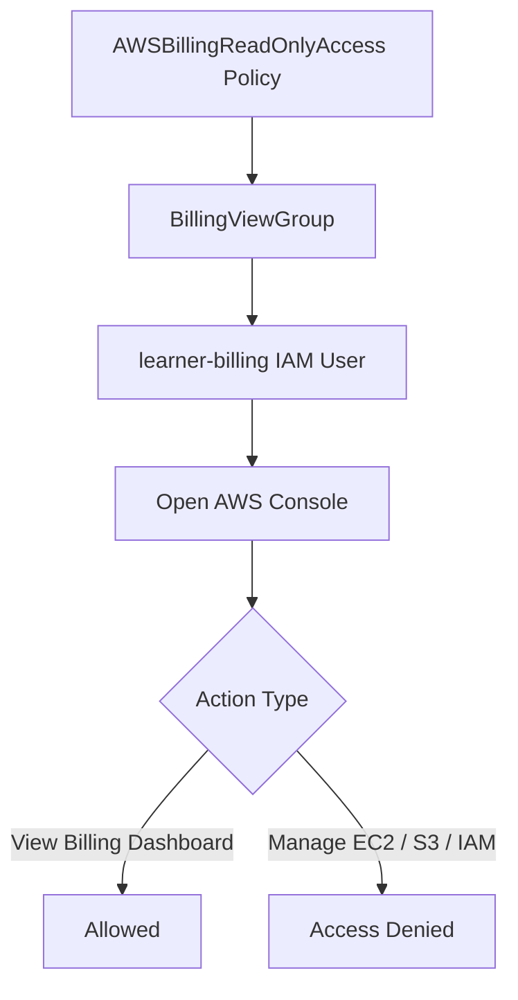

# Lab 4 – Billing View Access

## Goal

Understand billing access with limited permissions.

In this lab, I will create an IAM group with billing read-only permissions, create an IAM user, add the user to the group, and test that the user can view the Billing Dashboard but cannot manage unrelated AWS services.

---

# Main Concept

The main IAM permission flow is:

```text
Policy → Group → User
```

For this lab:

```text
AWSBillingReadOnlyAccess
        ↓
BillingViewGroup
        ↓
learner-billing
        ↓
Can view billing information
Cannot manage unrelated AWS services
```

---

# Important Note About Billing Access

IAM users and roles may not be able to access Billing and Cost Management by default.

The root user may need to activate IAM access to billing first.

If `learner-billing` gets Access Denied on the Billing Dashboard, check this setting using the root user:

```text
Root user → Account settings → IAM user and role access to Billing information → Activate IAM Access
```

After activating IAM billing access, log in again as `learner-billing` and test the Billing Dashboard.

---

# Why This Lab Is Important

This lab helps understand:

```text
IAM group-based permissions
Billing read-only access
Limited permissions
Least privilege
Allowed vs denied actions
Billing security
```

The main security idea is:

```text
Give billing visibility only, not full AWS service access.
```

---

# Lab Requirements

## Create Group

| Setting | Value |
|---|---|
| Group name | BillingViewGroup |
| Policy | AWSBillingReadOnlyAccess |

## Create User

| Setting | Value |
|---|---|
| User name | learner-billing |
| Add user to group | BillingViewGroup |

---

# Step 1 – Create IAM Group

Go to:

```text
AWS Console → IAM → User groups → Create group
```

Create a group with this name:

```text
BillingViewGroup
```

Attach this AWS managed policy:

```text
AWSBillingReadOnlyAccess
```

This policy allows billing read-only access.

---

## Screenshot Deliverable 1




```text
IAM → User groups → BillingViewGroup
```


```text
Group name: BillingViewGroup
```

---

# Step 2 – Confirm Billing Policy Attached


Open:

```text
IAM → User groups → BillingViewGroup → Permissions
```

Confirm this policy is attached:

```text
AWSBillingReadOnlyAccess
```

---


# Step 3 – Create IAM User

Go to:

```text
IAM → Users → Create user
```

Create a user with this name:

```text
learner-billing
```

If testing through the AWS Console, enable console access for this user.

Add the user to this group:

```text
BillingViewGroup
```

---

## Optional Screenshot



```text
IAM → Users → learner-billing → Groups
```

```text
learner-billing is a member of BillingViewGroup
```

---

# Step 4 – Log in as learner-billing

Log out from the current AWS user or open another browser/incognito window.

Log in as:

```text
learner-billing
```

Then open:

```text
AWS Console → Billing and Cost Management
```

---

# Step 5 – Test Billing Dashboard Access

The user should be able to view billing-related information.

Allowed billing view actions may include:

```text
Open Billing Dashboard
View cost summary
View current charges
View budgets
View cost-related pages
View billing information
```

---

## Screenshot Deliverable 3




```text
AWS Console → Billing and Cost Management
```

Screenshot should show that `learner-billing` can view the Billing Dashboard.

This proves billing read-only access is working.

---

# Step 6 – Confirm User Cannot Manage Unrelated Services

Now try to open or manage unrelated AWS services.

Examples:

```text
EC2 launch instance
S3 create bucket
IAM create user
IAM attach policy
Terminate EC2 instance
Delete S3 bucket
```

Expected result:

```text
Access Denied
You are not authorized
```

This is correct because the user only has billing read-only access.

---

## Optional Screenshot or Note




Example note:

```text
When logged in as learner-billing, I tried to manage an unrelated AWS service, but the action was denied because the user only has AWSBillingReadOnlyAccess.
```

---

# Testing Table

| Test | Expected Result | Reason |
|---|---|---|
| Open Billing Dashboard | Allowed | User has billing read-only access |
| View billing summary | Allowed | Billing read-only policy allows viewing |
| View budgets | Allowed | User can view billing-related data |
| Launch EC2 instance | Denied | Billing policy does not allow EC2 management |
| Create S3 bucket | Denied | Billing policy does not allow S3 management |
| Create IAM user | Denied | Billing policy does not allow IAM management |

---

# IAM Permission Flow Diagram



---

# Allowed vs Denied Actions

## Allowed Actions

The user should be able to view billing-related information such as:

```text
Billing Dashboard
Current charges
Cost summary
Budgets
Cost and usage information
Billing-related pages
```

## Denied Actions

The user should not be able to manage unrelated AWS services such as:

```text
Launch EC2 instance
Terminate EC2 instance
Create S3 bucket
Delete S3 bucket
Create IAM user
Attach IAM policies
Modify AWS resources
```

---

# Why Access Denied Is Good Here

In this lab, **Access Denied is expected** for unrelated AWS service management.

It proves:

```text
Least privilege is working
The user only has billing view access
The policy is correctly attached to the group
The user is receiving permissions from the group
The user does not have extra permissions
```

---

# Short Note for Deliverable

```text
In this lab, I created an IAM group named BillingViewGroup and attached the AWSBillingReadOnlyAccess policy. Then I created an IAM user named learner-billing and added the user to the group. After logging in as learner-billing, I verified that the user could view billing information but could not manage unrelated AWS services. This lab helped me understand billing access with limited permissions.
```

---

# Deliverables Checklist

| Deliverable | Status |
|---|---|
| Screenshot of BillingViewGroup | Required |
| Screenshot of AWSBillingReadOnlyAccess policy attached | Required |
| Screenshot of Billing Dashboard access | Required |
| Screenshot or note for denied unrelated service action | Optional but recommended |

---

# Screenshot Security Note

Before sharing screenshots, hide or crop sensitive information.

Do not share:

```text
AWS account ID
Root email
IAM sign-in URL if sensitive
Temporary password
Access keys
Secret access keys
MFA QR code
Payment details
Credit card information
Billing address
Detailed invoice information
Personal email
Personal phone number
```

---

# Common Mistakes

| Mistake | Problem | Fix |
|---|---|---|
| IAM user cannot access Billing Dashboard | IAM billing access may not be activated | Activate IAM access to billing from root account settings |
| Attaching policy directly to user | Harder to manage at scale | Attach policy to group |
| Forgetting to add user to group | User will not receive permissions | Add learner-billing to BillingViewGroup |
| Using AdministratorAccess | Too much permission | Use AWSBillingReadOnlyAccess |
| Testing as root user | Wrong test | Log in as learner-billing |
| Sharing billing/payment details | Security risk | Crop or blur sensitive details |

---

# Best Practices Learned

```text
Use IAM groups for common permissions
Use billing read-only access when only visibility is needed
Do not give AdministratorAccess for billing view tasks
Apply least privilege
Test allowed and denied actions
Protect billing screenshots
Do not use root user for daily work
Check billing dashboard regularly
```

---

# Troubleshooting

## Problem: learner-billing gets Access Denied on Billing Dashboard

Possible reason:

```text
IAM access to Billing and Cost Management is not activated.
```

Fix:

```text
Sign in as root user
Go to Account settings
Find IAM user and role access to Billing information
Activate IAM Access
Sign out
Log in again as learner-billing
Test Billing Dashboard again
```

---

## Problem: user can view billing but cannot create EC2 or S3

This is expected.

Reason:

```text
learner-billing only has AWSBillingReadOnlyAccess.
```

This proves least privilege is working.

---

# Final Summary

```text
Lab 4 teaches billing view access by attaching AWSBillingReadOnlyAccess to BillingViewGroup and adding learner-billing to that group. The user can view billing information but cannot manage unrelated AWS services.
```

Alhamdulillah, Lab 4 helped me understand billing access with limited permissions using IAM groups.
