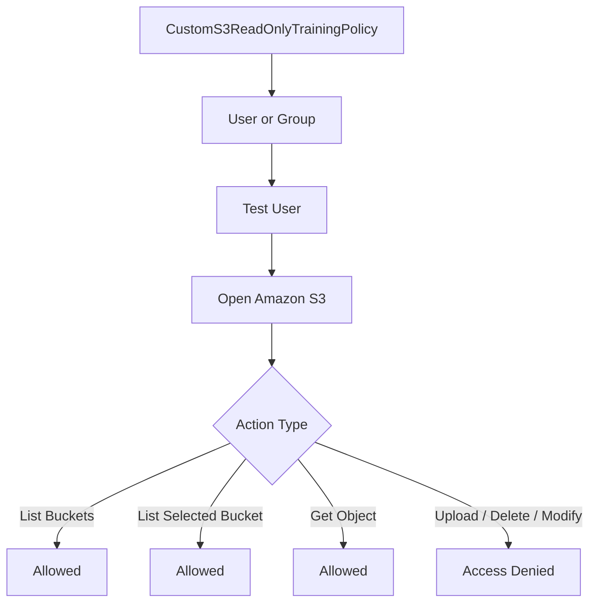

# Lab 5 – Custom S3 Read-Only JSON Policy

## Goal

Read and create a basic IAM JSON policy.

In this lab, I will create a customer-managed IAM policy that gives read-only access to one specific S3 bucket.

---

# Main Concept

In previous labs, I used AWS managed policies such as:

```text
AmazonS3ReadOnlyAccess
AmazonEC2ReadOnlyAccess
AWSBillingReadOnlyAccess
```

In this lab, I will create my own policy.

This is called a:

```text
Customer-managed policy
```

Policy name:

```text
CustomS3ReadOnlyTrainingPolicy
```

---

# Why This Lab Is Important

This lab helps understand:

```text
IAM JSON policy structure
Customer managed policies
S3 actions
S3 resource ARNs
Least privilege
Allowed vs denied actions
```

The main idea is:

```text
Give read-only access to one specific S3 bucket, not all S3 buckets.
```

---

# Policy Flow

```text
Custom JSON Policy
        ↓
IAM Policy Created
        ↓
Attach Policy to User or Group
        ↓
User can read one selected S3 bucket
        ↓
User cannot upload, delete, or modify S3 resources
```

---

# Recommended Repo File Name

Save the policy JSON in your repo with this name:

```text
custom-s3-read-only-training-policy.json
```

Example folder structure:

```text
lab-5-custom-s3-read-only-json-policy/
├── README.md
├── custom-s3-read-only-training-policy.json
└── images/
    ├── custom-policy-created.png
    ├── allowed-s3-action.png
    └── denied-s3-action.png
```

---

# Step 1 – Choose Your S3 Bucket Name

Before creating the policy, choose the S3 bucket that should be read-only.

bucket name:

```text
user-s3-t-d
```

---

https://youtu.be/xMPRSQWoEPo

<video src="videos/custom-policy.mp4" controls width="700"></video>


# Step 2 – Create Customer Managed Policy

Go to:

```text
AWS Console → IAM → Policies → Create policy
```

Choose:

```text
JSON
```

Paste the policy JSON.

Policy name:

```text
CustomS3ReadOnlyTrainingPolicy
```
Description:
```text
Allows read-only access to one specific S3 bucket for training and least privilege practice.
```

---

# Sample Policy JSON

Replace `YOUR-BUCKET-NAME` with your actual bucket name.

```json
{
  "Version": "2012-10-17",
  "Statement": [
    {
      "Effect": "Allow",
      "Action": [
        "s3:ListAllMyBuckets",
        "s3:GetBucketLocation"
      ],
      "Resource": "*"
    },
    {
      "Effect": "Allow",
      "Action": [
        "s3:ListBucket"
      ],
      "Resource": "arn:aws:s3:::YOUR-BUCKET-NAME"
    },
    {
      "Effect": "Allow",
      "Action": [
        "s3:GetObject"
      ],
      "Resource": "arn:aws:s3:::YOUR-BUCKET-NAME/*"
    }
  ]
}
```

---

# Example Policy with Real Bucket Name

If my bucket name is:

```text
user-s3-t-d
```

Then the policy becomes:

```json
{
  "Version": "2012-10-17",
  "Statement": [
    {
      "Effect": "Allow",
      "Action": [
        "s3:ListAllMyBuckets",
        "s3:GetBucketLocation"
      ],
      "Resource": "*"
    },
    {
      "Effect": "Allow",
      "Action": [
        "s3:ListBucket"
      ],
      "Resource": "arn:aws:s3:::user-s3-t-d"
    },
    {
      "Effect": "Allow",
      "Action": [
        "s3:GetObject"
      ],
      "Resource": "arn:aws:s3:::user-s3-t-d/*"
    }
  ]
}
```

---

# Policy Explanation

## Version

```json
"Version": "2012-10-17"
```

This is the IAM policy language version.

## Statement

```json
"Statement": []
```

The `Statement` section contains one or more permission rules.

Each rule defines:

```text
Effect
Action
Resource
```

## Effect

```json
"Effect": "Allow"
```

This means the listed actions are allowed.

Possible values:

```text
Allow
Deny
```

Important:

```text
Explicit Deny always wins.
```

## Action

```json
"Action": [
  "s3:ListBucket"
]
```

`Action` means what AWS API action is allowed.

Examples:

```text
s3:ListAllMyBuckets
s3:GetBucketLocation
s3:ListBucket
s3:GetObject
```

## Resource

```json
"Resource": "arn:aws:s3:::YOUR-BUCKET-NAME"
```

[Resource": "arn:aws:s3:::YOUR-BUCKET-NAME study notes](md/explain-s3-resource-arn-study-notes.md)

`Resource` means where the permission applies.

| Part               | Meaning                                        |
| ------------------ | ---------------------------------------------- |
| `arn`              | Amazon Resource Name                           |
| `aws`              | AWS partition                                  |
| `s3`               | AWS service name                               |
| `:::`              | S3 ARN format uses empty region/account fields |
| `YOUR-BUCKET-NAME` | Your actual S3 bucket name                     |


For S3 bucket itself:

```text
arn:aws:s3:::bucket-name
```

For objects inside the bucket:

```text
arn:aws:s3:::bucket-name/*
```

---

# What Each Policy Section Allows

## Section 1 – List Buckets and Get Bucket Location

```json
{
  "Effect": "Allow",
  "Action": [
    "s3:ListAllMyBuckets",
    "s3:GetBucketLocation"
  ],
  "Resource": "*"
}
```

Meaning:

```text
User can see the bucket list and get bucket location.
```

Why `Resource` is `*` here:

```text
Some S3 list actions require Resource "*".
```

## Section 2 – List One Specific Bucket

```json
{
  "Effect": "Allow",
  "Action": [
    "s3:ListBucket"
  ],
  "Resource": "arn:aws:s3:::YOUR-BUCKET-NAME"
}
```

Meaning:

```text
User can list objects inside the selected bucket.
```

This permission applies to the bucket itself.

## Section 3 – Read Objects Inside the Bucket

```json
{
  "Effect": "Allow",
  "Action": [
    "s3:GetObject"
  ],
  "Resource": "arn:aws:s3:::YOUR-BUCKET-NAME/*"
}
```

Meaning:

```text
User can read/download objects inside the selected bucket.
```

This permission applies to objects inside the bucket.

---

# Step 3 – Attach Policy

Attach the custom policy to an IAM user or group.

Recommended method:

```text
Policy → Group → User
```

Example:

```text
CustomS3ReadOnlyTrainingPolicy
        ↓
S3CustomReadOnlyGroup
        ↓
learner-s3
```

You can also attach it directly to a test user, but group-based access is better for learning and management.

---

# Step 4 – Test Allowed Actions

https://youtu.be/nrwon5sKtAc

<video src="videos/try-to-creat-folder-with-not-allowed-policy.mp4" controls width="700"></video>


Log in as the test user.

Open:

```text
AWS Console → S3
```

Allowed actions should include:

```text
List buckets
Open selected bucket
List objects inside selected bucket
Read/download objects from selected bucket
```

## CLI Allowed Test

```bash
aws s3 ls --profile learner-s3
```

List selected bucket:

```bash
aws s3 ls s3://YOUR-BUCKET-NAME --profile learner-s3
```

Download/read object:

```bash
aws s3 cp s3://YOUR-BUCKET-NAME/example.txt . --profile learner-s3
```

---

# Step 5 – Test Denied Actions

Try actions that are not allowed.

Examples:

```text
Create bucket
Upload file
Delete object
Delete bucket
Modify bucket policy
Open/read another restricted bucket
```

Expected result:

```text
Access Denied
You are not authorized
```

## CLI Denied Test Examples

Try to create a bucket:

```bash
aws s3 mb s3://my-test-denied-bucket --profile learner-s3
```

Try to upload a file:

```bash
echo "test" > test.txt
aws s3 cp test.txt s3://YOUR-BUCKET-NAME/ --profile learner-s3
```

Try to delete an object:

```bash
aws s3 rm s3://YOUR-BUCKET-NAME/example.txt --profile learner-s3
```

Expected:

```text
AccessDenied
```

---

# Testing Table

| Test | Expected Result | Reason |
|---|---|---|
| List all buckets | Allowed | `s3:ListAllMyBuckets` is allowed |
| Get bucket location | Allowed | `s3:GetBucketLocation` is allowed |
| List selected bucket | Allowed | `s3:ListBucket` is allowed for selected bucket |
| Read/download object | Allowed | `s3:GetObject` is allowed for selected bucket objects |
| Upload object | Denied | `s3:PutObject` is not allowed |
| Delete object | Denied | `s3:DeleteObject` is not allowed |
| Create bucket | Denied | `s3:CreateBucket` is not allowed |
| Modify bucket policy | Denied | Policy modification is not allowed |

---

# IAM Permission Flow Diagram



---

# Deliverables

| Deliverable | Description |
|---|---|
| Policy JSON in repo | Save the JSON policy file in your GitHub repo |
| Screenshot of custom policy created | Show `CustomS3ReadOnlyTrainingPolicy` created |
| Screenshot of allowed action | Show user can list/read selected S3 bucket |
| Screenshot or note for denied action | Show upload/delete/create action is denied |

---

# Screenshot Security Note

Before sharing screenshots, hide or crop sensitive information.

Do not share:

```text
AWS account ID
Root email
IAM sign-in URL if sensitive
Temporary password
Access keys
Secret access keys
MFA QR code
Payment details
Personal email
Private bucket data if sensitive
```

---

# Short Note for Deliverable

```text
In this lab, I created a customer managed IAM policy named CustomS3ReadOnlyTrainingPolicy. This policy allows read-only access to one selected S3 bucket. The user can list buckets, view the selected bucket, and read objects inside that bucket, but cannot upload, delete, create buckets, or modify S3 resources. This lab helped me understand IAM JSON policy structure, S3 actions, S3 resource ARNs, and least privilege.
```

---

# Common Mistakes

| Mistake | Problem | Fix |
|---|---|---|
| Forgetting to replace YOUR-BUCKET-NAME | Policy will not work for your bucket | Use actual bucket name |
| Using bucket ARN for object actions | `GetObject` needs object ARN with `/*` | Use `arn:aws:s3:::bucket-name/*` |
| Using object ARN for bucket list action | `ListBucket` needs bucket ARN only | Use `arn:aws:s3:::bucket-name` |
| Expecting upload to work | Policy is read-only | Upload should be denied |
| Giving `s3:*` on all buckets | Too much permission | Scope to specific actions and bucket |
| Sharing access keys in screenshots | Security risk | Never share keys |

---

# Best Practices Learned

```text
Use customer managed policies for custom permissions
Use least privilege
Scope permissions to specific resources
Separate bucket-level and object-level permissions
Test both allowed and denied actions
Save policy JSON in repo
Do not expose credentials or sensitive screenshots
```

---

# Final Summary

```text
Lab 5 teaches how to create a custom S3 read-only IAM JSON policy. The policy allows listing buckets, listing one selected bucket, and reading objects inside that bucket, while denying upload, delete, create, and modify actions.
```

Alhamdulillah, Lab 5 helped me understand basic IAM JSON policy writing and least privilege for S3.
