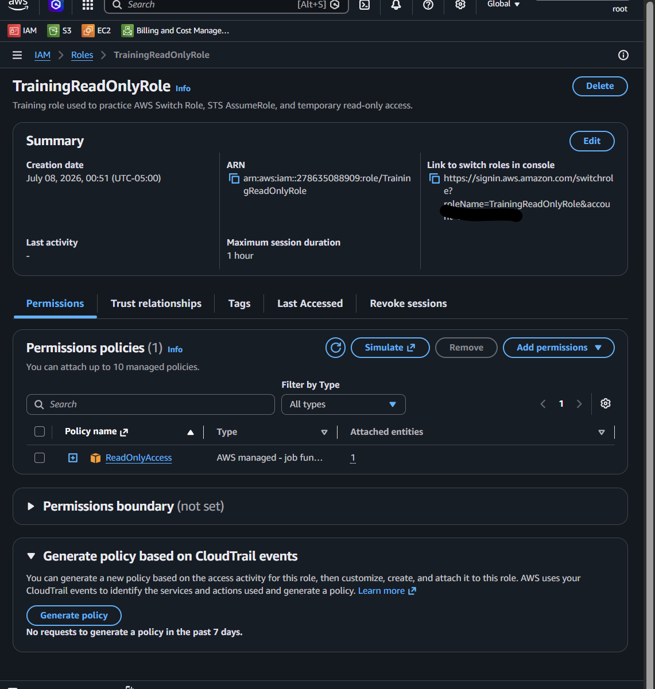
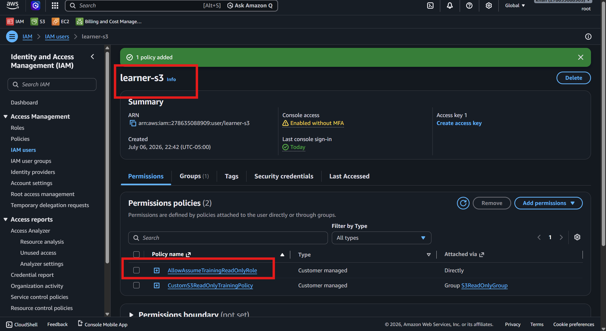
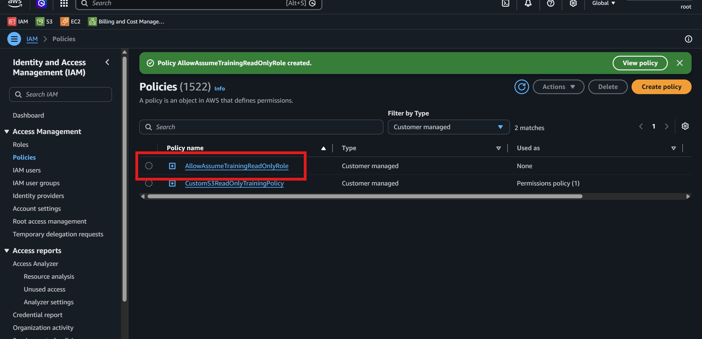

# Optional Advanced Lab – Switch Role

## Goal

Understand role assumption and temporary access in AWS.

In this lab, I will create an IAM role, allow an IAM user to assume that role, and test switching roles from the AWS Console.

---

# Main Concept

This lab teaches the difference between an IAM user and an IAM role.

```text
IAM User = login identity
IAM Role = temporary access
STS = provides temporary credentials / AWS STS = service that gives temporary access / Security Token Service
Policy = defines allowed or denied actions
```

---

# Simple Flow

```text
IAM User logs in
        ↓
IAM User has permission: sts:AssumeRole
        ↓
User clicks Switch Role in AWS Console
        ↓
AWS STS provides temporary credentials
        ↓
User works as TrainingReadOnlyRole
        ↓
Access is based on the role permissions
```

---

# Why This Lab Is Important

In real AWS environments, users often do not get permanent permissions directly.

Instead, they log in with an IAM user or federated identity and then assume a role for temporary access.

This improves security because:

```text
Access is temporary
Permissions are controlled by the role
Users do not need permanent admin permissions
Role access can be audited
Least privilege is easier to manage
```

---

# Lab Requirements

## Create IAM Role

| Setting | Value |
|---|---|
| Role name | TrainingReadOnlyRole |
| Policy attached to role | ReadOnlyAccess |

## Create IAM User Policy

The IAM user needs permission to assume the role.

Policy action:

```text
sts:AssumeRole
```

Resource:

```text
arn:aws:iam::ACCOUNT-ID:role/TrainingReadOnlyRole
```

Replace:

```text
ACCOUNT-ID
```

with your real AWS account ID.

---

# Step 1 – Create the IAM Role

https://youtu.be/nrwon5sKtAc

<video src="videos/lab-advance-role-readonlyaccess.mp4" controls width="700"></video>


Go to:

```text
AWS Console → IAM → Roles → Create role
```

Choose trusted entity type:

```text
AWS account
```

Select:

```text
This account
```

Attach this policy:

```text
ReadOnlyAccess
```

Role name:

```text
TrainingReadOnlyRole
```

Description:
```text
Training role used to practice AWS Switch Role, STS AssumeRole, and temporary read-only access.
```

Create the role.

---

## Screenshot Deliverable 1



---

# Step 2 – Understand the Role Permission

The role has this permission:

```text
ReadOnlyAccess
```

This means after switching into the role, the user should be able to view AWS resources but should not be able to create, update, or delete resources.

Allowed examples:

```text
View EC2 instances
View S3 buckets
View IAM users
View CloudWatch metrics
View VPC resources
```

Denied examples:

```text
Launch EC2 instance
Terminate EC2 instance
Create S3 bucket
Upload object
Delete object
Create IAM user
Attach IAM policy
Modify AWS resources
```

---

# Step 3 – Create Policy for IAM User to Assume Role

https://youtu.be/nrwon5sKtAc


<video src="videos/lab-advance-role-readonlyaccess.mp4" controls width="700"></video>


The IAM user needs permission to switch into the role.

Create this policy and attach it to the IAM user.

## Policy Name Suggestion

```text
AllowAssumeTrainingReadOnlyRole
```

## Policy JSON

Replace `ACCOUNT-ID` with your AWS account ID.

```json
{
  "Version": "2012-10-17",
  "Statement": [
    {
      "Effect": "Allow",
      "Action": "sts:AssumeRole",
      "Resource": "arn:aws:iam::ACCOUNT-ID:role/TrainingReadOnlyRole"
    }
  ]
}
```

---

# Example Policy with Account ID

Example account ID:

```text
278635088909
```

Example policy:

```json
{
  "Version": "2012-10-17",
  "Statement": [
    {
      "Effect": "Allow",
      "Action": "sts:AssumeRole",
      "Resource": "arn:aws:iam::278635088909:role/TrainingReadOnlyRole"
    }
  ]
}
```

---

# Step 4 – Attach AssumeRole Policy to IAM User

https://youtu.be/p50FKfVGnO4



<video src="videos/Attach-AssumeRole-Policy-to-IAM-User.mp4" controls width="700"></video>


Go to:

```text
AWS Console → IAM → Users → Select IAM user → Permissions
```

Attach the policy:

```text
AllowAssumeTrainingReadOnlyRole
```

Now this IAM user is allowed to assume:

```text
TrainingReadOnlyRole
```

Important:

```text
The IAM user does not automatically get ReadOnlyAccess.
The IAM user only gets permission to switch into the role.
After switching, the permissions come from the role.
```

---

## Screenshot Deliverable 2




```text
IAM user has AllowAssumeTrainingReadOnlyRole policy attached
```

---

# Step 5 – Switch Role in AWS Console

Log in as the IAM user.

Click your account menu in the top-right corner.

Choose:

```text
Switch role
```

Enter:

```text
Account ID: Your AWS account ID
Role name: TrainingReadOnlyRole
Display name: TrainingReadOnlyRole
```

Then click:

```text
Switch Role
```

---

## Screenshot Deliverable 3

Take screenshot showing you successfully switched into:

```text
TrainingReadOnlyRole
```

---

# Step 6 – Verify Role-Based Access

After switching roles, test read-only access.

Try opening services such as:

```text
EC2
S3
IAM
CloudWatch
VPC
```

You should be able to view resources.

---

# Step 7 – Test Denied Actions

Try actions that require write permissions.

Examples:

```text
Launch EC2 instance
Create S3 bucket
Upload object to S3
Delete object from S3
Create IAM user
Attach IAM policy
Modify security group
```

Expected result:

```text
Access Denied
You are not authorized
```

This is correct because the role only has read-only permissions.

---

## Screenshot or Note for Denied Action

Example note:

```text
After switching into TrainingReadOnlyRole, I tried to create an S3 bucket, but the action was denied because the role only has ReadOnlyAccess.
```

---

# Testing Table

| Test | Expected Result | Reason |
|---|---|---|
| IAM user login | Allowed | IAM user is the login identity |
| Switch into TrainingReadOnlyRole | Allowed | User has `sts:AssumeRole` permission |
| View EC2 instances | Allowed | Role has `ReadOnlyAccess` |
| View S3 buckets | Allowed | Role has `ReadOnlyAccess` |
| View IAM users | Allowed | Role has `ReadOnlyAccess` |
| Create S3 bucket | Denied | Role does not allow write actions |
| Launch EC2 instance | Denied | Role does not allow write actions |
| Create IAM user | Denied | Role does not allow write actions |

---

# IAM User vs IAM Role

| Topic | IAM User | IAM Role |
|---|---|---|
| Purpose | Login identity | Temporary access |
| Credentials | Can have username/password or access keys | Uses temporary credentials |
| Access type | Usually long-term | Temporary |
| Used by | People or applications | Users, services, accounts |
| Example | `learner-user` | `TrainingReadOnlyRole` |
| Key idea | Who signs in | What permissions are temporarily used |

---

# What Is STS?

STS stands for:

```text
Security Token Service
```

AWS STS provides temporary security credentials.

When a user assumes a role, STS gives temporary credentials for that role.

Simple flow:

```text
IAM User
   ↓
sts:AssumeRole
   ↓
AWS STS
   ↓
Temporary credentials
   ↓
TrainingReadOnlyRole permissions
```

---

# What Is sts:AssumeRole?

This action allows an IAM user or another identity to assume an IAM role.

```json
"Action": "sts:AssumeRole"
```

Meaning:

```text
This user is allowed to switch into the specified role.
```

The resource tells AWS which role can be assumed:

```json
"Resource": "arn:aws:iam::ACCOUNT-ID:role/TrainingReadOnlyRole"
```

---

# Important ARN Explanation

```text
arn:aws:iam::ACCOUNT-ID:role/TrainingReadOnlyRole
```

| Part | Meaning |
|---|---|
| `arn` | Amazon Resource Name |
| `aws` | AWS partition |
| `iam` | AWS IAM service |
| `ACCOUNT-ID` | Your AWS account ID |
| `role/TrainingReadOnlyRole` | The IAM role resource |

Example:

```text
arn:aws:iam::278635088909:role/TrainingReadOnlyRole
```

This means:

```text
The TrainingReadOnlyRole inside AWS account 278635088909.
```

---

# Important Security Note

Do not share screenshots that expose sensitive information.

Hide or crop:

```text
AWS account ID
Root email
IAM sign-in URL if sensitive
Access keys
Secret access keys
MFA QR code
Temporary credentials
Personal email
Payment details
```

---

# Common Mistakes

| Mistake | Problem | Fix |
|---|---|---|
| User cannot switch role | User may not have `sts:AssumeRole` permission | Attach AllowAssumeTrainingReadOnlyRole policy |
| Wrong account ID | Role ARN will not match | Use correct AWS account ID |
| Wrong role name | Switch role fails | Use exact role name: `TrainingReadOnlyRole` |
| Role has no policy | User switches but has no useful permissions | Attach `ReadOnlyAccess` to role |
| Expecting user policy to give read-only access directly | User policy only allows switching | Permissions after switch come from role |
| Trying write actions after switching | Role is read-only | Write actions should be denied |

---

# Best Practices Learned

```text
Use IAM roles for temporary access
Use sts:AssumeRole to allow role switching
Attach permissions to roles, not directly to users when possible
Use least privilege
Test both allowed and denied actions
Use ReadOnlyAccess for safe learning
Do not expose account or credential details in screenshots
```

---

# Deliverables Checklist

| Deliverable | Status |
|---|---|
| Screenshot of TrainingReadOnlyRole created | Required |
| Screenshot of ReadOnlyAccess attached to role | Required |
| Screenshot of IAM user policy allowing sts:AssumeRole | Required |
| Screenshot of successful Switch Role | Required |
| Screenshot of allowed read-only action | Required |
| Screenshot or note for denied write action | Recommended |

---

# Short Note for Deliverable

```text
In this advanced lab, I created an IAM role named TrainingReadOnlyRole and attached the ReadOnlyAccess policy to it. Then I created a policy for an IAM user that allows sts:AssumeRole on the TrainingReadOnlyRole. After logging in as the IAM user, I used the Switch Role option in the AWS Console to assume the role. This helped me understand that an IAM user is a login identity, an IAM role provides temporary access, STS provides temporary credentials, and policies define allowed or denied actions.
```

---

# Final Summary

```text
Switch Role allows an IAM user to temporarily use the permissions of an IAM role. The IAM user logs in first, then uses sts:AssumeRole to switch into the role. After switching, access is controlled by the role's permissions.
```

Alhamdulillah, this advanced lab helps build a strong understanding of IAM roles, STS, temporary credentials, and role-based access in AWS.
