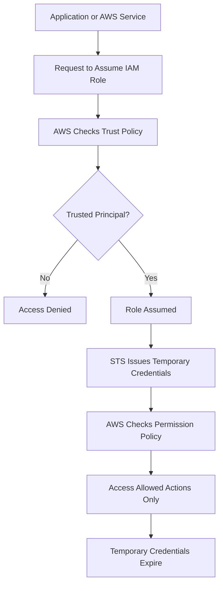

# README – Week 2 Day 3 Task 1: IAM Role

## Project Title

```text
Week 2 – Day 3 – Task 1: IAM Role
```

## Main Topic

```text
IAM Roles, STS, and Temporary Credentials
```

## Goal

Understand how an AWS service or workload gets temporary access to another AWS service **without storing permanent credentials**.

---

## Files Included

| File | Purpose |
|---|---|
| `AWS-IAM-Roles.png` | Visual poster / infographic for IAM Role concepts |
| `week-2-day-3-task-1-iam-role-study-notes.md` | Detailed study notes for Task 1 |
| `week-2-day-3-task-1-iam-role-10-mcqs.html` | Interactive 10-question MCQ quiz |
| `README.md` | Project overview and usage guide |

---

## What This Task Explains

This task explains the basic concept of an **IAM Role** in AWS.

An IAM role is an AWS identity with permissions, but it is not permanently attached to one person, service, or application.

A trusted principal can assume the role and receive temporary credentials.

---

## Key Concepts Covered

```text
IAM Role
AWS Identity
Trusted Principal
AssumeRole
Temporary Session
Temporary Credentials
AWS STS
Trust Policy
Permission Policy
Least Privilege
No Permanent Access Keys
```

---

## Simple Definition

```text
IAM Role = Temporary AWS identity with permissions
```

An IAM role allows trusted identities to access AWS resources securely without using long-term access keys.

---

## Why IAM Roles Are Important

IAM roles are important because they help avoid hardcoding permanent AWS access keys inside:

```text
Applications
EC2 instances
Lambda functions
Scripts
Servers
GitHub repositories
Automation workflows
```

Instead of storing access keys, AWS services can use roles and temporary credentials.

---

## Real-Life Example

```text
EC2 needs to read files from S3.

Bad practice:
Store AWS access key and secret key inside EC2.

Best practice:
Attach an IAM role to EC2.

Result:
EC2 gets temporary credentials automatically and can access S3 securely.
```

---

## Who Can Assume a Role?

A principal can assume a role if it is trusted by the role trust policy.

A principal can be:

```text
An AWS service such as EC2 or Lambda
An IAM user or IAM role in the same AWS account
A principal from another AWS account
A federated identity such as GitHub OIDC or SAML user
```

---

## Trust Policy vs Permission Policy

| Policy | Main Question | Purpose |
|---|---|---|
| Trust Policy | Who can assume the role? | Defines the trusted principal |
| Permission Policy | What can the role do? | Defines allowed or denied actions |

---

## Simple Formula

```text
Trusted Identity = Who can use the role temporarily

Trust Policy = Who is trusted

Permission Policy = What the role can do

STS = Gives temporary credentials
```

---

## IAM Role Flow

```text
Application / AWS Service
        ↓
Requests access
        ↓
AWS checks Trust Policy
        ↓
Role is assumed
        ↓
STS provides temporary credentials
        ↓
Application accesses AWS resource
        ↓
Credentials expire automatically
```

---

## Mermaid Flowchart



---

## MCQ Quiz Features

The quiz file includes:

```text
10 questions
10-minute timer
Answer checking
Score calculation
Progress tracking
Short explanations
Correct and wrong answer highlighting
Clear answers option
Reattempt option
Questions shuffle on every reattempt
Answer choices shuffle on every reattempt
Responsive design
```

---

## How to Use the MCQ Quiz

Open this file in any browser:

```text
week-2-day-3-task-1-iam-role-10-mcqs.html
```

Then:

```text
1. Read each question carefully.
2. Select one answer.
3. Complete all 10 questions.
4. Click Submit Quiz.
5. Review your score and explanations.
6. Click Reattempt & Shuffle to practice again.
```

---

## Recommended Study Flow

```text
Step 1: Review the poster
Step 2: Read the study notes
Step 3: Understand IAM Role flow
Step 4: Attempt the MCQ quiz
Step 5: Review wrong answers
Step 6: Reattempt with shuffled questions
```

---

## Common Mistakes to Avoid

```text
Thinking that a role automatically has full access
Hardcoding AWS access keys inside EC2 or Lambda
Uploading access keys to GitHub
Confusing IAM user with IAM role
Confusing trust policy with permission policy
Forgetting that temporary credentials expire
Giving more permissions than required
```

---

## Quick Revision Table

| Question | Answer |
|---|---|
| What is an IAM role? | Temporary AWS identity with permissions |
| Is a role permanently tied to one person? | No |
| Who assumes a role? | A trusted principal |
| What defines who can assume the role? | Trust policy |
| What defines what the role can do? | Permission policy |
| What service gives temporary credentials? | AWS STS |
| Why use roles? | To avoid storing permanent access keys |

---

## One-Line Summary

```text
An IAM role is a temporary AWS identity that trusted principals can assume to access AWS resources securely without permanent access keys.
```

---

## Final Takeaway

```text
IAM Role = Temporary identity with permissions
Trust Policy = Who can assume it
Permission Policy = What it can do
STS = Gives temporary credentials
Least Privilege = Give only required access
```

---

## Author

```text
Muhammad Khalid Khan
Linux System Administrator | DevOps Engineer
Website: khalidkhan.me
GitHub: github.com/krmaryum
Email: kkhalid7631@gmail.com
Location: Illinois, USA
```

---

## Learning Reminder

```text
Keep Learning, Keep Building, Keep Automating.
```
