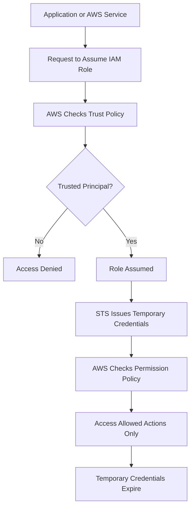

# Week 2 – Day 3  
# Task 1 – IAM Role

## Main Topic

> IAM Roles, STS, and Temporary Credentials

---

> Assume Role means a trusted identity temporarily uses the role’s permissions.

---

```text
User = direct login identity
Role = temporary access identity
Assume = to take or use something temporarily
Assume Role = to temporarily use the permissions of a role
```
Real-life example:
```text
You visit an office and receive a temporary visitor badge.

You are not a permanent employee.
But for a short time, you can enter the allowed rooms.

That is like assuming a role.
```

## Identity means:
```text
Who you are in AWS.
```
In AWS, an identity can be:
```text
IAM user
IAM role
AWS service like EC2 or Lambda
Another AWS account
Federated user like GitHub OIDC
```

Simple example:
```text
IAM user = identity for a person
IAM role = identity for temporary access
EC2 service = identity for an AWS service
```
One-line:

> Identity means the user, service, role, or system that is trying to access AWS.

## Trusted identity means:
### the person, AWS service, account, or external system that AWS allows to assume an IAM role.

Example:
EC2 can be a trusted identity if the role trust policy allows EC2 to assume that role.

Simple formula:
Trusted Identity = Who can use the role temporarily

Trust Policy = Where AWS defines who is trusted

Permission Policy = What the role can do after it is assumed

---


## Goal

Understand how an AWS service or workload gets temporary access to another AWS service **without storing permanent credentials**.

---

# Task 1 – IAM Role (identity for temporary access)

## What is an IAM Role?

An **IAM role** is an AWS identity that has permissions, but it is **not permanently attached to one person/service**.

A user usually logs in with a username and password, but a role is different. A role is **assumed** by a trusted principal for temporary access.

```text
IAM Role = Temporary AWS identity with permissions
```

---

## Why do we need IAM Roles?

We use IAM roles so applications, AWS services, or users can access AWS resources **without storing permanent access keys**.

For example:

```text
EC2 needs to read files from S3.

Bad practice:
Store AWS access key and secret key inside EC2.

Best practice:
Attach an IAM role to EC2.
EC2 gets temporary credentials automatically.
```

IAM roles help improve security because we do not need to hardcode access keys inside applications, scripts, servers, or GitHub repositories.


---

## What does “Assume Role” mean?

**Assume role** means a trusted identity takes the role for a temporary session.

```text
Trusted Principal
        ↓
Assumes IAM Role
        ↓
Gets Temporary Credentials
        ↓
Accesses AWS Resource
```

The role is not owned permanently. It is used temporarily.

> Temporary session means the credentials work only for a limited time. For AssumeRole, the session is commonly 1 hour by default, and the maximum duration depends on the role settings and AWS limits.

---

## What is a Principal?

A **principal** is the identity that is allowed to request access or assume a role.

A principal can be:

```text
An AWS service such as EC2 or Lambda
An IAM user or IAM role in the same AWS account
A principal in another AWS account
A federated identity such as GitHub OIDC or SAML user
```

---

## Simple Example

```text
EC2 instance wants to access an S3 bucket.

Principal:
EC2 service

Role:
EC2-S3-ReadOnly-Role

Permission:
Read files from S3

Result:
EC2 can read S3 files using temporary credentials.
```

---

## Trust Policy and Permission Policy

An IAM role has two very important parts:

| Part | Meaning |
|---|---|
| Trust Policy | Defines who is allowed to assume the role |
| Permission Policy | Defines what the role can do after it is assumed |

---

## Trust Policy

The **trust policy** answers this question:

```text
Who can assume this role?
```

Example:

```text
Can EC2 assume this role?
Can Lambda assume this role?
Can another AWS account assume this role?
Can GitHub OIDC assume this role?
```

The trust policy controls the trusted principal.

---

## Permission Policy

The **permission policy** answers this question:

```text
What can this role do after it is assumed?
```

Example:

```text
Can it read S3?
Can it write to S3?
Can it start EC2?
Can it access DynamoDB?
```

The permission policy controls allowed and denied actions.

---

## Real-Life Analogy

Think of an IAM role like a temporary visitor badge in a building.

```text
Principal = person asking for the badge

Trust Policy = security desk checks who is allowed to get the badge

IAM Role = visitor badge

Permission Policy = rooms the badge can open

Temporary Session = badge works only for a limited time
```

---

## IAM Role Flow

```text
Application / AWS Service
        ↓
Requests access
        ↓
AWS checks Trust Policy
        ↓
Role is assumed
        ↓
STS provides temporary credentials
        ↓
Application accesses AWS resource
        ↓
Credentials expire automatically
```

---

## Mermaid Flowchart



---

## Key Points

```text
An IAM role gives temporary access.
An IAM role is not permanently tied to one person, service, or identity.
A trusted principal assumes the role.
The trust policy defines who can assume the role.
The permission policy defines what the role can do.
Temporary credentials are safer than permanent access keys.
```

---

## Common Mistake

### Mistake

```text
Thinking that a role automatically has full access.
```

### Correction

```text
A role only has the permissions attached to it.
If the role has read-only permission, it can only read.
If delete permission is not allowed, delete actions will fail.
```

---

## Another Common Mistake

### Mistake

```text
Storing AWS access keys inside EC2, Lambda, scripts, or GitHub.
```

### Correction

```text
Use IAM roles and temporary credentials instead.
```

---

## Quick Revision Table

| Question | Answer |
|---|---|
| What is an IAM role? | Temporary AWS identity with permissions |
| Is a role tied permanently to one person? | No |
| Who assumes a role? | A trusted principal |
| What defines who can assume the role? | Trust policy |
| What defines what the role can do? | Permission policy |
| What service gives temporary credentials? | AWS STS |
| Why use roles? | To avoid storing permanent access keys |

---

## Interview Style Explanation

An IAM role is an AWS identity with permissions, but it is not attached permanently to a single user. A trusted principal, such as EC2, Lambda, an IAM user, another AWS account, or a federated identity, can assume the role. After the role is assumed, AWS STS provides temporary credentials. The role can only perform the actions allowed by its permission policy.

---

## One-Line Summary

```text
An IAM role is a temporary AWS identity that trusted principals can assume to access AWS resources securely without permanent access keys.
```

---

## Final Takeaway

```text
IAM Role = Temporary identity with permissions
Trust Policy = Who can assume it
Permission Policy = What it can do
STS = Gives temporary credentials
```
