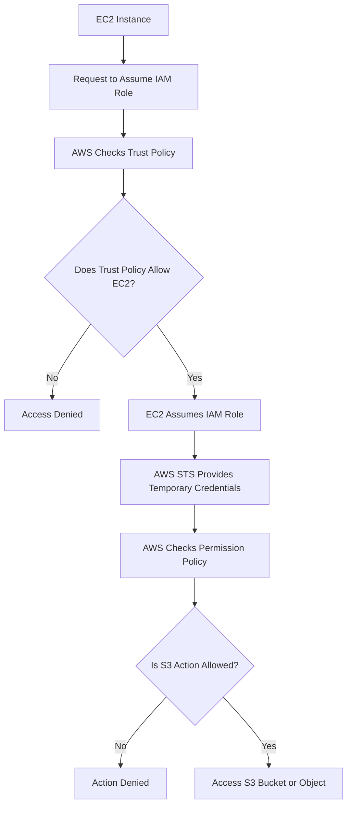

# README – Week 2 Day 3 Task 2: Trust Policy vs Permission Policy

## Project Title

```text
Week 2 – Day 3 – Task 2: Trust Policy vs Permission Policy
```

## Main Topic

```text
IAM Roles, STS, and Temporary Credentials
```

## Goal

Understand the difference between an IAM role **trust policy** and **permission policy**, and how both work together to allow secure temporary access in AWS.

---

## Files Included

| File | Purpose |
|---|---|
| `Trust-vs-Permission-policies-in-IAM.png` | Visual poster / infographic for Task 2 |
| `week-2-day-3-task-2-trust-policy-vs-permission-policy-study-notes.md` | Detailed study notes |
| `week-2-day-3-task-2-trust-vs-permission-10-mcqs.html` | Interactive 10-question MCQ quiz |
| `README.md` | Project overview and usage guide |

---

## What This Task Explains

This task explains that an IAM role usually needs **two different policy parts**:

```text
1. Trust Policy
2. Permission Policy
```

Both policies are required, but they answer different questions.

```text
Trust Policy = Who can assume the role?

Permission Policy = What can the assumed role do?
```

---

## Quick Comparison

| Policy | Main Question | Typical Content |
|---|---|---|
| Trust Policy | Who can assume this role? | Principal and `sts:AssumeRole` |
| Permission Policy | What can the assumed role do? | Allowed or denied actions and resources |

---

## Trust Policy

A **trust policy** defines who is allowed to assume the IAM role.

In simple words:

```text
Trust policy decides who can take the role temporarily.
```

Example:

```json
{
  "Version": "2012-10-17",
  "Statement": [
    {
      "Effect": "Allow",
      "Principal": { "Service": "ec2.amazonaws.com" },
      "Action": "sts:AssumeRole"
    }
  ]
}
```

This means:

```text
EC2 service is trusted.
EC2 is allowed to assume this IAM role.
This policy does not grant S3 access.
```

---

## Permission Policy

A **permission policy** defines what the role can do after it is assumed.

In simple words:

```text
Permission policy decides what actions are allowed or denied.
```

Example:

```json
{
  "Version": "2012-10-17",
  "Statement": [
    {
      "Effect": "Allow",
      "Action": ["s3:ListBucket"],
      "Resource": "arn:aws:s3:::YOUR-BUCKET-NAME"
    },
    {
      "Effect": "Allow",
      "Action": ["s3:GetObject"],
      "Resource": "arn:aws:s3:::YOUR-BUCKET-NAME/*"
    }
  ]
}
```

This means:

```text
The role can list objects inside the bucket.
The role can read/download objects from the bucket.
The role cannot delete objects unless delete permission is added.
```

---

## Bucket ARN vs Object ARN

| ARN | Meaning | Example Action |
|---|---|---|
| `arn:aws:s3:::YOUR-BUCKET-NAME` | Refers to the bucket itself | `s3:ListBucket` |
| `arn:aws:s3:::YOUR-BUCKET-NAME/*` | Refers to objects/files inside the bucket | `s3:GetObject` |

---

## How It Works

```text
EC2 wants to access S3
        ↓
EC2 tries to assume IAM role
        ↓
AWS checks Trust Policy
        ↓
Trust Policy allows EC2
        ↓
EC2 assumes the role
        ↓
AWS STS provides temporary credentials
        ↓
AWS checks Permission Policy
        ↓
S3 access is allowed based on permissions
```

---

## Mermaid Flowchart



---

## Real-Life Analogy

Think of a company building.

```text
Trust Policy = Who is allowed to receive a visitor badge?

Permission Policy = Which rooms can that badge open?
```

Example:

```text
Security desk says a person is allowed to receive a visitor badge.
That is like the trust policy.

The visitor badge only opens the training room, not the finance room.
That is like the permission policy.
```

---

## Common Confusions

### Mistake 1

```text
Thinking that a trust policy gives access to S3.
```

Correction:

```text
A trust policy does not give access to S3 or any AWS resource.
It only says who can assume the role.
```

### Mistake 2

```text
Thinking that a permission policy decides who can assume the role.
```

Correction:

```text
A permission policy does not decide who can assume the role.
It only decides what the role can do after it is assumed.
```

---

## Easy Memory Trick

```text
Trust = Who?

Permission = What?
```

Or:

```text
Trust Policy = Who can enter?

Permission Policy = What can they do after entering?
```

---

## Security Best Practices

```text
Use least privilege.
Only allow the trusted principal that needs the role.
Only allow the actions required for the task.
Avoid broad permissions like s3:* unless truly required.
Avoid Resource:* unless truly required.
Do not store permanent access keys inside applications or servers.
```

---

## MCQ Quiz Features

The quiz file includes:

```text
10 questions
10-minute timer
Answer checking
Score calculation
Progress tracking
Short explanations
Correct and wrong answer highlighting
Clear answers option
Reattempt option
Questions shuffle on every reattempt
Answer choices shuffle on every reattempt
Responsive design
```

---

## How to Use the MCQ Quiz

Open this file in any browser:

```text
week-2-day-3-task-2-trust-vs-permission-10-mcqs.html
```

Then:

```text
1. Read each question carefully.
2. Select one answer.
3. Complete all 10 questions.
4. Click Submit Quiz.
5. Review your score and explanations.
6. Click Reattempt & Shuffle to practice again.
```

---

## Recommended Study Flow

```text
Step 1: Review the poster
Step 2: Read the study notes
Step 3: Understand Trust = Who and Permission = What
Step 4: Review JSON examples
Step 5: Attempt the MCQ quiz
Step 6: Reattempt with shuffled answers
```

---

## Quick Revision Table

| Question | Answer |
|---|---|
| What does trust policy answer? | Who can assume this role? |
| What does permission policy answer? | What can the role do? |
| What action appears in a trust policy? | `sts:AssumeRole` |
| What does `Principal` mean? | The trusted identity |
| Does trust policy grant S3 access? | No |
| Which policy grants S3 access? | Permission policy |
| What does `s3:ListBucket` allow? | Listing bucket contents |
| What does `s3:GetObject` allow? | Reading/downloading objects |
| What does bucket ARN refer to? | The bucket itself |
| What does object ARN with `/*` refer to? | Objects/files inside the bucket |

---

## One-Line Summary

```text
A trust policy controls who can assume the role, while a permission policy controls what the role can do after it is assumed.
```

---

## Final Takeaway

```text
Trust Policy = Who can assume the role
Permission Policy = What the role can do
STS = Provides temporary credentials
Least Privilege = Give only required access
```

---

## Author

```text
Muhammad Khalid Khan
Linux System Administrator | DevOps Engineer
Website: khalidkhan.me
GitHub: github.com/krmaryum
Email: kkhalid7631@gmail.com
Location: Illinois, USA
```

---

## Learning Reminder

```text
Keep Learning, Keep Building, Keep Automating.
```
