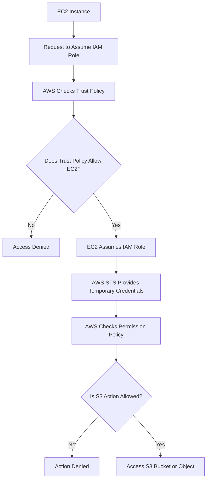

# Week 2 – Day 3  
# Task 2 – Trust Policy vs Permission Policy

## Main Topic

```text
IAM Roles, STS, and Temporary Credentials
```

## Goal

Understand how an AWS service or workload gets temporary access to another AWS service **without storing permanent credentials**.

---

# Task 2 – Trust Policy vs Permission Policy

## Main Idea

An IAM role usually needs **two types of policies**:

```text
1. Trust Policy
2. Permission Policy
```

Both are important, but they answer different questions.

```text
Trust Policy = Who can use or assume the role?

Permission Policy = What can the role do after it is assumed?
```

---

## Simple Comparison Table

| Policy | Main Question | Typical Content |
|---|---|---|
| Trust Policy | Who can assume this role? | Principal and `sts:AssumeRole` |
| Permission Policy | What can the assumed role do? | Allowed or denied actions and resources |

---

# 1. Trust Policy

## What is a Trust Policy?

A **trust policy** defines **who is allowed to assume the IAM role**.

> Trust policy does not give service permissions. It only allows a principal to assume the role.

In simple words:

```text
Trust policy decides who can take the role temporarily.
```

For example, if we want an EC2 instance to use a role, the trust policy must trust the EC2 service.

---

## EC2 Trust Policy Example

```json
{
  "Version": "2012-10-17",
  "Statement": [
    {
      "Effect": "Allow",
      "Principal": { "Service": "ec2.amazonaws.com" },
      "Action": "sts:AssumeRole"
    }
  ]
}
```

---

## What Does This Trust Policy Mean?

| Field | Meaning |
|---|---|
| `Effect: Allow` | Allow this trust relationship |
| `Principal` | The trusted identity |
| `Service: ec2.amazonaws.com` | EC2 service is trusted |
| `Action: sts:AssumeRole` | EC2 is allowed to assume the role |

---

## Important Point

```text
This trust policy trusts the EC2 service.

It only allows EC2 to assume the role.

It does not grant access to S3.
```

The trust policy answers:

```text
Who can assume the role?
```

It does **not** answer:

```text
What can the role do?
```

---

# 2. Permission Policy

## What is a Permission Policy?

A **permission policy** defines what the role can do **after it is assumed**.

> Trust policy does not give service permissions. It only allows a principal to assume the role.

In simple words:

```text
Permission policy decides what actions are allowed or denied.
```

For example, if EC2 assumes a role, the permission policy decides whether EC2 can read from S3, write to S3, start EC2 instances, access DynamoDB, and so on.

---

## S3 Read Permission Policy Example

```json
{
  "Version": "2012-10-17",
  "Statement": [
    {
      "Effect": "Allow",
      "Action": ["s3:ListBucket"],
      "Resource": "arn:aws:s3:::YOUR-BUCKET-NAME"
    },
    {
      "Effect": "Allow",
      "Action": ["s3:GetObject"],
      "Resource": "arn:aws:s3:::YOUR-BUCKET-NAME/*"
    }
  ]
}
```

---

## What Does This Permission Policy Mean?

| Action | Resource | Meaning |
|---|---|---|
| `s3:ListBucket` | `arn:aws:s3:::YOUR-BUCKET-NAME` | Allows listing objects inside the bucket |
| `s3:GetObject` | `arn:aws:s3:::YOUR-BUCKET-NAME/*` | Allows reading or downloading objects inside the bucket |

---

## Bucket ARN vs Object ARN

### Bucket ARN

```text
arn:aws:s3:::YOUR-BUCKET-NAME
```

This refers to the **bucket itself**.

Used with actions like:

```text
s3:ListBucket
```

### Object ARN

```text
arn:aws:s3:::YOUR-BUCKET-NAME/*
```

This refers to **all objects/files inside the bucket**.

Used with actions like:

```text
s3:GetObject
s3:PutObject
s3:DeleteObject
```

In this task, we only allow `s3:GetObject`, so the role can read objects but cannot upload or delete them.

---

# Trust Policy vs Permission Policy Flow

```text
EC2 wants to access S3
        ↓
EC2 tries to assume IAM role
        ↓
AWS checks Trust Policy
        ↓
Trust Policy says EC2 is allowed
        ↓
EC2 assumes the role
        ↓
AWS checks Permission Policy
        ↓
Permission Policy allows S3 ListBucket and GetObject
        ↓
EC2 can read from S3
```

---

## Mermaid Flowchart



---

# Real-Life Analogy

Think of a company building.

```text
Trust Policy = Who is allowed to receive a visitor badge?

Permission Policy = Which rooms can that badge open?
```

Example:

```text
Security desk says Khalid is allowed to receive a visitor badge.
That is like the trust policy.

The visitor badge only opens the training room, not the finance room.
That is like the permission policy.
```

---

# Common Confusion

## Mistake

```text
Thinking that a trust policy gives access to S3.
```

## Correction

```text
A trust policy does not give access to S3, EC2, DynamoDB, or any AWS resource.

It only says who can assume the role.
```

The actual AWS service permissions come from the **permission policy**.

---

# Another Common Confusion

## Mistake

```text
Thinking that permission policy decides who can assume the role.
```

## Correction

```text
Permission policy does not decide who can assume the role.

Trust policy decides who can assume the role.
Permission policy decides what the role can do.
```

---

# Easy Memory Trick

```text
Trust = Who?

Permission = What?
```

Or:

```text
Trust Policy = Who can enter?

Permission Policy = What can they do after entering?
```

---

# Practical Example

## Scenario

An EC2 instance needs read-only access to an S3 bucket.

## Required Setup

### Trust Policy

```text
Allow EC2 to assume the role.
```

### Permission Policy

```text
Allow S3 ListBucket and GetObject.
```

## Result

```text
EC2 can read files from S3 using temporary credentials.

EC2 cannot delete files unless delete permission is added.
```

---

# Security Best Practice

```text
Use least privilege.

Only allow the trusted principal that needs the role.

Only allow the actions required for the task.

Avoid using broad permissions like s3:* or Resource:* unless truly required.

Do not store permanent access keys inside applications or servers.
```

---

# Quick Revision Table

| Question | Answer |
|---|---|
| What does trust policy answer? | Who can assume this role? |
| What does permission policy answer? | What can the role do? |
| What action appears in a trust policy? | `sts:AssumeRole` |
| What does `Principal` mean? | The trusted identity |
| Does trust policy grant S3 access? | No |
| Which policy grants S3 access? | Permission policy |
| What does `s3:ListBucket` allow? | Listing bucket contents |
| What does `s3:GetObject` allow? | Reading/downloading objects |
| What does bucket ARN refer to? | The bucket itself |
| What does object ARN with `/*` refer to? | Objects/files inside the bucket |

---

# Interview Style Answer

An IAM role has two important policy parts: a trust policy and a permission policy. The trust policy defines who can assume the role, such as EC2, Lambda, another AWS account, or a federated identity. The permission policy defines what the role can do after it is assumed. For example, a trust policy may allow EC2 to assume a role, but a separate permission policy is needed to allow that role to read from S3.

---

# One-Line Summary

```text
A trust policy controls who can assume the role, while a permission policy controls what the role can do after it is assumed.
```

---

# Final Takeaway

```text
Trust Policy = Who can assume the role?

Permission Policy = What the role can do?

Both are required for secure IAM role access.
```
