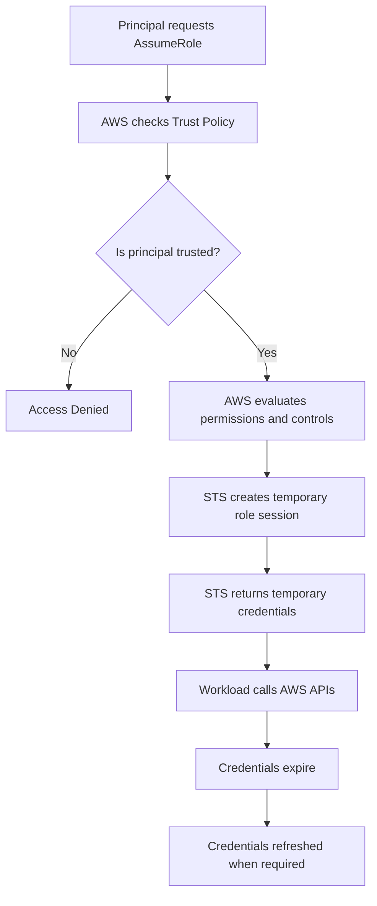

# README – Week 2 Day 3 Task 3: STS AssumeRole Mechanism

## Project Title

```text
Week 2 – Day 3 – Task 3: STS AssumeRole Mechanism
```

## Main Topic

```text
IAM Roles, STS, and Temporary Credentials
```

## Goal

Understand how **AWS Security Token Service (STS)** creates a temporary role session when a trusted principal assumes an IAM role.

This task focuses on how AWS workloads can access AWS services securely without storing long-lived access keys.

---

## Files Included

| File | Purpose |
|---|---|
| `image(790).png` | Visual poster / infographic for STS AssumeRole mechanism |
| `week-2-day-3-task-3-sts-assumerole-mechanism-study-notes.md` | Detailed study notes for Task 3 |
| `week-2-day-3-task-3-sts-assumerole-10-mcqs.html` | Interactive 10-question MCQ quiz |
| `README.md` | Project overview and usage guide |

---

## What This Task Explains

This task explains how **STS AssumeRole** works in AWS.

When a trusted principal assumes an IAM role, AWS STS creates a temporary role session and provides temporary credentials.

These temporary credentials allow a workload to call AWS APIs securely for a limited time.

---

## Key Concepts Covered

```text
AWS STS
AssumeRole
IAM Role
Trusted Principal
Trust Policy
Temporary Role Session
Temporary Credentials
Access Key ID
Secret Access Key
Session Token
Expiration Time
AWS API Calls
Credential Refresh
Least Privilege
```

---

## What is STS?

```text
STS = AWS Security Token Service
```

STS creates temporary security credentials for trusted principals that assume IAM roles.

Simple meaning:

```text
STS gives temporary access credentials when a trusted principal assumes an IAM role.
```

---

## What is AssumeRole?

```text
AssumeRole = Temporarily use the permissions of an IAM role
```

A principal does not permanently own the role.

It only receives temporary credentials for a limited time.

---

## Simplified STS AssumeRole Flow

```text
1. A principal requests to assume a role.

2. AWS checks whether the role trust policy trusts that principal.

3. AWS evaluates other applicable controls and permissions.

4. STS creates a temporary session for the role.

5. The workload uses the temporary credentials to call AWS APIs.

6. The credentials expire and are refreshed when required.
```

---

## STS Response Contains

When a human or application directly calls STS AssumeRole, the response contains:

```text
Access key ID
Secret access key
Session token
Expiration time
```

---

## Credential Parts Explained

| Credential Part | Meaning |
|---|---|
| Access key ID | Temporary access key identifier |
| Secret access key | Temporary secret key |
| Session token | Proof that credentials are part of a temporary session |
| Expiration time | Time when credentials stop working |

---

## Temporary Credentials vs Long-Lived IAM User Access Keys

| Temporary Credentials | Long-Lived IAM User Access Keys |
|---|---|
| Created by STS | Created for IAM users |
| Have expiration time | Do not expire automatically |
| Include session token | Usually do not include session token |
| Safer for workloads | Risky if exposed |
| Used with IAM roles | Used with IAM users |
| Short-lived access | Long-term access |

---

## Why Session Token Matters

The session token proves that the credentials belong to a temporary role session.

```text
Access Key ID + Secret Access Key + Session Token = Temporary Credentials
```

Without the session token, temporary credentials will not work.

---

## Why Expiration Matters

Temporary credentials expire to reduce security risk.

```text
If temporary credentials are leaked,
they only work for a short time.

After expiration,
they become useless.
```

This is safer than long-lived IAM user access keys.

---

## Practical Example: EC2 Accessing S3

```text
EC2 Instance
   ↓
Assumes IAM Role
   ↓
STS provides temporary credentials
   ↓
EC2 calls S3 API
   ↓
S3 access works based on permission policy
   ↓
Credentials expire and refresh automatically
```

---

## Mermaid Flowchart



---

## Real-Life Analogy

Think of STS like a security desk.

```text
Principal = person asking for temporary access

Trust Policy = security desk checks if the person is allowed

IAM Role = temporary visitor badge

STS = security desk issuing the badge

Temporary Credentials = badge details

Expiration Time = badge expiry time
```

---

## Common Mistakes

```text
Thinking temporary credentials are the same as long-lived access keys

Forgetting the session token

Thinking STS gives full access automatically

Hardcoding AWS access keys inside applications

Forgetting that permissions still depend on the IAM role policy
```

---

## Security Best Practices

```text
Use IAM roles instead of hardcoded access keys.
Use least privilege permissions.
Keep role sessions short when possible.
Do not expose temporary credentials publicly.
Do not commit credentials to GitHub.
Use trust policies carefully.
Review permission policies regularly.
```

---

## MCQ Quiz Features

The quiz file includes:

```text
10 questions
10-minute timer
Answer checking
Score calculation
Progress tracking
Short explanations
Correct and wrong answer highlighting
Clear answers option
Reattempt option
Questions shuffle on every reattempt
Answer choices shuffle on every reattempt
Responsive design
```

---

## How to Use the MCQ Quiz

Open this file in any browser:

```text
week-2-day-3-task-3-sts-assumerole-10-mcqs.html
```

Then:

```text
1. Read each question carefully.
2. Select one answer.
3. Complete all 10 questions.
4. Click Submit Quiz.
5. Review your score and explanations.
6. Click Reattempt & Shuffle to practice again.
```

---

## Recommended Study Flow

```text
Step 1: Review the poster
Step 2: Read the study notes
Step 3: Understand STS AssumeRole flow
Step 4: Review temporary credentials and session token
Step 5: Attempt the MCQ quiz
Step 6: Reattempt with shuffled answers
```

---

## Quick Revision Table

| Question | Answer |
|---|---|
| What does STS stand for? | Security Token Service |
| What does STS create? | Temporary security credentials |
| What does AssumeRole do? | Allows a trusted principal to use a role temporarily |
| What checks who can assume the role? | Trust policy |
| What does STS return? | Access key ID, secret access key, session token, expiration time |
| What makes temporary credentials different? | Session token and expiration time |
| Why do temporary credentials expire? | To reduce security risk |
| Can STS give full access automatically? | No, permissions depend on the role policy |

---

## One-Line Summary

```text
STS AssumeRole lets a trusted principal temporarily use an IAM role and receive short-lived credentials to call AWS APIs securely.
```

---

## Final Takeaway

```text
STS = Creates temporary credentials

AssumeRole = Temporarily use role permissions

Session Token = Proof of temporary session

Expiration = Security protection

Temporary Credentials = Safer than long-lived access keys
```

---

## Author

```text
Muhammad Khalid Khan
Linux System Administrator | DevOps Engineer
Website: khalidkhan.me
GitHub: github.com/krmaryum
Email: kkhalid7631@gmail.com
Location: Illinois, USA
```

---

## Learning Reminder

```text
Keep Learning, Keep Building, Keep Automating.
```
