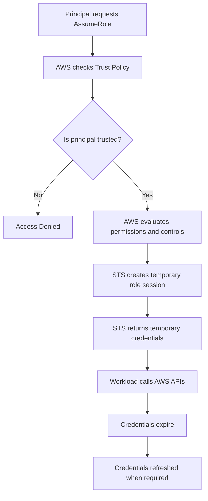

# Week 2 – Day 3  
# Task 3 – STS AssumeRole Mechanism

## Main Topic

```text
IAM Roles, STS, and Temporary Credentials
```

## Goal

Understand how **AWS Security Token Service (STS)** creates a temporary role session when a trusted principal assumes an IAM role.

---

# Task 3 – STS AssumeRole Mechanism

## What is STS?

**STS** stands for:

```text
AWS Security Token Service
```

STS is the AWS service that creates **temporary security credentials**.

Simple meaning:

```text
STS gives temporary access credentials when a trusted principal assumes an IAM role.
```

---

## What is AssumeRole?

**AssumeRole** means a trusted principal temporarily uses the permissions of an IAM role.

```text
Principal
   ↓
AssumeRole
   ↓
Temporary Role Session
```

The principal does not permanently own the role.  
It only receives temporary credentials for a limited time.

---

## What is a Temporary Role Session?

A **temporary role session** is the limited-time access created when STS allows a principal to assume a role.

During this session, the workload can use the role permissions.

```text
Temporary Role Session = Limited-time use of an IAM role
```

---

# Simplified STS AssumeRole Flow

```text
1. A principal requests to assume a role.

2. AWS checks whether the role trust policy trusts that principal.

3. AWS evaluates other applicable controls and permissions.
> This may include IAM permissions, conditions, permission boundaries, session policies, and organization-level controls if used.

4. STS creates a temporary session for the role.

5. The workload uses the temporary credentials to call AWS APIs.

6. The credentials expire and are refreshed when required.
```

---

## Flow Explanation

### Step 1 – Principal Requests AssumeRole

A principal can be:

```text
IAM user
IAM role
AWS service such as EC2 or Lambda
Another AWS account
Federated identity such as GitHub OIDC
```

The principal requests permission to assume an IAM role.

---

### Step 2 – AWS Checks Trust Policy

AWS checks the role trust policy.

The trust policy answers:

```text
Who can assume this role?
```

If the principal is trusted, the process continues.

If the principal is not trusted, access is denied.

---

### Step 3 – AWS Evaluates Other Controls

AWS may evaluate other controls such as:

```text
IAM permissions
Service control policies
Permission boundaries
Session policies
Conditions
```

The request must pass all required checks.

---

### Step 4 – STS Creates Temporary Session

If the request is allowed, STS creates a temporary role session.

This session represents the assumed role for a limited time.

---

### Step 5 – Workload Uses Temporary Credentials

The workload uses temporary credentials to call AWS APIs.

Example:

```text
EC2 uses temporary credentials to call S3 APIs.
Lambda uses temporary credentials to write logs to CloudWatch.
GitHub Actions uses temporary credentials to access AWS.
```

---

### Step 6 – Credentials Expire

Temporary credentials expire automatically.

After expiration, they stop working and must be refreshed when required.

This improves security because leaked temporary credentials are only useful for a short time.

---

# Real-Life Example

## Scenario

An EC2 instance needs to read files from an S3 bucket.

## Flow

```text
EC2 instance wants to read files from S3.

EC2 requests to assume an IAM role.

AWS checks the role trust policy.

If EC2 is trusted, STS creates temporary credentials.

EC2 uses those temporary credentials to call S3 APIs.

After some time, the credentials expire and are refreshed automatically.
```

---

# STS Response Contains

When a human or application directly calls STS AssumeRole, the response contains:

```text
Access key ID
Secret access key
Session token
Expiration time
```

---

## Credential Parts Explained

| Credential Part | Meaning |
|---|---|
| Access key ID | Temporary access key identifier |
| Secret access key | Temporary secret key |
| Session token | Proves the credentials are part of a temporary session |
| Expiration time | Shows when the credentials will stop working |

---

# Temporary Credentials vs Long-Lived IAM User Access Keys

| Temporary Credentials | Long-Lived IAM User Access Keys |
|---|---|
| Created by STS | Created for IAM users |
| Have expiration time | Do not expire automatically |
| Include session token | Usually do not include session token |
| Safer for workloads | Risky if exposed |
| Used with IAM roles | Used with IAM users |
| Short-lived access | Long-term access |

---

# Why Session Token Matters

The **session token** is very important because it proves the credentials belong to a temporary role session.

```text
Access key ID + Secret access key + Session token = Temporary credentials
```

Without the session token, temporary credentials will not work.

---

# Why Expiration Matters

Temporary credentials expire to reduce security risk.

```text
If temporary credentials are leaked,
they only work for a short time.

After expiration,
they become useless.
```

This is safer than long-lived IAM user access keys.

---

# Easy Analogy

Think of STS like a security desk.

```text
Principal = person asking for temporary access

Trust Policy = security desk checks if the person is allowed

IAM Role = temporary visitor badge

STS = security desk issuing the badge

Temporary Credentials = badge details

Expiration Time = badge expiry time
```

---

# Mermaid Flowchart



---

# Practical Example: EC2 Accessing S3

```text
EC2 Instance
   ↓
Assumes IAM Role
   ↓
STS provides temporary credentials
   ↓
EC2 calls S3 API
   ↓
S3 access works based on permission policy
   ↓
Credentials expire and refresh automatically
```

---

# Common Mistakes

## Mistake 1

```text
Thinking temporary credentials are the same as long-lived access keys.
```

### Correction

```text
Temporary credentials include a session token and expiration time.
Long-lived IAM user access keys usually do not expire automatically.
```

---

## Mistake 2

```text
Forgetting the session token.
```

### Correction

```text
Temporary credentials require the access key ID, secret access key, and session token.
```

---

## Mistake 3

```text
Thinking STS gives full access automatically.
```

### Correction

```text
STS only creates temporary credentials for the assumed role.
The role can only do what its permission policy allows.
```

---

## Mistake 4

```text
Hardcoding AWS access keys inside applications.
```

### Correction

```text
Use IAM roles and STS temporary credentials whenever possible.
```

---

# Security Best Practices

```text
Use IAM roles instead of hardcoded access keys.
Use least privilege permissions.
Keep role sessions short when possible.
Do not expose temporary credentials publicly.
Do not commit credentials to GitHub.
Use trust policies carefully.
Review permission policies regularly.
```

---

# Quick Revision Table

| Question | Answer |
|---|---|
| What does STS stand for? | Security Token Service |
| What does STS create? | Temporary security credentials |
| What does AssumeRole do? | Allows a trusted principal to use a role temporarily |
| What checks who can assume the role? | Trust policy |
| What does STS return? | Access key ID, secret access key, session token, expiration time |
| What makes temporary credentials different? | Session token and expiration time |
| Why do temporary credentials expire? | To reduce security risk |
| Can STS give full access automatically? | No, permissions depend on the role policy |

---

# Interview Style Answer

AWS STS AssumeRole allows a trusted principal to temporarily assume an IAM role. AWS first checks whether the role trust policy trusts that principal. If the request is allowed, STS creates a temporary role session and returns temporary credentials, including an access key ID, secret access key, session token, and expiration time. The workload then uses these temporary credentials to call AWS APIs. These credentials are safer than long-lived IAM user access keys because they expire automatically.

---

# One-Line Summary

```text
STS AssumeRole lets a trusted principal temporarily use an IAM role and receive short-lived credentials to call AWS APIs securely.
```

---

# Final Takeaway

```text
STS = Creates temporary credentials

AssumeRole = Temporarily use role permissions

Session Token = Proof of temporary session

Expiration = Security protection

Temporary Credentials = Safer than long-lived access keys
```
