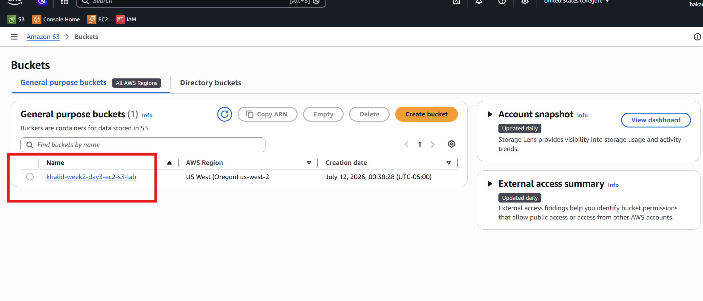
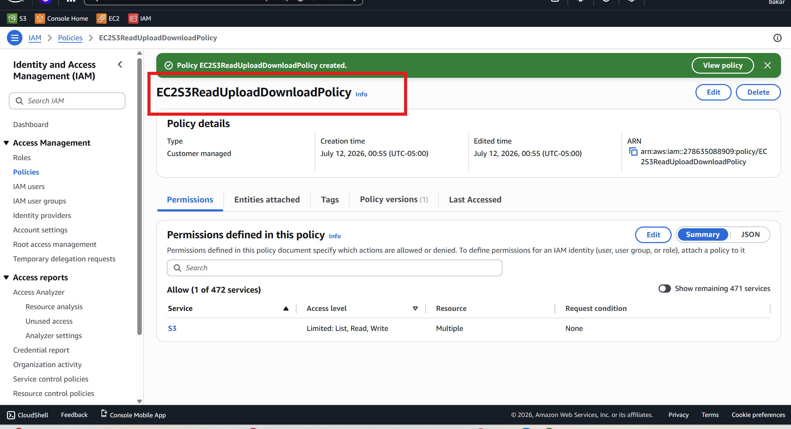
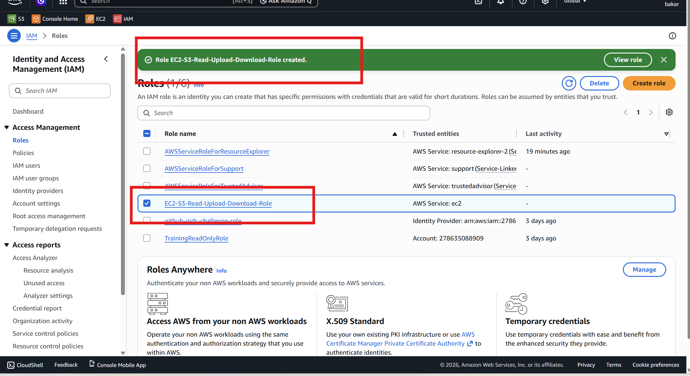
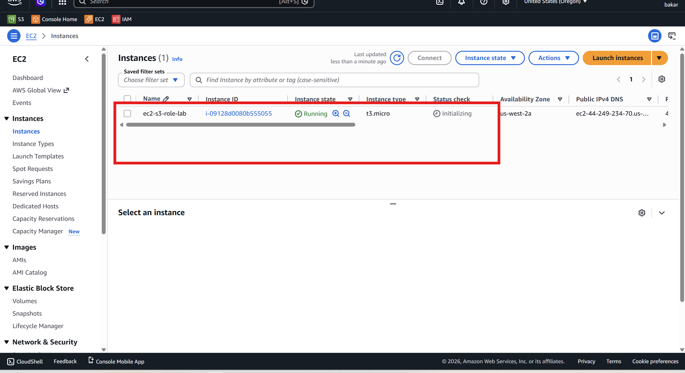
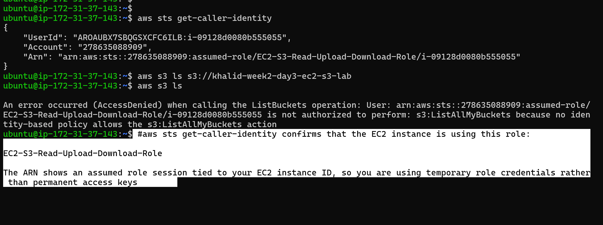
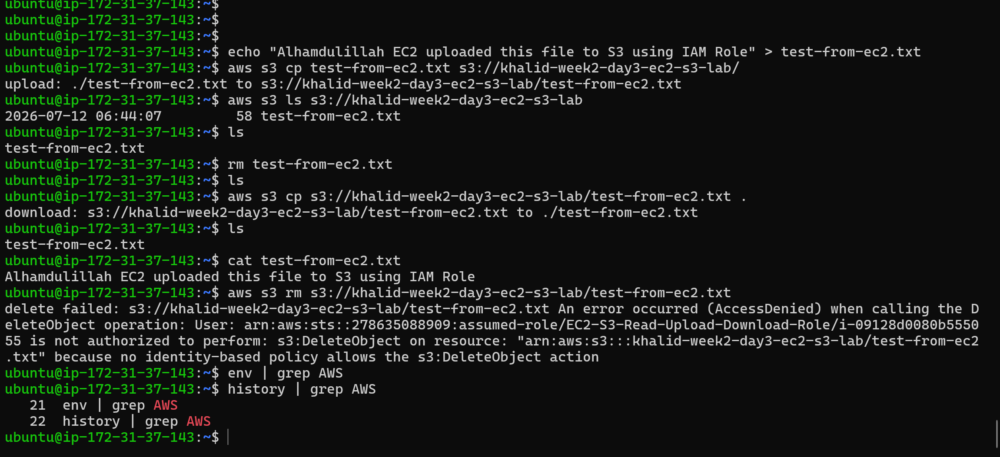
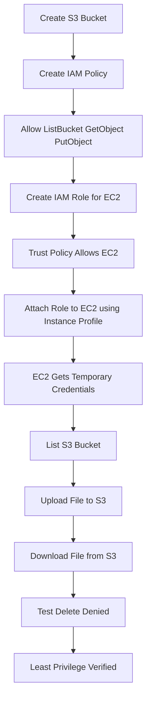

# Week 2 – Day 3  
# Project: EC2 Access S3 Bucket Using IAM Role

## Project Title

```text
EC2 Access S3 Bucket Using IAM Role
```

## Main Topic

```text
IAM Roles, Instance Profiles, STS, and Temporary Credentials
```

## Project Goal

Create an AWS project where an EC2 instance can securely access an S3 bucket to:

```text
Read / list files
Upload files
Download files
```

The EC2 instance will access S3 using an **IAM Role + Instance Profile**, not permanent access keys.

---

# Final Architecture

```text
EC2 Instance
   ↓
Instance Profile
   ↓
IAM Role
   ↓
STS Temporary Credentials
   ↓
S3 Bucket
   ↓
Read / Upload / Download
```

---

# Why This Project Is Important

In real AWS environments, applications should not store permanent access keys.

Bad practice:

```text
Store AWS access key and secret key inside EC2
```

Best practice:

```text
Attach an IAM role to EC2
Use temporary credentials automatically
Allow only required S3 permissions
```

This project teaches:

```text
IAM Role
Instance Profile
STS temporary credentials
S3 permissions
Least privilege
Credential provider chain
Secure EC2 to S3 access
```

---

# Part 1 – Create S3 Bucket

https://youtu.be/ixReLf2KV0Y



<video src="videos/create-s3-bucket.mp4" controls width="700"></video>


## Step 1: Open S3

Go to:

```text
AWS Console → S3 → Create bucket
```

---

## Step 2: Bucket Name

Use a globally unique bucket name, for example:

```text
khalid-week2-day3-ec2-s3-lab
```

Important:

```text
S3 bucket names must be unique across all AWS accounts.
```

---

## Step 3: Choose Region

Choose your AWS region, for example:

```text
us-east-1
```

---

## Step 4: Block Public Access

Keep this enabled:

```text
Block all public access = ON
```

This keeps the bucket private and secure.

---

## Step 5: Create Bucket

Click:

```text
Create bucket
```

---

# Part 2 – Create IAM Policy for S3 Access

https://youtu.be/OiT9TTg9k10



<video src="videos/create-policy.mp4" controls width="700"></video>


This policy allows EC2 to:

```text
List bucket
Read / download objects
Upload objects
```

It does **not** allow delete access.

---

## Step 1: Open IAM Policies

Go to:

```text
AWS Console → IAM → Policies → Create policy
```

---

## Step 2: Choose JSON

Paste this policy.

Replace this bucket name with your bucket name:

```text
khalid-week2-day3-ec2-s3-lab
```

---

## IAM Policy JSON

```json
{
  "Version": "2012-10-17",
  "Statement": [
    {
      "Sid": "ListBucketAccess",
      "Effect": "Allow",
      "Action": [
        "s3:ListBucket"
      ],
      "Resource": "arn:aws:s3:::khalid-week2-day3-ec2-s3-lab"
    },
    {
      "Sid": "ObjectReadUploadDownloadAccess",
      "Effect": "Allow",
      "Action": [
        "s3:GetObject",
        "s3:PutObject"
      ],
      "Resource": "arn:aws:s3:::khalid-week2-day3-ec2-s3-lab/*"
    }
  ]
}
```

---

## Policy Explanation

| Action | Meaning |
|---|---|
| `s3:ListBucket` | EC2 can list files in the bucket |
| `s3:GetObject` | EC2 can read/download files |
| `s3:PutObject` | EC2 can upload files |
| No `s3:DeleteObject` | EC2 cannot delete files |

---

## Bucket ARN vs Object ARN

### Bucket ARN

```text
arn:aws:s3:::khalid-week2-day3-ec2-s3-lab
```

This refers to the bucket itself.

Used with:

```text
s3:ListBucket
```

---

### Object ARN

```text
arn:aws:s3:::khalid-week2-day3-ec2-s3-lab/*
```

This refers to objects/files inside the bucket.

Used with:

```text
s3:GetObject
s3:PutObject
```

---

## Step 3: Policy Name

Use:

```text
EC2S3ReadUploadDownloadPolicy
```

Click:

```text
Create policy
```

---

# Part 3 – Create IAM Role for EC2

https://youtu.be/c2DGYMEecmc



<video src="videos/create-role.mp4" controls width="700"></video>


## Step 1: Open IAM Roles

Go to:

```text
IAM → Roles → Create role
```

---

## Step 2: Trusted Entity

Choose:

```text
AWS service
```

Use case:

```text
EC2
```

Click:

```text
Next
```

---

## Step 3: Attach Permission Policy

Search for the policy you created:

```text
EC2S3ReadUploadDownloadPolicy
```

Select it.

Click:

```text
Next
```

---

## Step 4: Role Name

Use:

```text
EC2-S3-Read-Upload-Download-Role
```

---

## Step 5: Create Role

Click:

```text
Create role
```

---

# Part 4 – Check Trust Policy

Open the role:

```text
IAM → Roles → EC2-S3-Read-Upload-Download-Role → Trust relationships
```

It should look like this:

```json
{
  "Version": "2012-10-17",
  "Statement": [
    {
      "Effect": "Allow",
      "Principal": {
        "Service": "ec2.amazonaws.com"
      },
      "Action": "sts:AssumeRole"
    }
  ]
}
```

---

## Trust Policy Meaning

```text
EC2 is trusted to assume this role.
```

Important:

```text
Trust policy does not grant S3 access.
It only allows EC2 to assume the role.
```

S3 access comes from the permission policy.

---

# Part 5 – Launch EC2 Instance

## Step 1: Open EC2

Go to:

```text
EC2 → Instances → Launch instance
```

---

## Step 2: Instance Name

Use:

```text
ec2-s3-role-lab
```

---

## Step 3: Choose AMI

Choose one:

```text
Ubuntu Server
```

or:

```text
Amazon Linux
```

---

## Step 4: Instance Type

Use a free-tier type:

```text
t2.micro
```

or:

```text
t3.micro
```

---

## Step 5: Key Pair

Choose an existing key pair or create a new one.

---

## Step 6: Security Group

Allow SSH:

```text
Type: SSH
Port: 22
Source: My IP
```

Security reminder:

```text
Do not allow SSH from 0.0.0.0/0 unless it is temporary and required for testing.
```

---

## Step 7: Attach IAM Role

In **Advanced details**, find:

```text
IAM instance profile
```

Select:

```text
EC2-S3-Read-Upload-Download-Role
```

Behind the scenes, AWS uses an instance profile to make the IAM role available to EC2.

---

## Step 8: Launch Instance

https://youtu.be/AlfA2_9ft8c



<video src="videos/launch-instance.mp4" controls width="700"></video>


Click:

```text
Launch instance
```

---

# Part 6 – SSH into EC2

## Ubuntu

```bash
ssh -i your-key.pem ubuntu@EC2_PUBLIC_IP
```

## Amazon Linux

```bash
ssh -i your-key.pem ec2-user@EC2_PUBLIC_IP
```

Replace:

```text
your-key.pem
EC2_PUBLIC_IP
```

with your actual key and EC2 public IP.

---

# Part 7 – Check AWS CLI


## Check Version

```bash
aws --version
```

---

## Install AWS CLI on Ubuntu

```bash
sudo apt update
sudo apt install awscli -y
```

---

## Install AWS CLI on Amazon Linux

```bash
sudo yum install awscli -y
```

---

# Part 8 – Verify Role Credentials

https://youtu.be/6RcbLOQ9qNo



<video src="videos/Verify-Role-Credentials.mp4" controls width="700"></video>


Run:

```bash
aws sts get-caller-identity
```

Expected result should show an assumed role:

```json
{
    "UserId": "AROAUBX7SBQGSXCFC6ILB:i-09128d0080b555055",
    "Account": "278635088909",
    "Arn": "arn:aws:sts::278635088909:assumed-role/EC2-S3-Read-Upload-Download-Role/i-09128d0080b555055"
}
```

---

## What This Confirms

```text
EC2 is using IAM role credentials.
STS temporary credentials are working.
No permanent access keys are needed.
```

Important:

```text
If you see assumed-role in the ARN, your EC2 role is working.
```

---

# Part 9 – Test S3 Read/List Access

List the bucket:

```bash
aws s3 ls s3://khalid-week2-day3-ec2-s3-lab
```

If the bucket is empty, no output is okay.

Important:

```text
This policy does not include s3:ListAllMyBuckets.
So use the exact bucket path.
```

---

# Part 10 – Upload File from EC2 to S3

https://youtu.be/fEBCbQ308w0



<video src="videos/Upload-Download-File-from-EC2-to-S3.mp4" controls width="700"></video>


Create a test file:

```bash
echo "Alhamdulillah EC2 uploaded this file to S3 using IAM Role" > test-from-ec2.txt
```

Upload it to S3:

```bash
aws s3 cp test-from-ec2.txt s3://khalid-week2-day3-ec2-s3-lab/
```

Expected output:

```text
upload: ./test-from-ec2.txt to s3://khalid-week2-day3-ec2-s3-lab/test-from-ec2.txt
```

---

# Part 11 – Confirm Uploaded File

List the bucket again:

```bash
aws s3 ls s3://khalid-week2-day3-ec2-s3-lab/
```

Expected output should show:

```text
test-from-ec2.txt
```

---

# Part 12 – Download File from S3 to EC2

Remove the local file first:

```bash
rm test-from-ec2.txt
```

Download the file from S3:

```bash
aws s3 cp s3://khalid-week2-day3-ec2-s3-lab/test-from-ec2.txt .
```

Check the file content:

```bash
cat test-from-ec2.txt
```

Expected output:

```text
Alhamdulillah EC2 uploaded this file to S3 using IAM Role
```

---

# Part 13 – Test Denied Delete Access

Try to delete the object:

```bash
aws s3 rm s3://khalid-week2-day3-ec2-s3-lab/test-from-ec2.txt
```

Expected result:

```text
AccessDenied
```

---

## Why Delete Is Denied

Because the IAM policy allows:

```text
s3:ListBucket
s3:GetObject
s3:PutObject
```

But does not allow:

```text
s3:DeleteObject
```

This proves least privilege is working.

---

# Part 14 – Important Security Checks

## Check Environment Variables

Run:

```bash
env | grep AWS
```

You should not see permanent access keys like:

```text
AWS_ACCESS_KEY_ID=AKIA...
AWS_SECRET_ACCESS_KEY=...
```

---

## Check Shell History

Run:

```bash
history | grep AWS
```

You should not store access keys there.

---

# Do Not Place Permanent Access Keys In

Never place permanent AWS access keys in:

```text
User data
Environment files
Application source code
AMIs
Shell history
```

These places can be viewed, logged, copied, reused, leaked, or accidentally pushed to GitHub.

---

# Troubleshooting

## Problem 1: AccessDenied When Listing Bucket

Possible reasons:

```text
Bucket name is wrong
IAM policy has wrong bucket ARN
Role is not attached to EC2
Policy does not include s3:ListBucket
You are using aws s3 ls without exact bucket path
```

Fix:

```bash
aws s3 ls s3://YOUR-BUCKET-NAME
```

---

## Problem 2: Upload Fails

Possible reasons:

```text
Policy does not include s3:PutObject
Object ARN is missing /*
Bucket name is wrong
Role is not attached correctly
```

Fix policy resource:

```text
arn:aws:s3:::YOUR-BUCKET-NAME/*
```

---

## Problem 3: Download Fails

Possible reasons:

```text
Policy does not include s3:GetObject
File name is wrong
Object does not exist
Object ARN is wrong
```

---

## Problem 4: aws sts get-caller-identity Does Not Show Assumed Role

Possible reasons:

```text
IAM role was not attached to EC2
Instance profile was not selected
AWS CLI is using old local credentials
EC2 metadata access problem
```

Fix:

```text
Check EC2 instance IAM role
Remove any manually configured AWS access keys
Run aws configure list
```

---

# Cleanup

To avoid charges, clean up after the lab if you no longer need the resources.

## Remove Test Object

```bash
aws s3 rm s3://khalid-week2-day3-ec2-s3-lab/test-from-ec2.txt
```

If delete is denied from EC2, delete it from the AWS Console or temporarily add delete permission for cleanup.

---

## Terminate EC2

Go to:

```text
EC2 → Instances → Select instance → Instance state → Terminate
```

---

## Delete S3 Bucket

Go to:

```text
S3 → Select bucket → Empty bucket → Delete bucket
```

---

## Delete IAM Role and Policy

Go to:

```text
IAM → Roles → Delete role
IAM → Policies → Delete custom policy
```

---

# Project Summary

```text
S3 bucket created
IAM policy created
IAM role created for EC2
Instance profile attached to EC2
EC2 used temporary credentials
EC2 listed S3 bucket
EC2 uploaded file to S3
EC2 downloaded file from S3
Delete action was denied
No permanent access keys were stored
```

---

# Mermaid Project Flow



---

# Final Project Flow

```text
EC2 Instance
   ↓
Instance Profile
   ↓
IAM Role
   ↓
STS Temporary Credentials
   ↓
S3 API Calls
   ↓
List / Upload / Download
```

---

# One-Line Takeaway

```text
EC2 can securely access S3 by using an IAM role and temporary credentials instead of storing permanent AWS access keys.
```

---

# Final Security Reminder

```text
No access keys in user data.
No access keys in environment files.
No access keys in source code.
No access keys in AMIs.
No access keys in shell history.

Use IAM roles, instance profiles, STS temporary credentials, and least privilege.
```
