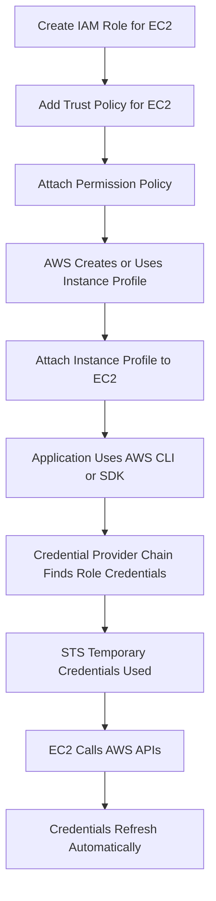

# Week 2 – Day 3  
# Task 4 – Instance Profiles and EC2 Roles

## Main Topic

```text
IAM Roles, STS, and Temporary Credentials
```

## Goal

Understand how an EC2 instance gets temporary AWS credentials through an **IAM role** and **instance profile** without storing permanent access keys.

---

# Task 4 – Instance Profiles and EC2 Roles

## What is an IAM Role?

An **IAM role** is an AWS identity that contains:

```text
Trust relationship
Permissions
```

The IAM role decides:

```text
Who can assume the role?

What can the role do after it is assumed?
```

For EC2, the trust policy usually allows:

```text
ec2.amazonaws.com
```

This means EC2 is trusted to assume the role.

---

## What is an Instance Profile?

An **instance profile** is the container that makes one IAM role available to an EC2 instance.

Simple meaning:

```text
IAM Role = permissions and trust relationship

Instance Profile = container that attaches the role to EC2
```

Very simple:

```text
EC2 does not directly hold the role by itself.

The instance profile makes the IAM role available to the EC2 instance.
```

---

## Easy Formula

```text
IAM Role = What permissions exist

Instance Profile = How EC2 receives the role

EC2 Instance = Uses temporary credentials from the role
```

---

# IAM Role vs Instance Profile

| Item | Purpose |
|---|---|
| IAM Role | Contains trust policy and permission policy |
| Instance Profile | Connects the IAM role to an EC2 instance |
| EC2 Instance | Uses temporary credentials from the attached role |
| AWS STS | Provides temporary credentials |
| AWS CLI / SDK | Automatically obtains and refreshes credentials |

---

## What Happens When You Create an EC2 Role?

When you create an IAM role for EC2 from the AWS Console, AWS usually creates and manages the **instance profile** automatically.

That means beginners often see only the IAM role in the console, but behind the scenes AWS also uses an instance profile.

```text
Create EC2 Role in Console
        ↓
AWS creates IAM Role
        ↓
AWS commonly creates Instance Profile
        ↓
Instance Profile is attached to EC2
        ↓
EC2 can use the role
```

---

## Why Instance Profile Is Needed

An IAM role contains the permissions, but EC2 needs a way to receive and use that role.

The instance profile provides that connection.

```text
IAM Role
   ↓
Instance Profile
   ↓
EC2 Instance
   ↓
Temporary Credentials
```

---

# How Applications Get Credentials on EC2

Applications running on EC2 can use the standard AWS credential provider chain.

This means AWS CLI and SDKs automatically look for credentials in the correct places.

For EC2 with an IAM role attached:

```text
Application / AWS CLI / SDK
        ↓
Checks credential provider chain
        ↓
Finds EC2 role credentials
        ↓
Uses temporary credentials
        ↓
Refreshes them automatically
```

So you do **not** need to manually put access keys inside the server.

---

## What is the AWS Credential Provider Chain?

The AWS credential provider chain is the process used by AWS CLI and SDKs to find credentials automatically.

It may check places such as:

```text
Environment variables
AWS credentials file
IAM role attached to EC2
Container credentials
Web identity token
Other supported credential sources
```

For EC2 role access, the AWS CLI and SDK can automatically obtain temporary credentials from the instance metadata service.

---

## Real Example

### Scenario

```text
EC2 needs to read files from S3.
```

### Bad Practice

```text
Put access key and secret key inside EC2.
```

### Best Practice

```text
Create IAM role with S3 read permission.

Attach role to EC2 through instance profile.

AWS CLI or SDK gets temporary credentials automatically.

EC2 reads S3 securely.
```

---

# Practical Flow: EC2 Accessing S3

```text
EC2 instance starts
        ↓
Instance profile is attached
        ↓
IAM role becomes available to EC2
        ↓
AWS STS provides temporary credentials
        ↓
AWS CLI / SDK uses credentials automatically
        ↓
EC2 calls S3 API
        ↓
Credentials refresh automatically
```

---

## Mermaid Flowchart



---

# Do Not Place Permanent Access Keys In

Never place permanent AWS access keys in:

```text
User data
Environment files
Application source code
AMIs
Shell history
```

These places can be viewed, logged, copied, reused, leaked, or accidentally pushed to GitHub.

---

## Why User Data Is Risky

User data is often used during EC2 launch, but it is not a safe place for secrets.

Do not put this in user data:

```bash
AWS_ACCESS_KEY_ID=AKIA...
AWS_SECRET_ACCESS_KEY=...
```

Instead, attach an IAM role to EC2.

---

## Why Environment Files Are Risky

Environment files can be read by users, copied during backups, or exposed during troubleshooting.

Bad places for secrets:

```text
/etc/environment
.env
app.env
profile scripts
systemd environment files
```

Better approach:

```text
Use IAM role and SDK credential provider chain.
```

---

## Why Source Code Is Risky

Never hardcode keys inside application code.

Bad example:

```python
aws_access_key_id = "AKIA..."
aws_secret_access_key = "SECRET..."
```

This is dangerous because source code may be pushed to GitHub or shared with others.

---

## Why AMIs Are Risky

If access keys are saved inside an AMI, every EC2 instance created from that AMI may contain the same keys.

That means one mistake can spread credentials to many servers.

```text
One leaked AMI can create many leaked EC2 instances.
```

---

## Why Shell History Is Risky

Commands may stay in shell history.

Bad example:

```bash
export AWS_ACCESS_KEY_ID=AKIA...
export AWS_SECRET_ACCESS_KEY=...
```

Someone checking shell history may see the keys.

---

# Simple Analogy

Think of EC2 like a worker in a company.

```text
IAM Role = job responsibility

Instance Profile = HR file that assigns the job to the worker

EC2 Instance = worker

STS Temporary Credentials = temporary work badge

AWS CLI / SDK = worker using badge automatically
```

The worker does not need a permanent master key.

---

# Common Mistakes

## Mistake 1

```text
Thinking IAM role and instance profile are exactly the same.
```

### Correction

```text
IAM role contains trust and permissions.
Instance profile attaches the role to EC2.
```

---

## Mistake 2

```text
Putting AWS access keys inside EC2 user data.
```

### Correction

```text
Use IAM role and instance profile instead.
```

---

## Mistake 3

```text
Hardcoding access keys inside application source code.
```

### Correction

```text
Use AWS SDK credential provider chain with an EC2 role.
```

---

## Mistake 4

```text
Saving credentials inside an AMI.
```

### Correction

```text
Keep AMIs free from secrets and use roles for runtime access.
```

---

# Security Best Practices

```text
Use IAM roles for EC2 workloads.
Use instance profiles to attach roles to EC2.
Use least privilege permissions.
Avoid permanent access keys on servers.
Do not put secrets in user data.
Do not store keys in environment files.
Do not hardcode keys in source code.
Do not bake credentials into AMIs.
Do not type credentials in shell history.
Let AWS CLI and SDKs refresh credentials automatically.
```

---

# Quick Revision Table

| Question | Answer |
|---|---|
| What does an IAM role contain? | Trust relationship and permissions |
| What is an instance profile? | Container that makes one IAM role available to EC2 |
| Does AWS Console commonly create the instance profile? | Yes, when creating an EC2 role |
| How do CLI and SDKs get credentials on EC2? | Through the AWS credential provider chain |
| Are credentials refreshed automatically? | Yes, by AWS CLI and SDKs |
| Should access keys be placed in user data? | No |
| Should access keys be stored in source code? | No |
| What should EC2 use instead of permanent keys? | IAM role through instance profile |

---

# Interview Style Answer

An IAM role contains the trust relationship and permission policies. An instance profile is the container that makes an IAM role available to an EC2 instance. When an EC2 role is created in the AWS Console, AWS commonly creates and manages the instance profile automatically. Applications running on EC2 can use the standard AWS credential provider chain, and AWS CLI or SDKs automatically obtain and refresh temporary credentials. Permanent access keys should not be stored in user data, environment files, source code, AMIs, or shell history.

---

# One-Line Summary

```text
An instance profile attaches an IAM role to EC2 so applications can use temporary credentials automatically without storing permanent access keys.
```

---

# Final Takeaway

```text
IAM Role = Trust relationship and permissions

Instance Profile = Container that makes the role available to EC2

AWS CLI / SDK = Automatically gets and refreshes temporary credentials

Permanent Access Keys = Do not store on EC2
```
