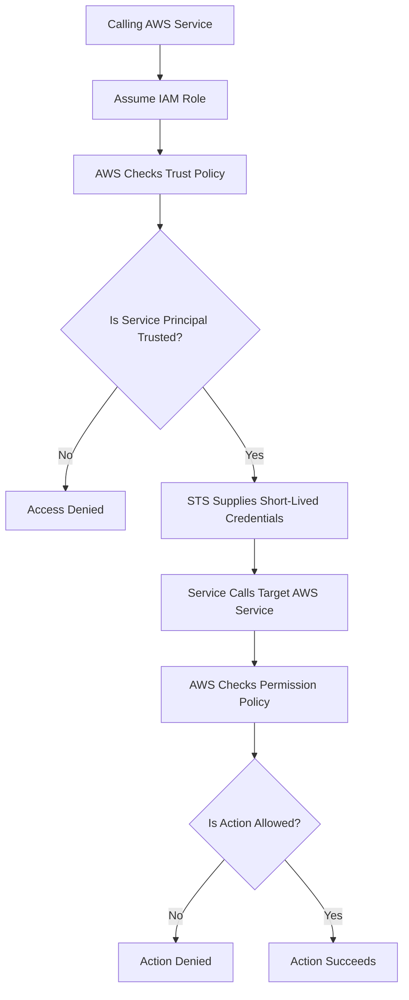

# Week 2 – Day 3  
# Task 5 – Cross-Service Role Assumption

## Main Topic

```text
IAM Roles, STS, Temporary Credentials, and AWS Service-to-Service Access
```

## Goal

Understand how one AWS service can securely call another AWS service by assuming an IAM role.

---

# Task 5 – Cross-Service Role Assumption

## What is Cross-Service Role Assumption?

**Cross-service role assumption** happens when one AWS service uses an IAM role to call another AWS service for you.

Simple meaning:

```text
One AWS service assumes a role
        ↓
Receives temporary credentials
        ↓
Uses those credentials
        ↓
Calls another AWS service
```

This avoids storing permanent AWS access keys inside applications or workloads.

---

# Why Is It Needed?

AWS services often need to work together.

For example:

```text
EC2 may need to read objects from S3.

Lambda may need to write logs to CloudWatch Logs.

Step Functions may need to invoke a Lambda function.

ECS tasks may need to read secrets from Secrets Manager.
```

Instead of using permanent access keys, AWS services use:

```text
IAM Role
Trust Policy
Permission Policy
STS Temporary Credentials
```

---

# Important Key Line

```text
Trust policy answers WHO.

Permission policy answers WHAT.

STS supplies short-lived credentials.

The instance profile delivers the role to EC2.
```

---

# Main Formula

```text
Calling AWS Service = WHO wants access

Trust Policy = WHO can assume the role

Permission Policy = WHAT the role can do

STS = Supplies short-lived temporary credentials

Target AWS Service = Service being accessed
```

---

# Cross-Service Role Assumption Flow

```text
AWS service wants to call another AWS service
        ↓
AWS checks the role trust policy
        ↓
Calling service is trusted
        ↓
STS creates short-lived credentials
        ↓
Calling service uses the credentials
        ↓
Target AWS service checks permissions
        ↓
Allowed action succeeds
```

---

# Mermaid Flowchart



---

# Example 1 – EC2 Reads an Object from S3

## Scenario

```text
An EC2 instance needs to read an object from an S3 bucket.
```

## Flow

```text
EC2 Instance
   ↓
Instance Profile delivers IAM Role
   ↓
EC2 uses temporary credentials
   ↓
Reads object from S3
```

## Trust Policy Answers

```text
Can EC2 assume this role?
```

Example service principal:

```text
ec2.amazonaws.com
```

## Permission Policy Answers

```text
Can this role read from S3?
```

Required permission example:

```text
s3:GetObject
```

Example permission policy:

```json
{
  "Effect": "Allow",
  "Action": [
    "s3:GetObject"
  ],
  "Resource": "arn:aws:s3:::example-bucket/*"
}
```

---

# Example 2 – Lambda Writes Logs to CloudWatch Logs

## Scenario

```text
A Lambda function needs to write logs to CloudWatch Logs.
```

## Flow

```text
Lambda Function
   ↓
Assumes Lambda Execution Role
   ↓
Gets temporary credentials
   ↓
Writes logs to CloudWatch Logs
```

## Trust Policy Allows

```text
lambda.amazonaws.com
```

## Permission Policy Allows

```text
logs:CreateLogGroup
logs:CreateLogStream
logs:PutLogEvents
```

---

# Example 3 – Step Functions Invokes Lambda

## Scenario

```text
Step Functions needs to invoke a Lambda function.
```

## Flow

```text
Step Functions
   ↓
Assumes IAM Role
   ↓
Gets temporary credentials
   ↓
Invokes Lambda Function
```

## Trust Policy Allows

```text
states.amazonaws.com
```

## Permission Policy Allows

```text
lambda:InvokeFunction
```

---

# Example 4 – ECS Tasks Read Secrets from Secrets Manager

## Scenario

```text
An ECS task needs to read a secret from AWS Secrets Manager.
```

## Flow

```text
ECS Task
   ↓
Assumes Task Role
   ↓
Gets temporary credentials
   ↓
Reads secret from Secrets Manager
```

## Trust Policy Allows

```text
ecs-tasks.amazonaws.com
```

## Permission Policy Allows

```text
secretsmanager:GetSecretValue
```

---

# Trust Policy vs Permission Policy

## Trust Policy

The trust policy answers:

```text
WHO can assume this role?
```

Example:

```json
{
  "Effect": "Allow",
  "Principal": {
    "Service": "ec2.amazonaws.com"
  },
  "Action": "sts:AssumeRole"
}
```

Meaning:

```text
EC2 is allowed to assume this role.
```

Important:

```text
Trust policy does not grant access to S3, Lambda, CloudWatch, or Secrets Manager.

It only decides who can assume the role.
```

---

## Permission Policy

The permission policy answers:

```text
WHAT can the role do after it is assumed?
```

Example:

```json
{
  "Effect": "Allow",
  "Action": [
    "s3:GetObject"
  ],
  "Resource": "arn:aws:s3:::example-bucket/*"
}
```

Meaning:

```text
After the role is assumed, it can read objects from the S3 bucket.
```

---

# Service Principals Examples

| AWS Service | Service Principal |
|---|---|
| EC2 | `ec2.amazonaws.com` |
| Lambda | `lambda.amazonaws.com` |
| Step Functions | `states.amazonaws.com` |
| ECS Tasks | `ecs-tasks.amazonaws.com` |

---

# Target Permission Examples

| Scenario | Required Permission Example |
|---|---|
| EC2 reads S3 object | `s3:GetObject` |
| Lambda writes logs | `logs:PutLogEvents` |
| Step Functions invokes Lambda | `lambda:InvokeFunction` |
| ECS reads secret | `secretsmanager:GetSecretValue` |

---

# Detailed Comparison Table

| Part | Question It Answers | Example |
|---|---|---|
| Trust Policy | Who can assume the role? | EC2, Lambda, ECS, Step Functions |
| Permission Policy | What can the role do? | Read S3, write logs, invoke Lambda, read secret |
| STS | How are temporary credentials created? | Short-lived role credentials |
| Instance Profile | How does EC2 receive a role? | EC2 role delivery container |
| Target Service | What service is being accessed? | S3, CloudWatch Logs, Lambda, Secrets Manager |

---

# Real-Life Analogy

Think of AWS services like employees in a company.

```text
Calling AWS Service = Employee asking to do a task

Trust Policy = Security desk checks if this employee can use the badge

IAM Role = Temporary badge

STS = Badge issuing system

Permission Policy = Rooms/actions allowed by the badge

Target AWS Service = Room or system being accessed
```

The employee can only enter the rooms listed on the badge.

---

# Common Mistakes

## Mistake 1

```text
Thinking trust policy gives access to the target service.
```

### Correction

```text
Trust policy only decides who can assume the role.
Permission policy decides what the role can do.
```

---

## Mistake 2

```text
Giving too many permissions to the role.
```

### Correction

```text
Grant only the required actions on the target service.
This is called least privilege.
```

---

## Mistake 3

```text
Using the wrong service principal.
```

### Correction

```text
Use the correct service principal for the calling AWS service.
```

Examples:

```text
Lambda = lambda.amazonaws.com
EC2 = ec2.amazonaws.com
ECS Tasks = ecs-tasks.amazonaws.com
Step Functions = states.amazonaws.com
```

---

## Mistake 4

```text
Thinking STS gives unlimited access.
```

### Correction

```text
STS only supplies temporary credentials.
The permissions still come from the role permission policy.
```

---

## Mistake 5

```text
Using permanent access keys for AWS service-to-service access.
```

### Correction

```text
Use IAM roles and short-lived STS credentials instead.
```

---

# Security Best Practices

```text
Use IAM roles instead of permanent access keys.
Use least privilege permissions.
Use the correct service principal in the trust policy.
Grant only required actions on the target service.
Scope resources as narrowly as possible.
Review trust policies carefully.
Review permission policies regularly.
Avoid wildcard permissions when possible.
Do not store credentials in source code, user data, AMIs, or shell history.
```

---

# Quick Revision Table

| Question | Answer |
|---|---|
| What is cross-service role assumption? | One AWS service uses a role to call another AWS service |
| What does trust policy answer? | WHO can assume the role |
| What does permission policy answer? | WHAT the role can do |
| What does STS supply? | Short-lived temporary credentials |
| What delivers the role to EC2? | Instance profile |
| EC2 service principal | `ec2.amazonaws.com` |
| Lambda service principal | `lambda.amazonaws.com` |
| Step Functions service principal | `states.amazonaws.com` |
| ECS task service principal | `ecs-tasks.amazonaws.com` |
| EC2 reads S3 permission | `s3:GetObject` |
| Lambda writes logs permission | `logs:PutLogEvents` |
| Step Functions invokes Lambda permission | `lambda:InvokeFunction` |
| ECS reads secret permission | `secretsmanager:GetSecretValue` |

---

# Interview Style Answer

Cross-service role assumption happens when one AWS service assumes an IAM role to call another AWS service on your behalf. The role trust policy names the calling service principal, such as `ec2.amazonaws.com`, `lambda.amazonaws.com`, `states.amazonaws.com`, or `ecs-tasks.amazonaws.com`. The permission policy grants only the required actions on the target service, such as `s3:GetObject`, `logs:PutLogEvents`, `lambda:InvokeFunction`, or `secretsmanager:GetSecretValue`. AWS STS supplies short-lived credentials, and for EC2, the instance profile delivers the role to the instance.

---

# One-Line Summary

```text
Cross-service role assumption allows one AWS service to securely call another AWS service using an IAM role and short-lived STS credentials.
```

---

# Final Takeaway

```text
Trust Policy = WHO can assume the role

Permission Policy = WHAT the role can do

STS = Supplies short-lived credentials

Instance Profile = Delivers the role to EC2

Least Privilege = Grant only required actions
```
