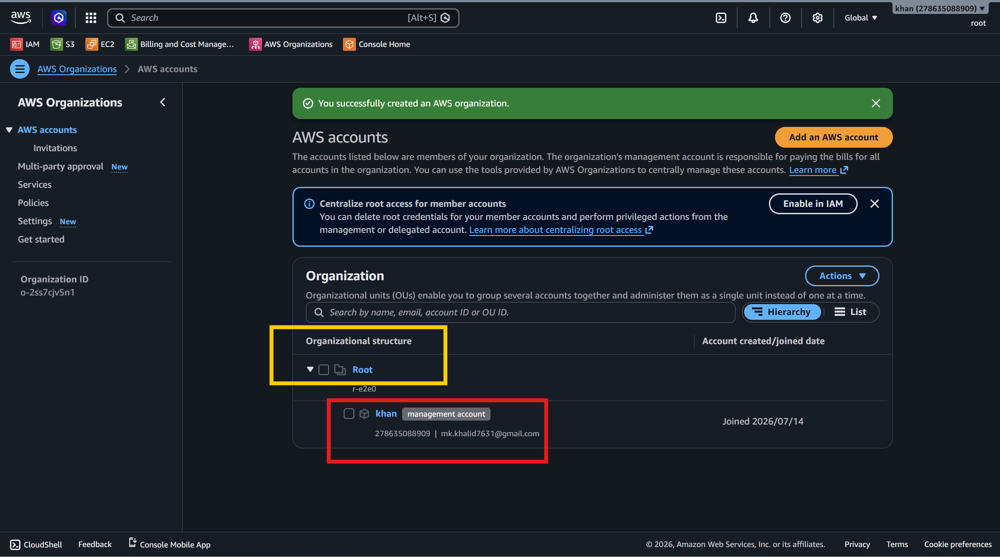
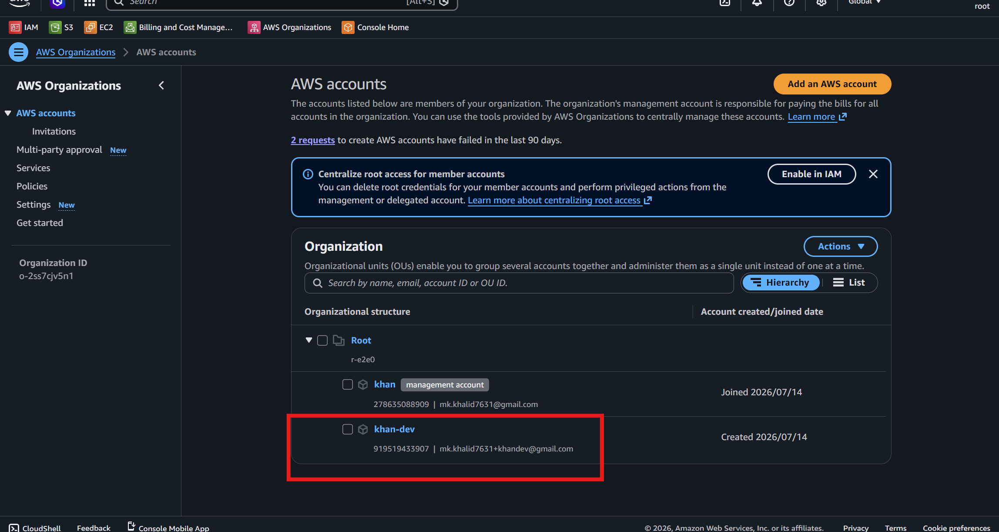
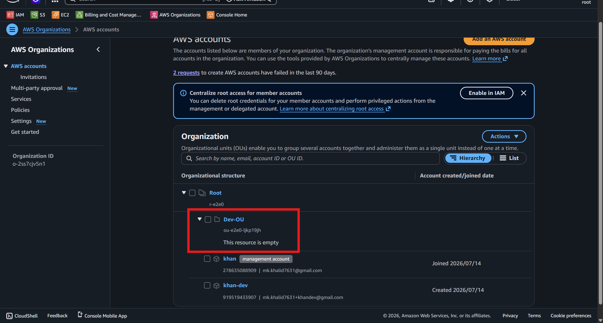
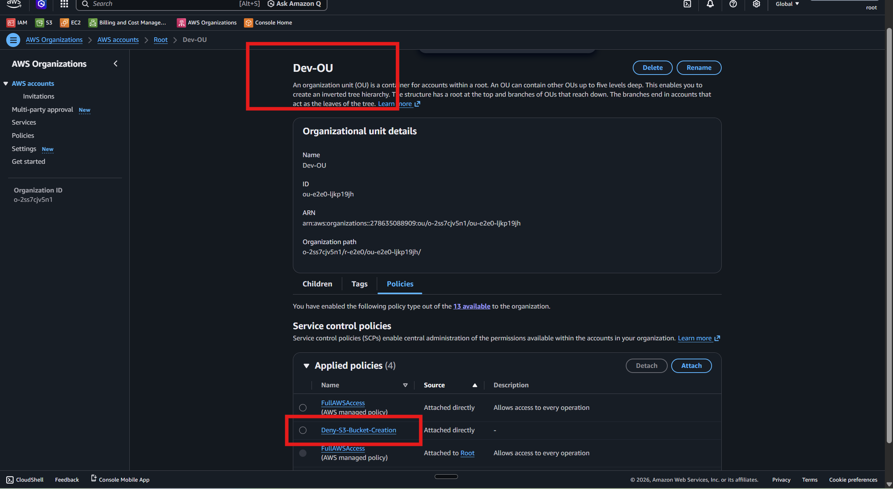
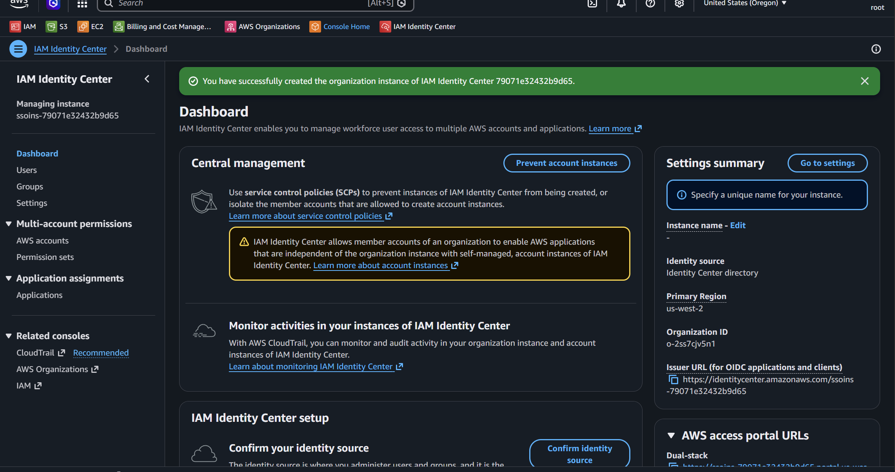
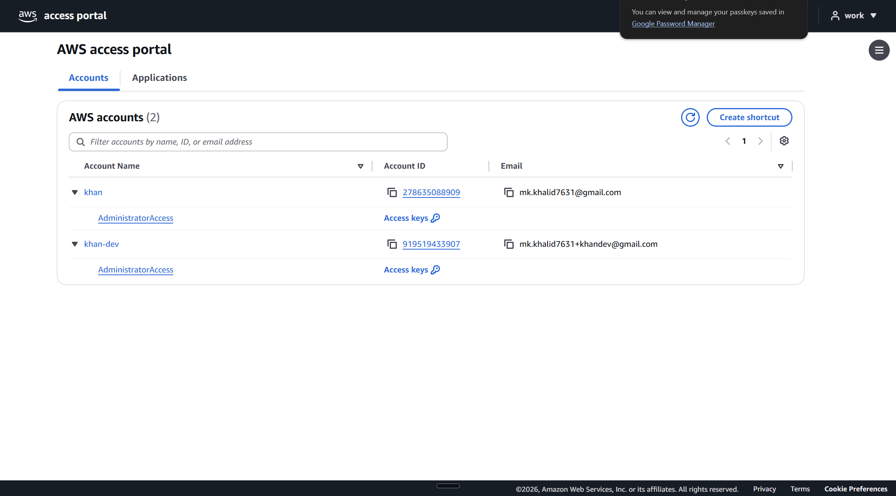
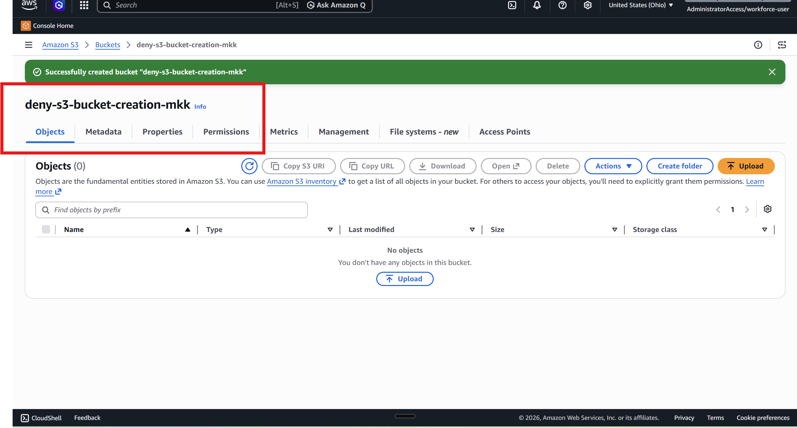
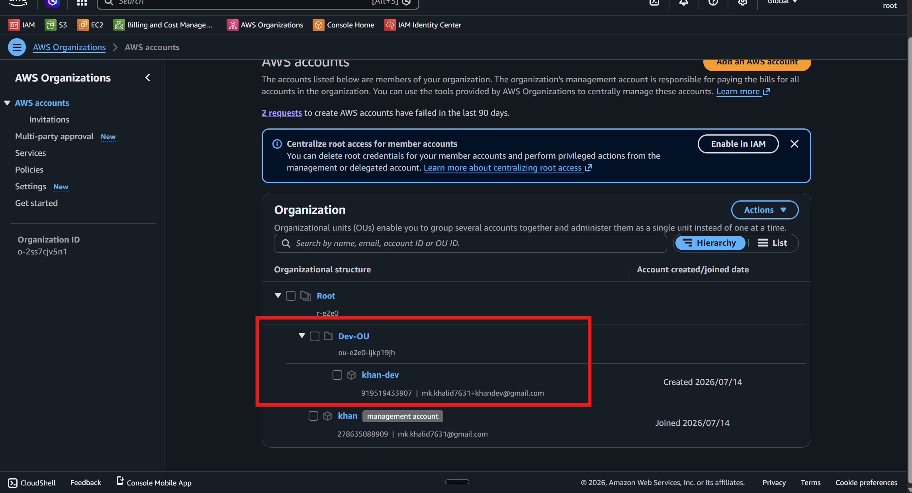

# Day 4 Practical Project — AWS Organizations, IAM Identity Center, and SCPs

## Project Goal

Build a small AWS multi-account environment and prove this permission rule:

```text
IAM Identity Center permission set: ALLOW s3:CreateBucket
                              +
khan-Dev OU service control policy: EXPLICIT DENY s3:CreateBucket
                              =
Final result: DENY
```

The S3 bucket must be created successfully while `khan-Dev` is directly under
the organization Root. The same operation must fail after `khan-Dev` is moved
into `khan-Dev` and inherits its SCP.

## Safety and Cost Rules

- Use a dedicated training organization, not a production organization.
- Do not record real account IDs, email addresses, portal URLs, organization
  IDs, or complete role ARNs in public notes or screenshots.
- Always run `aws sts get-caller-identity` before changing resources.
- When moving the account, select **Move**—never **Close** or **Remove from
  organization**.
- Do not create workloads in the management account.
- `khan-Admin` intentionally uses broad access to make the SCP demonstration
  clear. Use groups and least-privilege permission sets in production.
- Keep `FullAWSAccess` attached unless you have designed and tested an
  allow-list strategy.

## Final Lab Architecture

```text
AWS ORGANIZATION
|
|-- ROOT
|   |-- khan-Management (management account)
|   |
|   `-- khan-Dev OU
|       |-- FullAWSAccess (inherited from Root)
|       |-- Deny-S3-Bucket-Creation (attached to OU)
|       `-- khan-Dev (member account — moved here during the test)
|
`-- IAM Identity Center organization instance — ap-south-1
    `-- work-force (user with MFA)
        `-- khan-Admin (permission set)
            `-- Temporary AWS STS session in khan-Dev
```

## Completion Checklist

- [x] Organization created successfully — completed July 14, 2026
- [ ] `khan-Dev` member account created directly under Root
- [ ] `khan-Dev` OU created and initially empty
- [ ] `Deny-S3-Bucket-Creation` SCP created and attached to `khan-Dev`
- [ ] IAM Identity Center organization instance enabled in `ap-south-1`
- [ ] `work-force` user activated and MFA configured
- [ ] `khan-Admin` permission set created
- [ ] User assigned to both AWS accounts with `khan-Admin`
- [ ] S3 bucket creation succeeds before the OU move
- [ ] Successful test bucket deleted
- [ ] `khan-Dev` moved into `khan-Dev`
- [ ] S3 bucket creation fails after the OU move
- [ ] Consolidated billing reviewed
- [ ] Evidence recorded with sensitive information masked
- [ ] Cleanup completed

---

# Phase A — Build the Environment

Skip only the resources that already exist and match the names and settings
below.

## Part 1 — Create the AWS Organization

1. Sign in to the training account that will become the management account.
2. Open **AWS Organizations**.
3. Choose **Create an organization**.
4. Verify that the organization operates with **all features** enabled.
5. Under **AWS accounts**, identify the organization Root and management
   account.

Expected result: the organization is created successfully and the management
account is shown directly under Root.

> AWS Organizations creates new organizations with all features enabled by
> default. SCPs require all features.

### Step 1 Completion Record

| Item | Recorded Result |
| --- | --- |
| Status | **Completed** |
| Completion date | July 14, 2026 |
| AWS confirmation | `You successfully created an AWS organization.` |
| Root | Created and visible in the organizational structure |
| Management account | `khan` |
| Account placement | Management account is directly under Root |
| Lab name mapping | `khan` is the actual account name referred to as `khan-Management` in this lab |



## Part 2 — Create the Member Account

https://youtu.be/fnvydO0eUiI



<video src="videos/create-member-aws-account-khan-dev.mp4" controls width="700"></video>


1. In **AWS Organizations → AWS accounts**, choose **Add an AWS account**.
2. Choose **Create an AWS account**.
3. Enter:
   - AWS account name: `khan-Dev`
   - Account owner's email: a unique email address that is not already linked
     to another AWS account
   - IAM role name: keep the default unless your training standard requires a
     different name
4. Choose **Create AWS account**.
5. Wait until the account status shows that creation succeeded.
6. Verify that `khan-Dev` appears directly under Root.

Expected result: the member account exists under Root. New member accounts are
created at Root and can then be moved into an OU.

Do not include the member account email address or account ID in screenshots.

## Part 3 — Create the Dev-OU OU

https://youtu.be/V0CyyFiNaGY



<video src="videos/create-OU-dev-OU.mp4" controls width="700"></video>


1. In **AWS Organizations → AWS accounts**, select Root.
2. Choose **Actions → Organizational unit → Create new**.
3. Enter the OU name `Dev-OU`.
4. Create the OU.
5. Do **not** move `khan-Dev` into it yet.

Expected result: `khan-Dev` exists and is empty; `khan-Dev` remains directly
under Root.

## Part 4 — Create the SCP

https://youtu.be/exGbmDEvyKo



<video src="videos/Create-the-SCP-Dny-s3-bucket-creation.mp4" controls width="700"></video>


1. Open **AWS Organizations → Policies**.
2. Choose **Service control policies**.
3. If SCPs are disabled, choose **Enable service control policies**.
4. Choose **Create policy**.
5. Enter the name `Deny-S3-Bucket-Creation`.
6. Optional description: `Training guardrail that denies new S3 buckets`.
7. Replace the policy editor contents with:

```json
{
  "Version": "2012-10-17",
  "Statement": [
    {
      "Sid": "DenyS3BucketCreation",
      "Effect": "Deny",
      "Action": "s3:CreateBucket",
      "Resource": "*"
    }
  ]
}
```

8. Create the policy.
9. Open the new policy and choose **Targets → Attach**.
10. Select `Dev-OU` and attach the policy.
11. Verify that `FullAWSAccess` is inherited from Root and the custom deny SCP
    is attached to the OU.

Expected result: the SCP is attached only to `Dev-OU`. Because the OU is still
empty, it does not yet restrict `khan-Dev`.

### Important SCP Concept

An SCP does not grant permissions. It sets the maximum permissions available to
IAM users and roles in affected member accounts. The identity policy and all
applicable SCPs must allow an operation. An explicit deny wins.

SCPs do not restrict users or roles in the organization management account.
Therefore, the proof test must run in `khan-Dev`.

## Part 5 — Enable IAM Identity Center

https://youtu.be/iHtfS56AsMI



<video src="videos/IAM-enable.mp4" controls width="700"></video>


1. While signed in to `khan-Management`, switch the console Region to
   **United States (Oregon) — `us-west-2`**.
2. Open **IAM Identity Center**.
3. Choose **Enable**.
4. Select the **organization instance** option if AWS presents an instance-type
   choice.
5. Confirm that the IAM Identity Center dashboard opens successfully.
6. Record the AWS access portal URL privately; do not publish it.

Expected result: one organization instance is enabled in `us-west-2` and can
manage access across both AWS accounts.

> For multi-account access, use an organization instance—not an account
> instance. If IAM Identity Center is already enabled in another Region, do not
> delete it merely to match this lab. Use its existing home Region consistently
> and record the variation.

## Part 6 — Create the Workforce User

https://youtu.be/CxsGXQqNoQ8



<video src="videos/work-force-created-attached.mp4" controls width="700"></video>


1. In **IAM Identity Center → Users**, choose **Add user**.
2. Enter username `work-force`.
3. Enter a real email address you control so you can accept the invitation.
4. Complete the required name fields and create the user.
5. Open the invitation email and set the user's password.
6. Sign in to the AWS access portal as `work-force`.
7. Register MFA when prompted. If it is not required automatically, review
   **Settings → Authentication → Multi-factor authentication** and enable an
   appropriate training policy.

Expected result: `work-force` is active and can sign in with MFA.

Do not publish the invitation link, portal URL, email address, QR code, MFA
secret, or recovery information.

## Part 7 — Create the Permission Set

1. Open **IAM Identity Center → Multi-account permissions → Permission sets**.
2. Choose **Create permission set**.
3. Select **Predefined permission set**.
4. Select the AWS managed policy **AdministratorAccess**.
5. Enter or confirm the permission-set name `khan-Admin`.
6. Keep the session duration at the lab default, or use `1 hour`.
7. Review and create the permission set.

Expected result: `khan-Admin` exists. It will be provisioned to an account when
the user assignment is created.

## Part 8 — Assign Access to Both Accounts

Repeat these steps for `khan-Management` and `khan-Dev`:

1. Open **IAM Identity Center → Multi-account permissions → AWS accounts**.
2. Select one AWS account.
3. Choose **Assign users or groups**.
4. Select the **Users** tab and choose `work-force`.
5. Select the `khan-Admin` permission set.
6. Review and submit the assignment.
7. Wait until provisioning succeeds.

Expected result: the AWS access portal shows both accounts and the
`khan-Admin` role for each.

---

# Phase B — Prove the SCP Behavior

## Part 9 — Review the Before-SCP State

https://youtu.be/Wciqd-KdvlQ



<video src="videos/bucket-created-witout-SCP.mp4" controls width="700"></video>


While signed in to `khan-Management`:

1. Open **AWS Organizations → AWS accounts**.
2. Confirm that Root contains `khan-Management` and `khan-Dev`.
3. Confirm that `khan-Dev` is empty.
4. Open `khan-Dev` and review its policies.
5. Confirm that `deny-s3-bucket-creation-mkk` is attached.
6. Confirm that `khan-Dev` is outside `khan-Dev`, so the OU deny does not yet
   apply.

Checkpoint evidence: capture one screenshot showing the hierarchy and empty OU.
Mask account IDs and emails.

## Part 10 — Verify the Temporary STS Session

1. Open the AWS access portal in an incognito/private browser window.
2. Sign in as `work-force` and complete MFA.
3. Confirm that `khan-Management` and `khan-Dev` are visible.
4. Open `khan-Dev` using the `khan-Admin` permission set.
5. Select Mumbai (`ap-south-1`) and open **CloudShell**.
6. Run:

```bash
aws sts get-caller-identity
```

Expected result:

- `Account` is the `khan-Dev` account ID.
- `Arn` contains `assumed-role/AWSReservedSSO_khan-Admin` and a user session
  name.

Record a masked version for submission:

```text
Account: 12********90
Arn: arn:aws:sts::12********90:assumed-role/AWSReservedSSO_khan-Admin_******/work-force
```

## Part 11 — Create a Bucket Before the SCP Applies

Run in the `khan-Dev` CloudShell session:

```bash
export AWS_REGION=ap-south-1

ACCOUNT_ID=$(aws sts get-caller-identity \
  --query Account \
  --output text)

BUCKET="khan-before-scp-${ACCOUNT_ID}-$(date +%s)"

printf 'Account: %s\nRegion: %s\nBucket: %s\n' \
  "$ACCOUNT_ID" "$AWS_REGION" "$BUCKET"

aws s3api create-bucket \
  --bucket "$BUCKET" \
  --region "$AWS_REGION" \
  --create-bucket-configuration LocationConstraint="$AWS_REGION"

aws s3api head-bucket --bucket "$BUCKET"

printf 'BEFORE-SCP TEST: PASS — bucket creation was allowed\n'
```

Expected result: the bucket is created and `head-bucket` exits successfully.
The role allows the action, and the account does not yet inherit the OU deny.

Save the bucket name temporarily because it is needed for deletion. Do not
publish the account ID contained in the name.

### Delete the Successful Test Bucket

```bash
aws s3api delete-bucket \
  --bucket "$BUCKET" \
  --region "$AWS_REGION"

aws s3api head-bucket --bucket "$BUCKET"
```

Expected result: `head-bucket` returns `404 Not Found` after deletion. This
error is expected and proves that the bucket no longer exists.

## Part 12 — Move khan-Dev into DEV-OU

https://youtu.be/k_K0QlM-cAA



<video src="videos/aws-member-account-move-to-OU.mp4" controls width="700"></video>


Return to the `khan-Management` console session:

1. Open **AWS Organizations → AWS accounts**.
2. Select only `khan-Dev`.
3. Choose **Actions → AWS account → Move**.
4. Select `khan-Dev` as the destination.
5. Review the selected account and destination carefully.
6. Confirm the move.
7. Expand `khan-Dev` and verify that `khan-Dev` appears inside it.

Safety checkpoint: select **Move**, never **Close** or **Remove from
organization**.

Expected result: `khan-Dev` now inherits the custom SCP from `khan-Dev` in
addition to policies inherited from Root.

Checkpoint evidence: capture the new hierarchy with IDs masked.

## Part 13 — Attempt Bucket Creation After the SCP Applies

Return to the existing `khan-Dev` CloudShell session. Active sessions are still
subject to policy evaluation for each new request.

```bash
aws sts get-caller-identity

ACCOUNT_ID=$(aws sts get-caller-identity \
  --query Account \
  --output text)

BUCKET="khan-after-scp-${ACCOUNT_ID}-$(date +%s)"
printf 'Testing bucket: %s\n' "$BUCKET"

set +e
OUTPUT=$(aws s3api create-bucket \
  --bucket "$BUCKET" \
  --region ap-south-1 \
  --create-bucket-configuration LocationConstraint=ap-south-1 2>&1)
STATUS=$?
set -e

printf '%s\n' "$OUTPUT"
printf 'Exit status: %s\n' "$STATUS"

if [ "$STATUS" -ne 0 ] && printf '%s' "$OUTPUT" | grep -qi 'AccessDenied'; then
  printf 'AFTER-SCP TEST: PASS — bucket creation was denied\n'
else
  printf 'AFTER-SCP TEST: REVIEW REQUIRED\n'
fi
```

Expected result:

- The command fails with a nonzero exit status.
- The error is `AccessDenied`.
- The message indicates an explicit deny in a service control policy.
- No after-SCP bucket is created.

Compare this identity output with Part 10. The account and Identity Center role
are unchanged. The only intended change is the account's placement inside the
OU and its inherited SCP.

If the command unexpectedly succeeds, delete the bucket immediately and use
the troubleshooting section before repeating the test.

## Part 14 — Review Consolidated Billing

1. Return to `khan-Management`.
2. Open **Billing and Cost Management → Bills**.
3. Review the linked-account or organization billing structure.
4. Open **Cost Explorer**.
5. Choose **Group by → Linked account**.
6. Confirm that the management account can review organization-wide costs.
7. Note that new account and cost data may not appear immediately.

Expected result: billing is centralized in the management account while each
member account remains a separate security and resource boundary.

---

# Phase C — Record, Troubleshoot, and Clean Up

## Part 15 — Submission Evidence

Use this table in the project submission:

| Evidence | Required Result | Completed |
| --- | --- | --- |
| AWS Organization creation | Success confirmation and management account under Root | [x] |
| Organization hierarchy before move | `khan-Dev` under Root; `khan-Dev` empty | [x] |
| SCP target | `Deny-S3-Bucket-Creation` attached to `khan-Dev` | [x] |
| Identity Center portal | Both accounts visible to `work-force` | [x] |
| Masked STS identity | Dev account and `AWSReservedSSO_khan-Admin` role | [x] |
| Before-SCP command | Bucket creation succeeds | [x] |
| Bucket cleanup | Successful test bucket deleted | [x] |
| Organization hierarchy after move | `khan-Dev` inside `khan-Dev` | [x] |
| After-SCP command | `AccessDenied` due to explicit SCP deny | [x] |
| Billing review | Costs grouped by linked account | [x] |
| Cleanup | Temporary resources removed or intentionally retained | [x] |

### Final Result Statement

```text
Before moving khan-Dev into khan-Dev, the khan-Admin permission set allowed S3
bucket creation. After moving the same account into the OU, the unchanged role
received AccessDenied because the OU's SCP explicitly denied s3:CreateBucket.
This proves that an applicable SCP defines the maximum permissions available in
a member account and that an explicit deny overrides an identity-based allow.
```

## Troubleshooting by Isolation

### Bucket Fails Before the OU Move

Check in this order:

1. Run `aws sts get-caller-identity` and confirm that you are in `khan-Dev`.
2. Verify that `khan-Dev` is directly under Root, not inside `khan-Dev`.
3. Verify that `khan-Admin` is provisioned successfully to `khan-Dev`.
4. Confirm that `AdministratorAccess` is attached to the permission set.
5. Confirm that the bucket name is globally unique.
6. Confirm that the Mumbai `LocationConstraint=ap-south-1` is present.
7. Check whether another SCP or permissions boundary applies.

### Bucket Succeeds After the OU Move

Check in this order:

1. Refresh AWS Organizations and confirm `khan-Dev` is inside `khan-Dev`.
2. Open the OU and confirm the deny SCP is attached to that exact OU.
3. Verify that the SCP action is exactly `s3:CreateBucket`.
4. Wait briefly for policy propagation and retry with a new unique name.
5. Run `aws organizations list-policies-for-target` from an authorized
   management-account session if console verification is inconclusive.

### Portal Shows No Accounts

1. Verify that the user is active.
2. Verify the AWS account assignment.
3. Verify the permission-set assignment.
4. Confirm that provisioning succeeded.
5. Confirm that you opened the correct organization access portal.

### AccessDenied Does Not Mention an SCP

The failure may be caused by another policy rather than the intended guardrail.
Check the role permission set, permissions boundary, bucket name and Region,
then verify the account's OU placement and applicable SCPs.

### Important Notes

- Do not run the proof test in the management account; SCPs do not restrict its
  users or roles.
- `169.254.169.254` is the EC2 instance metadata endpoint. This project does
  not query EC2 metadata; `get-caller-identity` proves the current STS session.
- `HeadBucket` is used to verify the bucket without listing all buckets.

## Part 16 — Cleanup

Perform cleanup from `khan-Management` after saving the required evidence.

### Required Cleanup

1. Confirm that the before-SCP test bucket was deleted.
2. Confirm that no after-SCP bucket exists.
3. Move `khan-Dev` from `khan-Dev` back to Root if the OU was created only for
   this temporary lab.
4. Detach `Deny-S3-Bucket-Creation` from `khan-Dev` if the guardrail is not part
   of your intended final architecture.
5. Delete the custom SCP only after it has no targets and is no longer needed.
6. Delete `khan-Dev` only after it is empty and is no longer needed.

### Optional Cleanup

If these resources were created only for this lab and will not be used in the
next exercise:

1. Remove `work-force` account assignments.
2. Delete `khan-Admin` after it is deprovisioned from all accounts.
3. Delete or disable the training user according to your identity-retention
   plan.

Do not close `khan-Dev`, delete the organization, or disable IAM Identity Center
as routine lab cleanup. Those are larger lifecycle decisions and may affect
future exercises, recovery, billing, or other assignments.

## Knowledge Check

1. Why does the bucket creation succeed before the account is moved?
2. Why does `AdministratorAccess` not override the OU SCP?
3. Does an SCP grant S3 permissions to the user?
4. Why must the proof test run in the member account?
5. What changes when the account moves into `khan-Dev`?
6. Why should `get-caller-identity` be the first command?
7. What is the difference between an IAM Identity Center permission set and an
   SCP?
8. Why is `LocationConstraint` required for `ap-south-1`?

## Official AWS References

- [AWS Organizations tutorial](https://docs.aws.amazon.com/organizations/latest/userguide/orgs_tutorials_basic.html)
- [Creating a member account](https://docs.aws.amazon.com/organizations/latest/userguide/orgs_manage_accounts_create.html)
- [Managing organizational units](https://docs.aws.amazon.com/organizations/latest/userguide/orgs_manage_ous.html)
- [Moving an account into an OU](https://docs.aws.amazon.com/organizations/latest/userguide/move_account_to_ou.html)
- [Service control policies](https://docs.aws.amazon.com/organizations/latest/userguide/orgs_manage_policies_scps.html)
- [SCP syntax](https://docs.aws.amazon.com/organizations/latest/userguide/orgs_manage_policies_scps_syntax.html)
- [Enable IAM Identity Center](https://docs.aws.amazon.com/singlesignon/latest/userguide/enable-identity-center.html)
- [Create a permission set](https://docs.aws.amazon.com/singlesignon/latest/userguide/howtocreatepermissionset.html)
- [Assign users to AWS accounts](https://docs.aws.amazon.com/singlesignon/latest/userguide/assignusers.html)
- [IAM policy evaluation logic](https://docs.aws.amazon.com/IAM/latest/UserGuide/reference_policies_evaluation-logic.html)
- [AWS CLI `create-bucket`](https://docs.aws.amazon.com/cli/latest/reference/s3api/create-bucket.html)
