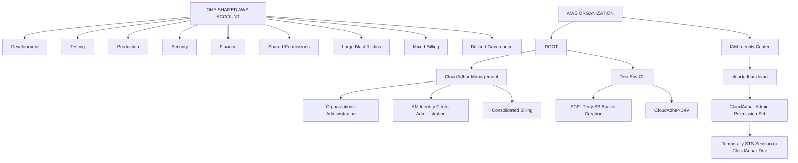

# Day 4 Study Notes  
# AWS Organizations, SCPs, IAM Identity Center, and Multi-Account Architecture

## Goal

Understand how a company centrally manages:

```text
Multiple AWS accounts
Workforce access
Security guardrails
Billing
Governance
```

---

# 1. The One-Account Problem

## Simple Scenario

Imagine one AWS account is shared by:

```text
Development team
Testing team
Production team
Security team
Finance team
```

At first, this may look simple, but as the company grows, this becomes risky.

---

## Problems With One Shared AWS Account

```text
Shared permissions
Large blast radius
Mixed billing
Difficult governance
```

### Shared Permissions

If everyone works in one AWS account, it becomes hard to separate who can do what.

Example:

```text
A developer may accidentally get access to production resources.
```

---

### Large Blast Radius

Blast radius means how much damage can happen if something goes wrong.

In one shared account:

```text
One mistake can affect development, testing, production, security, and finance.
```

Example:

```text
Someone deletes a shared VPC or S3 bucket.
Production may be affected.
```

---

### Mixed Billing

If all workloads run in one AWS account, it becomes hard to know which team created the cost.

Example:

```text
Development experiment uses expensive resources.
Finance cannot easily separate development cost from production cost.
```

---

### Difficult Governance

Governance means controlling and managing the environment properly.

In one shared account:

```text
Policies become difficult.
Auditing becomes difficult.
Security boundaries become weak.
Cost tracking becomes unclear.
```

---

# 2. Why This Is Not Only an IAM Problem

IAM controls users, roles, groups, and permissions inside an AWS account.

But the one-account problem is bigger than IAM.

It is an:

```text
Account-boundary problem
Governance problem
Security problem
Operations problem
Billing problem
```

## Important Point

```text
IAM can control permissions inside one account.
AWS Organizations helps control multiple accounts centrally.
```

---

# 3. Why Multiple AWS Accounts Are Better

AWS accounts provide stronger isolation boundaries.

A company can separate environments like this:

```text
Development Account
Testing Account
Production Account
Security Account
Finance Account
Logging Account
```

## Benefits

```text
Better isolation
Smaller blast radius
Clear cost tracking
Separate environments
Better security controls
Better governance
```

---

# 4. Target Multi-Account Architecture

The target architecture for this exercise is:

```text
AWS ORGANIZATION
|
|-- ROOT
|   |-- CloudAdhar-Management
|   |   |-- Organizations administration
|   |   |-- IAM Identity Center administration
|   |   `-- Consolidated billing
|   |
|   `-- Dev-Env OU
|       |-- SCP: Deny S3 bucket creation
|       `-- CloudAdhar-Dev
|
`-- IAM Identity Center
    `-- cloudadhar-demo
        `-- CloudAdhar-Admin permission set
            `-- temporary STS session in CloudAdhar-Dev
```

---

# 5. Main Components

## AWS Organization

AWS Organization is a collection of AWS accounts managed together.

Simple meaning:

```text
AWS Organization = Central management for multiple AWS accounts
```

It helps with:

```text
Account management
Central governance
Service Control Policies
IAM Identity Center integration
Consolidated billing
```

---

## Root

Root is the top-level container in AWS Organizations.

Important:

```text
Organization Root is not the same as AWS root user.
```

Simple meaning:

```text
Organization Root = Top hierarchy container in AWS Organizations
```

---

## Management Account

The management account controls the AWS Organization.

In this exercise:

```text
CloudAdhar-Management
```

Responsibilities:

```text
Organizations administration
IAM Identity Center administration
Consolidated billing
Account management
OU management
SCP management
```

## Important Best Practice

```text
Do not run normal workloads in the management account.
Use it mainly for organization-level administration.
```

---

## Member Account

A member account is an AWS account inside the organization.

In this exercise:

```text
CloudAdhar-Dev
```

This account is used for development workload testing.

Simple meaning:

```text
Member Account = Workload account inside AWS Organization
```

---

## Organizational Unit

OU means Organizational Unit.

In this exercise:

```text
Dev-Env OU
```

An OU groups accounts together so common controls can apply to them.

Simple meaning:

```text
OU = Folder-like group of AWS accounts
```

Example:

```text
Dev-Env OU
   └── CloudAdhar-Dev
```

---

# 6. What Is an SCP?

SCP means:

```text
Service Control Policy
```

An SCP is a guardrail that controls maximum available permissions for accounts.

In this exercise, the SCP is:

```text
SCP: Deny S3 bucket creation
```

---

## Very Important Rule

```text
SCP does not grant permissions.
SCP only limits permissions.
```

Simple meaning:

```text
IAM gives access.
SCP limits access.
```

---

# 7. SCP as a Guardrail

An SCP is like a safety boundary.

Even if IAM allows an action, SCP can deny it.

Example:

```text
IAM allows s3:CreateBucket
SCP denies s3:CreateBucket
Final result: AccessDenied
```

## Final Permission Formula

```text
Effective permission =
IAM or permission set allows
AND SCP allows
AND no explicit deny
```

---

# 8. Deny S3 Bucket Creation SCP

The policy for this exercise is:

```json
{
  "Version": "2012-10-17",
  "Statement": [
    {
      "Sid": "DenyS3BucketCreation",
      "Effect": "Deny",
      "Action": "s3:CreateBucket",
      "Resource": "*"
    }
  ]
}
```

## Meaning

```text
This SCP denies s3:CreateBucket.
Users cannot create S3 buckets in affected accounts.
Even administrators can be blocked by this SCP.
```

---

# 9. IAM Identity Center

IAM Identity Center provides centralized workforce access to AWS accounts.

In this exercise:

```text
IAM Identity Center
    └── cloudadhar-demo
        └── CloudAdhar-Admin permission set
            └── temporary STS session in CloudAdhar-Dev
```

Simple meaning:

```text
IAM Identity Center = Central login and access management for people
```

---

## Why IAM Identity Center Is Preferred

Without IAM Identity Center, companies may create duplicate IAM users in many accounts.

That causes problems:

```text
Hard to manage users
Hard to remove access
Hard to audit permissions
Repeated password and MFA setup
Inconsistent access
More security risk
```

IAM Identity Center is better because it provides:

```text
Central access portal
Users and groups
Permission sets
Temporary sessions
Access to multiple accounts
Better governance
```

---

# 10. Permission Set

A permission set is an access template used by IAM Identity Center.

In this exercise:

```text
CloudAdhar-Admin permission set
```

Simple meaning:

```text
Permission Set = Access package assigned to a user or group
```

A permission set can give a user access like:

```text
ReadOnlyAccess
PowerUserAccess
AdministratorAccess
Custom developer access
```

---

# 11. Permission Set vs SCP

| Topic | Permission Set | SCP |
|---|---|---|
| Service | IAM Identity Center | AWS Organizations |
| Applies to | Users and groups | Root, OU, or account |
| Purpose | Grants access | Sets maximum permission boundary |
| Grants permissions? | Yes | No |
| Can deny actions? | Not the main purpose | Yes |
| Example | CloudAdhar-Admin | Deny S3 bucket creation |

---

# 12. STS Temporary Session

STS means:

```text
AWS Security Token Service
```

When the user signs in through IAM Identity Center and selects an account and permission set, AWS creates a temporary STS session.

In this exercise:

```text
cloudadhar-demo user
        ↓
CloudAdhar-Admin permission set
        ↓
temporary STS session
        ↓
CloudAdhar-Dev account
```

Simple meaning:

```text
STS session = temporary login session with role-based permissions
```

---

# 13. Why S3 Creation Worked Before and Failed Afterward

## Before Account Move / Before SCP

Before the account was affected by the SCP:

```text
Permission set or IAM allowed s3:CreateBucket.
SCP did not deny it.
S3 bucket creation worked.
```

## After Account Move into Dev-Env OU

After the account moved into the OU where the SCP was attached:

```text
SCP denied s3:CreateBucket.
S3 bucket creation failed.
```

Final result:

```text
IAM Allow + SCP Deny = AccessDenied
```

---

# 14. Consolidated Billing

Consolidated billing means the management account receives and pays the bill for member accounts.

In this exercise:

```text
CloudAdhar-Management handles consolidated billing.
```

Benefits:

```text
Central payment
Cost visibility by linked account
Better finance tracking
Separate account usage with one bill
Possible pricing benefit sharing
```

Simple meaning:

```text
Consolidated Billing = One bill for multiple AWS accounts
```

---

# 15. Architecture Flow

## Problem Architecture

```text
ONE SHARED AWS ACCOUNT
|
|-- Development
|-- Testing
|-- Production
|-- Security
`-- Finance

Risks:
- Shared permissions
- Large blast radius
- Mixed billing
- Difficult governance
```

---

## Target Architecture

```text
AWS Organization
|
|-- Root
|   |-- CloudAdhar-Management
|   |   |-- Organizations administration
|   |   |-- IAM Identity Center administration
|   |   `-- Consolidated billing
|   |
|   `-- Dev-Env OU
|       |-- SCP: Deny S3 bucket creation
|       `-- CloudAdhar-Dev
|
`-- IAM Identity Center
    `-- cloudadhar-demo
        `-- CloudAdhar-Admin permission set
            `-- temporary STS session in CloudAdhar-Dev
```

---

# 16. Mermaid Diagram



---

# 17. Draw.io Exercise Checklist

Before starting the console practical, create an editable diagram in draw.io.

Your diagram should include:

```text
ONE SHARED AWS ACCOUNT problem box
Development
Testing
Production
Security
Finance
Shared permissions
Large blast radius
Mixed billing
Difficult governance
AWS Organization
Root
CloudAdhar-Management
Dev-Env OU
SCP: Deny S3 bucket creation
CloudAdhar-Dev
IAM Identity Center
cloudadhar-demo
CloudAdhar-Admin permission set
Temporary STS session in CloudAdhar-Dev
```

---

# 18. Security Masking Rules

Before submitting screenshots or files, mask:

```text
Account IDs
Email addresses
Portal URLs
Organization IDs
Full role ARNs
Temporary credentials
Session tokens
Access keys
Secret access keys
Private keys
```

Never commit:

```text
Temporary credentials
Session tokens
Private keys
Unmasked account details
```

---

# 19. Quick Memory Lines

```text
AWS Organizations = Manage multiple AWS accounts centrally

Root = Top hierarchy container

Management Account = Organization admin and billing account

Member Account = Workload account

OU = Group of accounts

SCP = Guardrail, not permission grant

IAM Identity Center = Central workforce access

Permission Set = Access package for users/groups

STS = Temporary session

Consolidated Billing = One bill for multiple accounts
```

---

# 20. Final Summary

A single AWS account becomes risky when many teams and environments share it.

AWS Organizations solves this by allowing a company to manage multiple AWS accounts centrally.

OUs group accounts.

SCPs provide security guardrails.

IAM Identity Center provides centralized workforce access.

Permission sets define user access.

STS creates temporary sessions.

Consolidated billing gives one billing view across accounts.

Most important point:

```text
IAM or Permission Set can allow an action,
but SCP can still deny it.
```

---

# 21. Editable draw.io Diagram File

For this exercise, I also created an editable draw.io diagram file:

```text
day-4-exercise-multi-account-architecture.drawio
```

This draw.io file includes both parts of the exercise:

```text
1. The one-account problem
2. The target multi-account AWS Organizations architecture
```

It contains:

```text
ONE SHARED AWS ACCOUNT
Development
Testing
Production
Security
Finance
Shared permissions
Large blast radius
Mixed billing
Difficult governance

AWS Organization
Root
CloudAdhar-Management
Dev-Env OU
SCP: Deny S3 bucket creation
CloudAdhar-Dev
IAM Identity Center
cloudadhar-demo
CloudAdhar-Admin permission set
Temporary STS session in CloudAdhar-Dev
```

This file can be opened and edited in draw.io / diagrams.net.

