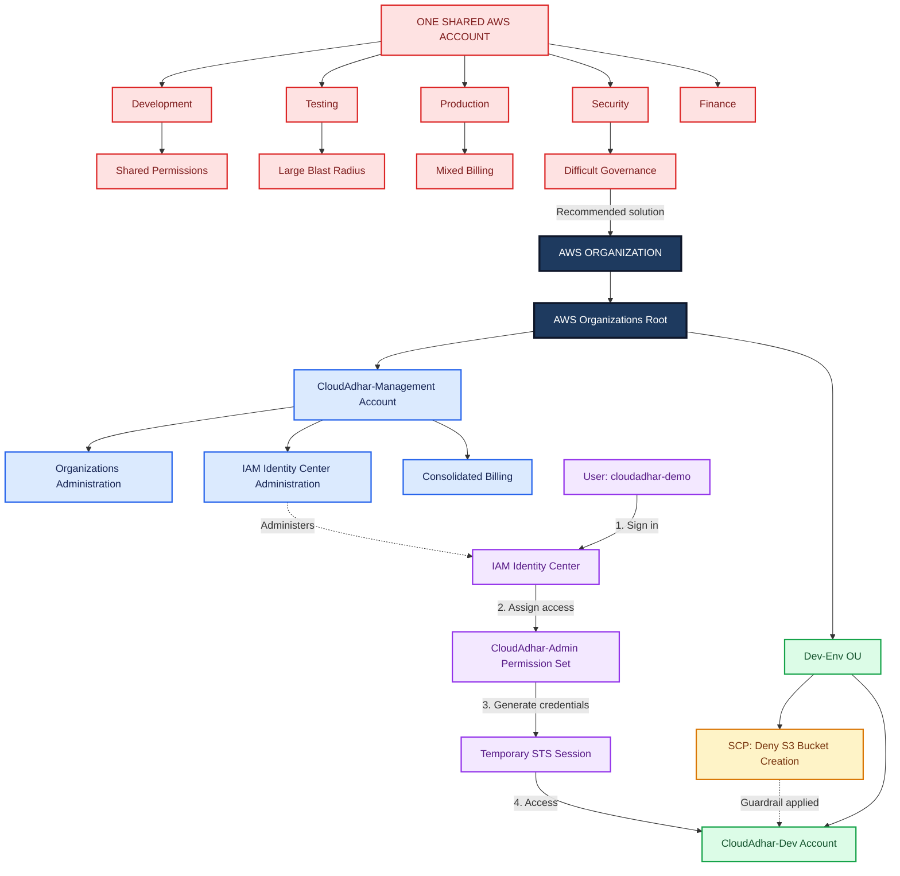

# Day 4 Study Notes  
# AWS Organizations, SCPs, IAM Identity Center aur Multi-Account Architecture

## Maqsad

Yeh samajhna ke ek company in cheezon ko centrally kaise manage karti hai:

```text
Multiple AWS accounts
Workforce access
Security guardrails
Billing
Governance
```

---

# 1. Ek Account Istemaal Karne Ka Masla

## Aasan Scenario

Tasawwur karein ke ek hi AWS account ko yeh sab teams mil kar istemaal kar rahi hain:

```text
Development team
Testing team
Production team
Security team
Finance team
```

Shuru mein yeh setup aasan lag sakta hai, lekin company ke barhne ke saath yeh risky ho jata hai.

---

## Ek Shared AWS Account Ke Masail

```text
Shared permissions
Bara blast radius
Mixed billing
Mushkil governance
```

### Shared Permissions

Agar sab log ek hi AWS account mein kaam karein, to yeh alag karna mushkil ho jata hai ke kaun kya kar sakta hai(authorized).

Misal:

```text
Ek developer ko ghalti se production resources ka access mil sakta hai.
```

---

### Bara Blast Radius

Blast radius ka matlab hai ke agar koi ghalti ho jaye to us se kitna nuqsan ho sakta hai.

Ek shared account mein:

```text
Ek ghalti development, testing, production, security aur finance sab ko mutasir kar sakti hai.
```

Misal:

```text
Koi shakhs shared VPC ya S3 bucket delete kar deta hai.
Is se production mutasir ho sakta hai.
```

---

### Mixed Billing

Agar tamam workloads ek hi AWS account mein chal rahe hon, to yeh maloom karna mushkil ho jata hai ke kis team ne kitna kharcha kiya.

Misal:

```text
Development team ka experiment mehngay resources istemaal karta hai.
Finance team development aur production ke kharchay ko aasani se alag nahi kar sakti.
```

---

### Mushkil Governance

Governance ka matlab environment ko sahi policies aur controls ke zariye manage karna hai.

Ek shared account mein:

```text
Policies manage karna mushkil ho jata hai.
Auditing mushkil ho jati hai.
Security boundaries kamzor ho jati hain.
Cost tracking wazeh nahi rehti.
```

---

# 2. Yeh Sirf IAM Ka Masla Kyun Nahi Hai?

IAM ek AWS account ke andar users, roles, groups aur permissions ko control karta hai.

Lekin ek account ka masla sirf IAM se kahin bara hai.

Yeh in sab se mutaliq masla hai:

```text
Account boundary
Governance
Security
Operations
Billing
```

## Aham Baat

```text
IAM ek account ke andar permissions control karta hai.
AWS Organizations multiple accounts ko centrally control karne mein madad karta hai.
```

---

# 3. Multiple AWS Accounts Behtar Kyun Hain?

AWS accounts zyada mazboot isolation boundaries faraham karte hain.

Ek company environments ko is tarah alag kar sakti hai:

```text
Development Account
Testing Account
Production Account
Security Account
Finance Account
Logging Account
```

## Fawaid

```text
Behtar isolation
Chhota blast radius
Wazeh cost tracking
Alag environments
Behtar security controls
Behtar governance
```

---

# 4. Target Multi-Account Architecture

Is exercise ke liye target architecture yeh hai:

```text
AWS ORGANIZATION
|
|-- ROOT
|   |-- CloudAdhar-Management
|   |   |-- Organizations administration
|   |   |-- IAM Identity Center administration
|   |   `-- Consolidated billing
|   |
|   `-- Dev-Env OU
|       |-- SCP: S3 bucket creation ko deny karna
|       `-- CloudAdhar-Dev
|
`-- IAM Identity Center
    `-- cloudadhar-demo
        `-- CloudAdhar-Admin permission set
            `-- CloudAdhar-Dev mein temporary STS session
```

---

# 5. Bunyadi Components

## AWS Organization

AWS Organization, AWS accounts ka ek majmua hai jinhein ek saath manage kiya jata hai.

Aasan alfaaz mein:

```text
AWS Organization = Multiple AWS accounts ka central management
```

Yeh in kaamon mein madad karta hai:

```text
Account management
Central governance
Service Control Policies
IAM Identity Center integration
Consolidated billing
```

---

## Root

Root, AWS Organizations mein sab se ooper wala container hota hai.

Aham baat:

```text
Organization Root aur AWS root user ek cheez nahi hain.
```

Aasan alfaaz mein:

```text
Organization Root = AWS Organizations ka top hierarchy container
```

---

## Management Account

Management account, AWS Organization ko control karta hai.

Is exercise mein:

```text
CloudAdhar-Management
```

Zimmedariyan:

```text
Organizations administration
IAM Identity Center administration
Consolidated billing
Account management
OU management
SCP management
```

## Aham Best Practice

```text
Management account mein normal workloads na chalayein.
Isay zyada tar organization-level administration ke liye istemaal karein.
```

---

## Member Account

Member account woh AWS account hota hai jo organization(OU) ke andar shamil ho.

Is exercise mein:

```text
CloudAdhar-Dev
```

Yeh account development workloads ki testing ke liye istemaal hota hai.

Aasan alfaaz mein:

```text
Member Account = AWS Organization ke andar workload account
```

---

## Organizational Unit

OU ka matlab hai:

```text
Organizational Unit
```

Is exercise mein:

```text
Dev-Env OU
```

OU accounts ko ek group mein jama karta hai taa-ke un sab par common controls apply kiye ja sakein.

Aasan alfaaz mein:

```text
OU = AWS accounts ka folder jaisa group
```

Misal:

```text
Dev-Env OU
   └── CloudAdhar-Dev
```

---

# 6. SCP Kya Hai?

SCP ka matlab hai:

```text
Service Control Policy
```

SCP ek guardrail hai jo accounts ke liye maximum available permissions ko control karta hai.

Is exercise mein SCP yeh hai:

```text
SCP: S3 bucket creation ko deny karna
```

---

## Bohat Aham Usool

```text
SCP permissions grant nahi karta.
SCP sirf permissions ko limit karta hai.
```

Aasan alfaaz mein:

```text
IAM access deta hai.
SCP access ko limit karta hai.
```

---

# 7. SCP Ek Guardrail Ke Taur Par

SCP ek safety boundary ki tarah hota hai.

Agar IAM kisi action ko allow bhi kare, tab bhi SCP usay deny kar sakta hai.

Misal:

```text
IAM s3:CreateBucket ko allow karta hai.
SCP s3:CreateBucket ko deny karta hai.
Aakhri natija: AccessDenied
```

## Final Permission Formula

```text
Effective permission =
IAM ya permission set allow kare
AND SCP allow kare
AND koi explicit deny na ho
```

---

# 8. S3 Bucket Creation Deny Karne Wala SCP

Is exercise ki policy yeh hai:

```json
{
  "Version": "2012-10-17",
  "Statement": [
    {
      "Sid": "DenyS3BucketCreation",
      "Effect": "Deny",
      "Action": "s3:CreateBucket",
      "Resource": "*"
    }
  ]
}
```

## Matlab

```text
Yeh SCP s3:CreateBucket action ko deny karta hai.
Mutasira accounts mein users S3 buckets create nahi kar sakte.
Is SCP ki wajah se administrators bhi block ho sakte hain.
```

---

# 9. IAM Identity Center

IAM Identity Center, AWS accounts ke liye centralized workforce access faraham karta hai.

Is exercise mein:

```text
IAM Identity Center
    └── cloudadhar-demo
        └── CloudAdhar-Admin permission set
            └── CloudAdhar-Dev mein temporary STS session
```

Aasan alfaaz mein:

```text
IAM Identity Center = Logon ke liye central login aur access management
```

---

## IAM Identity Center Ko Tarjeeh Kyun Di Jati Hai?

IAM Identity Center ke baghair companies ko mukhtalif accounts mein duplicate IAM users banane parh sakte hain.

Is se yeh masail paida hote hain:

```text
Users ko manage karna mushkil hota hai.
Access remove karna mushkil hota hai.
Permissions ka audit mushkil hota hai.
Password aur MFA setup baar baar karna parta hai.
Access mein consistency nahi rehti.
Security risk barh jata hai.
```

IAM Identity Center behtar hai kyun ke yeh faraham karta hai:

```text
Central access portal
Users aur groups
Permission sets
Temporary sessions
Multiple accounts ka access
Behtar governance
```

---

# 10. Permission Set

Permission set ek access template hai jo IAM Identity Center istemaal karta hai.

Is exercise mein:

```text
CloudAdhar-Admin permission set
```

Aasan alfaaz mein:

```text
Permission Set = User ya group ko diya jane wala access package
```

Permission set user ko is qisam ka access de sakta hai:

```text
ReadOnlyAccess
PowerUserAccess
AdministratorAccess
Custom developer access
```

---

# 11. Permission Set aur SCP Mein Farq

| Mauzu | Permission Set | SCP |
|---|---|---|
| Service | IAM Identity Center | AWS Organizations |
| Kis par apply hota hai? | Users aur groups | Root, OU ya account |
| Maqsad | Access grant karta hai | Maximum permission boundary set karta hai |
| Kya permissions grant karta hai? | Haan | Nahi |
| Kya actions deny kar sakta hai? | Is ka bunyadi maqsad nahi | Haan |
| Misal | CloudAdhar-Admin | S3 bucket creation ko deny karna |

---

# 12. STS Temporary Session

STS ka matlab hai:

```text
AWS Security Token Service
```

Jab user IAM Identity Center se sign in karke account aur permission set select karta hai, to AWS ek temporary STS session banata hai.

Is exercise mein:

```text
cloudadhar-demo user
        ↓
CloudAdhar-Admin permission set
        ↓
temporary STS session
        ↓
CloudAdhar-Dev account
```

Aasan alfaaz mein:

```text
STS session = Role-based permissions ke saath temporary login session
```

---

# 13. Pehle S3 Bucket Create Hua, Baad Mein Fail Kyun Hua?

## Account Move Karne Se Pehle / SCP Apply Hone Se Pehle

Jab account SCP se mutasir nahi tha:

```text
Permission set ya IAM ne s3:CreateBucket ko allow kiya.
SCP ne is action ko deny nahi kiya.
Is liye S3 bucket successfully create ho gaya.
```

## Account Ko Dev-Env OU Mein Move Karne Ke Baad

Jab account us OU mein move hua jis par SCP attached tha:

```text
SCP ne s3:CreateBucket ko deny kar diya.
S3 bucket creation fail ho gayi.
```

Aakhri natija:

```text
IAM Allow + SCP Deny = AccessDenied
```

---

# 14. Consolidated Billing

Consolidated billing ka matlab hai ke management account, member accounts ka bill receive aur pay karta hai.

Is exercise mein:

```text
CloudAdhar-Management consolidated billing handle karta hai.
```

Fawaid:

```text
Central payment
Har linked account ke cost ki visibility
Behtar finance tracking
Alag account usage ke saath ek bill
Pricing benefits share hone ka imkan
```

Aasan alfaaz mein:

```text
Consolidated Billing = Multiple AWS accounts ke liye ek bill
```

---

# 15. Architecture Ka Flow

## Problem Architecture

```text
EK SHARED AWS ACCOUNT
|
|-- Development
|-- Testing
|-- Production
|-- Security
`-- Finance

Risks:
- Shared permissions
- Bara blast radius
- Mixed billing
- Mushkil governance
```

---

## Target Architecture

```text
AWS Organization
|
|-- Root
|   |-- CloudAdhar-Management
|   |   |-- Organizations administration
|   |   |-- IAM Identity Center administration
|   |   `-- Consolidated billing
|   |
|   `-- Dev-Env OU
|       |-- SCP: S3 bucket creation ko deny karna
|       `-- CloudAdhar-Dev
|
`-- IAM Identity Center
    `-- cloudadhar-demo
        `-- CloudAdhar-Admin permission set
            `-- CloudAdhar-Dev mein temporary STS session
```

---

# 16. Mermaid Diagram

## From One Shared AWS Account to a Multi-Account Architecture


---

# 17. Draw.io Exercise Checklist

Console practical shuru karne se pehle draw.io mein ek editable diagram banayein.

Aap ke diagram mein yeh sab shamil hona chahiye:

```text
EK SHARED AWS ACCOUNT problem box
Development
Testing
Production
Security
Finance
Shared permissions
Bara blast radius
Mixed billing
Mushkil governance
AWS Organization
Root
CloudAdhar-Management
Dev-Env OU
SCP: S3 bucket creation ko deny karna
CloudAdhar-Dev
IAM Identity Center
cloudadhar-demo
CloudAdhar-Admin permission set
CloudAdhar-Dev mein temporary STS session
```

---

# 18. Security Masking Ke Usool

Screenshots ya files submit karne se pehle in cheezon ko mask karein:

```text
Account IDs
Email addresses
Portal URLs
Organization IDs
Full role ARNs
Temporary credentials
Session tokens
Access keys
Secret access keys
Private keys
```

In cheezon ko kabhi commit na karein:

```text
Temporary credentials
Session tokens
Private keys
Unmasked account details
```

---

# 19. Jaldi Yaad Rakhne Wali Lines

```text
AWS Organizations = Multiple AWS accounts ko centrally manage karna

Root = Top hierarchy container

Management Account = Organization administration aur billing account

Member Account = Workload account

OU = Accounts ka group

SCP = Guardrail hai, permission grant nahi

IAM Identity Center = Central workforce access

Permission Set = Users ya groups ke liye access package

STS = Temporary session

Consolidated Billing = Multiple accounts ke liye ek bill
```

---

# 20. Aakhri Khulasa

Jab bohat si teams aur environments ek hi AWS account ko share karein to woh account risky ho jata hai.

AWS Organizations company ko multiple AWS accounts centrally manage karne ki sahulat de kar is maslay ko hal karta hai.

OUs accounts ko groups mein organize karte hain.

SCPs security guardrails faraham karte hain.

IAM Identity Center centralized workforce access faraham karta hai.

Permission sets users ka access define karte hain.

STS temporary sessions banata hai.

Consolidated billing tamam accounts ke kharchay ko ek billing view mein dikhati hai.

Sab se aham baat:

```text
IAM ya Permission Set kisi action ko allow kar sakta hai,
lekin SCP phir bhi us action ko deny kar sakta hai.
```
